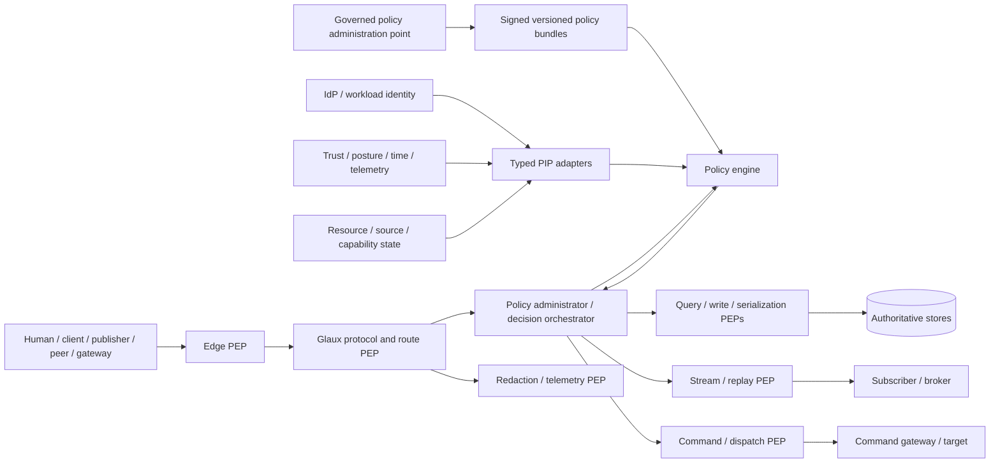

# Section 039A: Zero-Trust Architecture Alignment and Enforcement Model - Research Report

**Topic ID:** IDR-SRV-039A 
**Report Status:** Final 
**Research Plan:** [IDR-SRV-039A Zero-Trust Architecture Alignment and Enforcement Model](../IDR%20Plans/idr-srv-039a-zero-trust-architecture-alignment-and-enforcement-model.md) 
**Overall Research Plan:** [Glaux Server Overall IDR Research Plan](../IDR%20Plans/overall-idr-research-plan.md) 
**Research Questions Covered:** All questions concerning ZTA authority, terminology, scope, enterprise/server responsibility, trust boundaries, subject/resource/action modeling, PE/PA/PEP/PIP/PAP placement, identity integration, least privilege, data-centric access, source and workload trust, streaming, command/control, DDIL, telemetry, deployment profiles, clients, testing, evidence, and downstream handoffs 
**Methodology Used:** Current official-source extraction; accepted-baseline reconciliation; logical-component and data-flow modeling; control/data/management-plane separation; trust-boundary decomposition; criteria- and failure-mode analysis; deployment-profile comparison; enforcement/evidence/test traceability 
**Research Time:** Approximately 30 hours of AI-assisted execution on September 15, 2026 
**Approved Standards Baseline:** OGC 23-001 and OGC 23-002 Version 1.0, repository tag `v1.0.0` at [`8e03b236a049849f2ccc24b4fd9fdce5ff69bed2`](https://github.com/opengeospatial/ogcapi-connected-systems/commit/8e03b236a049849f2ccc24b4fd9fdce5ff69bed2) 
**ZTA Authority Baseline:** NIST SP 800-207; NIST SP 800-207A; NIST SP 1800-35 final; NIST CSWP 20; DoD Zero Trust Reference Architecture Version 2.0; DoD Zero Trust Strategy; DoD Zero Trust Execution Roadmap Version 1.1; CISA Zero Trust Maturity Model Version 2.0; NSA application/workload and data-pillar guidance; current OT-alignment guidance checked September 15, 2026 
**Implementation Evidence:** CS-Go `v1.0.4` at [`244f4dd586da685d4d9b75e43f73001028b5bd0e`](https://github.com/SomethingCreativeStudios/connected-systems-go/commit/244f4dd586da685d4d9b75e43f73001028b5bd0e); OpenSensorHub `v2.0.2` at [`235c0eabf24b6d6137b499b4402943d2794b70e6`](https://github.com/opensensorhub/osh-core/commit/235c0eabf24b6d6137b499b4402943d2794b70e6); OS4CSAPI phase-9 at `754411897173c2ec4debaa9bcf4ed9e0f8a9e230`; SECD at `f018fd129bf0d0d1ce75e68198e3ab4d99d937a0` 
**Supporting Resources:** Accepted IDR-SRV-001 through IDR-SRV-039, controlled-AEP findings, and upstream-history register Version 1.12 
**Document Purpose:** Define the Glaux Server ZTA-alignment claim, logical enforcement architecture, first-implementation baseline, operational-reference integration seams, profile behavior, evidence model, and downstream obligations without claiming enterprise deployment, maturity, accreditation, or authorization to operate 
**Author:** OpenAI Codex 
**Accepted By:** Glaux Project Lead 
**Acceptance Date:** September 15, 2026 
**Date:** September 15, 2026 
**Last Updated:** September 15, 2026

---

## Evidence and Decision Legend

| Mark | Meaning |
|---|---|
| N | Normative or controlling published-standard evidence |
| G | Official government guidance or reference architecture |
| A | Accepted Glaux design baseline |
| I | Pinned implementation or interoperability observation |
| E | Engineering/security analysis inferred from evidence |
| P | Proposed Glaux decision requiring report acceptance |
| X | Known gap, assumption, or unresolved choice |

NIST, DoD, CISA, and NSA sources guide ZTA alignment but do not make Glaux conformant, accredited, or operationally authorized. “Must” identifies an external obligation or an accepted/project-proposed invariant whose violation would make the stated Glaux profile untruthful. Product and organizational selections remain explicitly deferred.

---

## Contents

1. Executive Summary
2. Scope and Plan Alignment
3. Evidence Base and Authority Classification
4. ZTA Authority Baseline
5. ZTA Concept Crosswalk for Glaux Server
6. ZTA Scope, Non-Goals, and Enterprise/Server Boundary
7. Trust Boundary Model
8. Subject/Resource/Action Model
9. PDP (PE/PA), PEP, PIP, and PAP Model and Enforcement Locations
10. Authentication and Identity Integration Findings
11. Authorization, Least Privilege, and Object-Level Access Findings
12. Data-Centric Access, Policy/Releasability, and Redaction Findings
13. Source/Publisher Trust and Workload Identity Findings
14. Streaming/Event ZTA Enforcement Findings
15. Command/Control ZTA Enforcement Findings
16. DDIL/Tactical-Edge ZTA Findings
17. Observability, Telemetry, Audit, and Diagnostics Findings
18. Profile-Specific ZTA Recommendations
19. OpenAPI, Client, and Interoperability Implications
20. Testing, Evidence, and Traceability Implications
21. Downstream Topic Handoff Matrix
22. Recommendations
23. Risks, Assumptions, Constraints, and Open Questions
24. Validation Against This Plan's Success Criteria
25. References

---

## 1. Executive Summary

Glaux should claim **ZTA-aligned server enforcement**, not “a Zero Trust Architecture” or “Zero Trust compliance.” NIST defines ZTA as an enterprise cybersecurity plan encompassing component relationships, workflows, and access policies. DoD and CISA likewise organize ZT across identity/user, device, network/environment, application/workload, data, visibility/analytics, automation/orchestration, and governance capabilities. Glaux controls only part of that system. It can protect its resources per request, minimize implicit trust, expose identity/policy/telemetry integration contracts, enforce least privilege and dynamic decisions, and provide evidence; it cannot establish enterprise ICAM, endpoint posture, PKI, segmentation, threat intelligence, governance, workforce, monitoring, or accreditation by itself. **[G/E/P]**

The Glaux logical model should retain NIST's division of the policy decision point into a **policy engine (PE)** that decides and a **policy administrator (PA)** that establishes, constrains, or terminates access through policy enforcement points (PEPs). For clarity, the unrelated policy-authoring lifecycle is called the **policy administration point (PAP)**. Policy information points (PIPs) supply authoritative, versioned and freshness-qualified facts. The first implementation should embed a deterministic PE/PA path inside the server process behind product-neutral interfaces, while supporting a later external PDP/enterprise policy adapter. This provides local availability and DDIL testability without hard-wiring policy semantics or requiring an enterprise platform for development. **[G/E/P]**

Application PEPs are authoritative for Glaux semantics. Edge gateways, service meshes, network segmentation, brokers, database accounts, and command gateways add defense in depth, but cannot determine which CSAPI object, property, link, count, extent, observation, event, source assertion, command parameter, diagnostic, or policy-filtered view may cross a boundary. PEPs must therefore exist at protocol admission, route/action dispatch, repository/query construction, write/source admission, serialization and link generation, cache/cursor/ETag issuance, stream/replay emission, command lifecycle and dispatch, administrative operations, and observability export. Every business path must traverse one or more registered PEPs. **[A/E/P]**

Glaux should use the accepted immutable `SecurityContext` and hybrid authorization model from IDR-SRV-039. Each decision combines authenticated human and/or workload identity, client/delegation, target resource and action, local resource/source relationships, policy/releasability metadata, deployment/security domain, credential and policy freshness, time, DDIL state, and specialized command evidence. Network location and telemetry are contextual inputs that may reduce authority; they never independently create it. External claims and risk scores likewise cannot mint local source, data, administrative, or command authority. **[A/E/P]**

High-consequence decisions should be **criteria-based**: every mandatory predicate must be true, and missing, stale, contradictory, unauthenticated, or indeterminate evidence denies or reduces the operation. A risk/behavior score may trigger step-up, throttle, quarantine, shorten a session, or deny, but should not override a failed mandatory criterion or grant command/cross-boundary authority. Policy results are typed `ALLOW`, `DENY`, or `INDETERMINATE`, with bounded expiry, evidence versions, and enforceable obligations. PEPs treat `INDETERMINATE` as deny for the requested effect. **[G/E/P]**

Continuous authorization means **decision continuity**, not continuous implicit permission or unbounded real-time polling. Every HTTP request is authenticated and authorized; continuation cursors and conditional artifacts remain bound to the authorized view; subscriptions are checked at establishment, at event/replay emission, on expiry, and when relevant policy/trust/security versions change; source authority is checked at admission; administrative changes are reauthorized at commit; and commands retain the IDR-SRV-038 immediate pre-dispatch decision. The PA can shorten, constrain, pause, or terminate a session/effect when relevant evidence changes. **[G/A/E/P]**

DDIL does not waive zero-trust principles. It changes where fresh evidence can come from. A node may use locally verifiable credentials and signed, anti-rollback policy/trust bundles for explicit offline operation classes within issuer, audience, action, resource, time-confidence, freshness, and revocation-epoch bounds. Authority does not expand during disconnection. Unknown time, expired evidence, missing mandatory state, or exceeded staleness yields deny/indeterminate. Audit and security events buffer locally under bounded protected storage and synchronize later with provenance. IDR-SRV-042/043 will finalize public degraded-state and reconciliation semantics. **[A/E/P]**

The first implementation baseline is deliberately achievable: one capability/action registry; immutable security context; embedded deterministic PE/PA interfaces; versioned local policy bundles; application PEPs at every semantic boundary; authorized-query and serializer obligations; source/workload mapping; stream re-evaluation hooks; command profiles disabled until their accepted gates pass; safe telemetry/audit decisions; fail-fast deployment profiles; and deterministic negative tests. Enterprise IdP/PDP/PAP, service mesh, device posture, automated threat/risk scoring, cross-domain release policy, operational PKI, SIEM/SOAR, and accreditation remain operational-reference or downstream responsibilities. **[E/P]**

This supplemental report identifies no contradiction requiring modification of accepted IDR-SRV-039. It adds a named ZTA logical-component model, smaller trust-zone rule, decision-envelope contract, continuous-evaluation triggers, first-versus-operational scope, profile maturity/evidence model, and detailed PEP matrix for downstream consumption. It authorizes no implementation. Project-lead acceptance authorizes IDR-SRV-040 as the next bounded research topic. **[A]**

### 1.1 Recommended baseline at a glance

| Decision | Why | First implementation consequence | Confidence |
|---|---|---|---|
| Claim “ZTA-aligned enforcement,” never enterprise ZTA completion | Enterprise ZTA spans infrastructure, governance, people and operations | Scope statement and evidence manifest accompany every profile | High |
| Embedded deterministic PE/PA behind stable adapters | Keeps local/test/DDIL paths available and product-neutral | In-process evaluator plus optional external-PDP port | High |
| PAP is distinct from NIST policy administrator | Avoids ambiguous “PA” ownership | Authoring/approval/distribution cannot directly bypass runtime decision path | High |
| Application PEPs are authoritative | Only Glaux understands object/property/event/command semantics | Registered PEPs at query, write, serialization, streams, commands and diagnostics | High |
| Criteria-based decisions for high consequence | Opaque scores can hide failed mandatory facts | Scores constrain only; mandatory predicates fail closed | High |
| Every PIP fact carries provenance and freshness | Stale or unauthenticated context is not reliable evidence | Typed evidence envelope with authority/version/time/domain/confidence | High |
| Continuous authorization is event- and checkpoint-driven | Avoids both handshake-only trust and impractical constant polling | Request, continuation, stream, policy/trust, admin-commit and pre-dispatch triggers | High |
| Shrink trust zone to exact granted action/view/effect | Passing one gateway must not confer broad internal trust | Context and obligations propagate; downstream service authenticates separately | High |
| First implementation is ZTA-ready without enterprise dependencies | Local, CI and public demo must remain usable | Synthetic/local policy and identity adapters with safe profiles | High |
| Operational maturity is evidence-based, not a label | Feature presence does not prove enforcement | Profile conformance manifest and negative-test evidence | High |

## 2. Scope and Plan Alignment

### 2.1 Included scope

This report maps authoritative ZTA concepts to Glaux Server; separates enterprise, deployment and server responsibilities; defines trust zones and boundaries; models subjects, resources and actions; places PE, PA, PEP, PIP and PAP functions; defines decision and evidence envelopes; specializes authentication, least privilege, data-centric filtering, source/workload trust, streaming, command/control, DDIL, telemetry and diagnostics; profiles local, CI, conformance, public-demo, interoperability, DDIL-simulation and operational-reference behavior; and specifies verification and handoffs.

### 2.2 Excluded scope

The report does not certify DoD Target or Advanced ZT outcomes, CISA maturity, NIST conformance, NATO accreditation, RMF control satisfaction, cross-domain approval, or authorization to operate. It does not select a production IdP, policy engine, policy language, PKI, workload-identity system, gateway, service mesh, SIEM/SOAR, device-posture product, database, broker, network design, or deployment topology. It does not define final policy labels/release rules, audit schema/retention, DDIL synchronization protocol, or implementation schedule.

Glaux does not own enterprise user/device lifecycle, endpoint management, network segmentation, threat-intelligence quality, organizational roles/clearances, mission-risk acceptance, data-owner policy approval, external source certification, coalition trust agreements, incident response, training, or accreditation. It must consume explicit evidence and fail safely when mandatory evidence is unavailable.

### 2.3 Relationship to accepted reports

IDR-SRV-032's principal/publisher/source/authority separation, IDR-SRV-035's policy-bound publication, IDR-SRV-038's command decision plane, and IDR-SRV-039's authentication/threat model remain controlling. This report refines placement and orchestration rather than reopening their decisions. Any apparent conflict resolves in favor of the accepted report until a project-lead-approved addendum exists; this research found none.

### 2.4 Plan coverage

All 25 required sections are present. Sections 4-8 provide authority, crosswalk, scope, boundaries and subject/resource/action model. Sections 9-17 define logical components and specialized enforcement. Sections 18-20 supply profiles, clients, tests and the required 14-column matrix. Sections 21-24 provide handoffs, decisions, risks and success-criteria traceability.

## 3. Evidence Base and Authority Classification

### 3.1 Primary ZTA authorities

NIST SP 800-207 supplies the technology-neutral definition, seven tenets, PE/PA/PEP logical model, trust-algorithm inputs, deployment variations, threats and migration approach. NIST SP 800-207A specializes identity- and network-tier policy for cloud-native/multi-location applications and emphasizes workload identity, gateways and service-mesh patterns without making those products mandatory. NIST SP 1800-35, final June 2025, reports 19 example implementations and shows both the feasibility and integration gaps of real products. NIST CSWP 20 connects ZTA planning to enterprise risk management. **[G]**

The DoD Zero Trust Reference Architecture Version 2.0 and 2022 Strategy organize ZT across seven pillars and enterprise capabilities and emphasize dynamic multi-attribute confidence, data and application protection, visibility, automation and governance. The official Zero Trust Execution Roadmap Version 1.1, dated January 22, 2025, clarifies enterprise/component responsibility and Target-level outcomes. CISA ZTMM Version 2.0 organizes five pillars—identity, devices, networks, applications/workloads and data—plus visibility/analytics, automation/orchestration and governance, across Traditional, Initial, Advanced and Optimal maturity. These are alignment lenses, not a Glaux compliance checklist. **[G/E]**

NSA's May 2024 application/workload guidance calls for application inventory, secure development/integration, software-risk management, resource authorization/integration, and continuous monitoring/ongoing authorization. Its April 2024 data guidance emphasizes inventory, categorization/tagging, access control, encryption/rights management, monitoring and loss prevention. DoD's late-2025 OT activities/outcomes and the April 2026 interagency OT guide confirm that ZT for systems interacting with physical processes must be adapted carefully to availability, safety and operational realities rather than applied as a disruptive generic IT overlay. **[G/E]**

### 3.2 Controlling standards and project evidence

OGC API - Connected Systems Version 1.0 does not prescribe a ZTA. Its protected-functionality, authentication, HTTPS and machine-authentication guidance remains compatible with this model. SensorML/SWE metadata and security constraints can supply resource/PIP facts but do not themselves decide access. Accepted Glaux decisions remain the authority for API semantics, writes, source provenance, streaming, commands, storage, errors and tests. **[N/A]**

The controlled AEP artifact remains non-redistributable. This report uses only accepted, releasable project findings and contains no controlled text, real source credential, operational topology, mission identifier or command target. **[A]**

### 3.3 Implementation evidence and currency

Existing CSAPI implementations demonstrate granular permissions, test authentication and client interoperability, but none establishes the enterprise ZTA envelope Glaux needs. Their gaps—optional protection, broad CORS, incomplete security descriptions, static demo credentials, or route-centric controls—remain non-normative lessons. Sources were checked September 15, 2026. The shared CSAPI upstream-history register remains Version 1.12 because no standards-history change material to this topic was found.

## 4. ZTA Authority Baseline

### 4.1 NIST tenets mapped to Glaux

| NIST SP 800-207 tenet | Glaux interpretation | Evidence boundary |
|---|---|---|
| All data sources and computing services are resources | CSAPI data, policies, identities, schemas, streams, workers, brokers, gateways and diagnostics are protected resources | Resource inventory/capability registry |
| Secure all communication regardless of location | Authenticate/protect external and service hops; loopback/private network is not authorization | TLS/workload identity and profile evidence |
| Grant individual-resource access per session | Each request/session/stream/effect is scoped to exact resource/action/view and least privilege | Decision ID, scope, expiry and obligations |
| Dynamic policy uses identity, service, asset and environment | Use authenticated/authoritative PIP facts with explicit freshness; do not infer authority from network context | Evidence envelope and decision trace |
| Monitor owned/associated assets | Consume available device/workload/source posture; do not claim posture coverage when absent | Profile manifest declares PIP coverage |
| Authentication and authorization are dynamic and strictly enforced | Re-evaluate at request and relevant change/effect checkpoints; terminate or constrain ongoing access | PA/PEP transition evidence |
| Collect state to improve posture | Emit privacy/policy-safe telemetry, analyze externally, and feed validated signals through governed PIPs | Audit/telemetry and PAP change history |

The “per-session” term does not mean that a bearer token or HTTP connection receives broad standing trust. A Glaux decision session is the smallest useful bounded access interval: normally one HTTP request; one page continuation; one subscription lease between reevaluation points; one ingestion item/batch scope; or one command gate/effect ticket.

### 4.2 Logical component authority

NIST's PDP comprises the PE and PA. The PE decides to grant, deny or revoke using enterprise policy and inputs. The PA establishes or terminates the communication path through the PEP and may issue session-specific material. The PEP enables, monitors and terminates the subject/resource connection. Additional sources—identity, asset posture, threat intelligence, activity logs, compliance and policy data—feed the PE. **[G]**

“PIP” and “PAP” are useful policy-architecture names, but this report uses them carefully:

- **PIP:** a typed adapter supplying decision facts; it is not automatically authoritative because it returns data.
- **PAP:** authoring, validation, approval, versioning, distribution, rollback and retirement of policy bundles.
- **PA (NIST):** runtime decision executor/orchestrator, not the PAP and not a policy author.

### 4.3 Trust algorithm selection

NIST permits criteria- or score-based and singular or contextual trust algorithms. Glaux should use explicit criteria as the authoritative core. Scores and behavioral analytics are optional context that can reduce privilege, require stronger evidence, throttle, quarantine or deny. They cannot override a mandatory denial, manufacture an unknown attribute, or authorize physical effect/cross-boundary release. This makes decisions explainable, testable, DDIL-capable and less vulnerable to opaque model drift. **[G/E/P]**

Contextual history should be consumed only through a governed PIP with known authority, observation time, false-positive handling, and redaction. First implementation is criteria-based and predominantly singular per request, with versioned context such as rate/replay/source state. Automated behavioral scoring is deferred.

### 4.4 ZTA threats against the enforcement system

The ZTA components are themselves high-value resources. NIST identifies subversion of the decision process, denial/disruption, stolen credentials and insider threats, visibility-data exposure, proprietary lock-in, and non-person-entity administration risks. Glaux therefore authenticates and authorizes PE/PAP/PIP/configuration calls; signs or transactionally protects policy/evidence; isolates runtime and authoring duties; bounds decision latency and cache behavior; redacts telemetry; provides deterministic local fallback only where profiled; and keeps product-neutral decision/evidence schemas.

## 5. ZTA Concept Crosswalk for Glaux Server

| ZTA concept | Glaux realization | Not equivalent to |
|---|---|---|
| Enterprise resource | CSAPI object/view, dynamic record, stream, source registration, command/effect, policy, audit, service | Only an HTTP route or network host |
| Subject | Authenticated human, client, workload, publisher, gateway or peer plus represented/delegated identity | User-provided `sender`, source ID or network address |
| PE | Deterministic authorization evaluator behind a stable interface | Authentication middleware or command safety engine |
| PA | Runtime coordinator applying decision/obligations and revoking/terminating sessions/effects | Policy authoring UI or enterprise PAP |
| PEP | Every point capable of preventing data/action from crossing a protected boundary | A logging hook or client-side hidden button |
| PIP | Provenance/freshness-qualified identity, resource, source, policy, posture, time, trust and telemetry fact provider | Any arbitrary external claim or database field |
| PAP | Governed policy lifecycle and signed/versioned bundle distribution | Direct edit of live authorization state |
| Trust algorithm | Criteria evaluation over request and PIP evidence | A permanent “trusted” boolean or universal risk score |
| Implicit trust zone | Code/data reachable after the last effective PEP without another decision | “Internal network” by definition |
| Continuous authorization | Recheck on each access and material evidence/session/effect transition | Authenticate once forever or poll every PIP continuously |
| Micro-segmentation | Least-function connectivity between uniquely identified workloads | Substitute for object/action authorization |
| Data-centric control | Policy follows object/property/derived view/event and provenance | Route-only role check |
| Telemetry feedback | Validated observations can constrain decisions and improve policy | Raw log automatically grants/revokes authority |
| ZTA maturity | Evidence-backed capability coverage in a named deployment profile | Product presence, marketing label or self-attestation |

## 6. ZTA Scope, Non-Goals, and Enterprise/Server Boundary

### 6.1 Responsibility allocation

| Responsibility | Glaux Server | Reference deployment | Enterprise/mission authority |
|---|---|---|---|
| Resource/action/capability vocabulary | Owns canonical registry | Deploys enabled subset | Reviews mission suitability |
| Request security context | Validates and constructs | Supplies trusted proxy/transport evidence | Operates/approves issuers and identity lifecycle |
| Object/property/event/effect PEPs | Owns and cannot delegate away | Adds edge/network/workload PEPs | Sets control expectations |
| PE/PA runtime semantics | Owns interface and safe behavior | Selects embedded/external placement and HA | Approves policy/risk architecture |
| Policy lifecycle/PAP | Consumes signed/versioned bundles; validates | Hosts/administers selected tooling | Data/mission owners author and approve rules |
| PIP adapters/evidence schema | Owns typed contracts/freshness handling | Connects IdP, posture, trust, telemetry services | Owns authoritative sources and quality |
| Workload identity and TLS | Supports and requires by profile | Operates PKI/identity, rotation and trust | Governs credential policy |
| Segmentation/service mesh | Publishes least-function flows/readiness | Implements gateways, firewall/mesh policies | Approves architecture and exceptions |
| Device posture/endpoint response | Consumes supported evidence | Integrates posture/EDR/CDM | Owns endpoint policy and response |
| Data labels/releasability | Enforces obligations and preserves metadata | Protects stores/transports | Owns classification/release decisions |
| Security telemetry/audit | Emits safe structured evidence | Collects/protects/analyzes/routes | Owns monitoring, incident and retention policy |
| Accreditation/ATO | Supplies implementation evidence | Supplies deployed evidence | Sole approval authority |

### 6.2 First implementation boundary

The first implementation must include the product-neutral domain contracts and application PEPs even if deployed as one process. A modular monolith is not exempt from ZT; it simply has fewer network trust boundaries. In-process calls receive an explicit security/decision context rather than ambient global privilege. Direct repository, serializer, stream, command or diagnostic paths that bypass a PEP are architectural defects.

The first implementation need not deploy a service mesh, external PDP, enterprise ICAM, posture agent, threat feed, automated risk engine or SIEM. It must expose adapters and configuration so adding them does not change resource/action semantics or create alternate bypass paths.

### 6.3 Operational-reference boundary

An operational-reference deployment adds managed OIDC/OAuth and workload identity, protected external or replicated policy administration/distribution, TLS on every service hop, per-workload credentials, database/broker isolation, edge and network PEPs, protected observability export, high availability, rotation/revocation, incident response, and profile-specific device/telemetry PIPs. It remains a reference design until an owning organization tailors policy, validates integrations, assesses risk, and authorizes operation.

## 7. Trust Boundary Model

The diagram is logical. Components may be co-located, replicated, or external, but their contracts and authority remain distinct. The edge does not replace application PEPs, and the datastore is never assumed safe merely because it is behind the application.

### 7.1 Boundary inventory

Trust changes at external transport, edge proxy, application protocol parser, credential validator, external/local principal mapping, PA/PE/PIP/PAP interfaces, domain service, repository, store, cache, queue/outbox, broker, stream subscriber, publisher/source adapter, federation peer, command gateway/target, simulator/test control, documentation renderer, and observability exporter. Each separated workload has its own identity and least-function channel.

### 7.2 Minimum trust-zone rule

A successful PEP decision creates only a bounded **granted-action zone**: the exact subject/client/delegation, resource/query, action, authorized view, obligations, policy/evidence versions and expiry. It does not make the process, network segment, caller, connection, or downstream system generally trusted. When a downstream hop cannot cryptographically carry all context, it receives a short-lived audience-bound internal assertion or re-evaluates using authoritative references; arbitrary forwarded headers are prohibited.

### 7.3 Control, data and management planes

- The **data plane** carries CSAPI requests/responses, ingested content, events, replay and command-domain exchanges.
- The **control plane** carries authentication, policy decisions, session establishment/revocation, PIP evidence and enforcement updates.
- The **management plane** authors/configures policy, identities, mappings, trust anchors, deployment profiles and observability destinations.

Management-plane permission never implies data-plane visibility or command authority. Data-plane content cannot directly edit control policy. Control-plane failure behavior is operation/profile-specific and cannot degrade into allow-by-default.

## 8. Subject/Resource/Action Model

### 8.1 Subjects

The accepted IDR-SRV-039 identities remain: anonymous reader; authenticated person; operator; administrator; auditor; web/mobile client; confidential service client; publisher/adapter workload; represented source; simulator and scenario/run; federated server/security domain; command gateway/executor; conformance/security client; and internal worker. The decision subject is a composite of authenticating principal, client/workload, represented/delegated identity, source/gateway/device evidence and security domain. The composite is immutable for a decision session.

### 8.2 Resources

Resources include every standards object and property view; collections and query result sets; SensorML/SWE documents and substructures; Observations, status, events and replay positions; publisher/source registrations and trust state; ControlStreams, Commands, feasibility, approvals, dispatch tickets and results; schemas/API descriptions/conformance; caches/cursors/ETags; policies, identity mappings and secrets references; audit/diagnostic/health/metrics/traces; queues/work items; and services/datastores/brokers/gateways themselves.

### 8.3 Actions and decision tuple

The IDR-SRV-039 action vocabulary remains controlling. Each evaluation uses:

`subject × client/workload × represented identity × action × resource/query/view × environment × evidence versions → decision + obligations + expiry`

The action cannot be inferred only from HTTP verb: a `GET` may `discover`, `read`, `query`, `replay`, `view-diagnostics`, or `view-audit`; a `POST` may `create`, `ingest`, `subscribe`, `request-feasibility`, `submit-command`, `approve-command`, or `administer`. Capability registry entries provide the canonical mapping used by routes, PE policy, OpenAPI and tests.

### 8.4 Subject/resource/action invariants

- Anonymous is an explicit subject class, not authentication failure converted to public access.
- Every resource has stable local authority and security-domain identity even when derived or federated.
- Parent authorization does not automatically include children; child authorization does not disclose a hidden parent.
- `read`, `query`, `subscribe`, `replay`, `ingest`, `administer`, and command actions are never interchangeable.
- Delegation preserves both actor and represented identity.
- A resource identifier, role, token scope, source registration, device posture, network origin, or prior allow is never sufficient alone.

## 9. PDP (PE/PA), PEP, PIP, and PAP Model and Enforcement Locations

### 9.1 Policy engine contract

The PE consumes a normalized decision request and evidence set and returns a signed or transactionally protected decision envelope. The interface must work in process and across a protected remote call without changing semantics.

| Decision input/output | Required content |
|---|---|
| Request | decision ID, subject/client/delegation references, action, resource/query/view reference, environment/profile/security domain, request time/deadline |
| Evidence | typed PIP facts with authority, source, version, observed/effective time, expiry/max age, confidence/quality, integrity status and sensitivity |
| Result | `ALLOW`, `DENY`, or `INDETERMINATE`; no Boolean default |
| Obligations | authorized property/link view, query limits, rate/concurrency class, redaction, step-up/fresh-evidence requirement, session/event expiry, audit/evidence duty |
| Provenance | policy bundle/rule IDs and versions, relevant PIP versions/digests, evaluator version, decision time and expiry |
| Safe reason | stable internal reason class; public diagnostic mapping is separate |

The PE must be deterministic for the same versioned inputs. Policy evaluation cannot perform unconstrained network calls, mutate domain state, log raw credentials/content, or silently substitute stale values. It can request missing evidence; the PA decides whether the operation profile permits acquiring it, using a bounded cache, degrading authority, or denying.

### 9.2 Policy administrator / decision orchestrator

Glaux's PA executes PE results. It validates decision freshness and binding, installs obligations into the PEP, establishes a bounded access/session/effect, schedules reevaluation/expiry, and revokes or terminates it on a new deny/indeterminate. For one-request HTTP access, PA and PEP may be in the same call stack. For streams, workers and commands, the PA maintains a lease/ticket/state reference rather than assuming the initial call remains authorized.

The PA cannot upgrade or edit a decision. If a PEP cannot implement an obligation, the PA rejects the operation. A serializer unable to apply a property filter, a repository unable to push an authoritative predicate, or a broker adapter unable to preserve event filtering therefore fails closed or is not enabled for that profile.

### 9.3 Policy information points

| PIP | Facts supplied | Authority/freshness requirement |
|---|---|---|
| Identity/security context | principal, client/workload, delegation, credential assurance, issuer/audience/session | authenticated adapter; bound to request; credential expiry |
| Local principal mapping | external-to-local identity, roles/groups/attributes | versioned local authority; lifecycle/revocation |
| Resource catalog | type, owner/custodian, relationships, security domain, capability/version | authoritative store snapshot/version |
| Policy/releasability | labels, sharing constraints, purpose/domain rules | data/mission-owner-approved bundle; IDR-SRV-040 owns vocabulary |
| Source trust registry | publisher/source binding, allowed types/actions, state, sequence/revocation | accepted registration authority and current state |
| Workload/device posture | workload identity, software/configuration/integrity posture | signed/authenticated source, observation time and maximum age |
| Token/session status | active/revoked, assurance, authentication time | issuer/introspection or signed offline state; bounded cache |
| Time/DDIL state | trusted time confidence, connectivity/degraded class, policy epoch | local trusted source and explicit uncertainty |
| Command facts | target/stream/grant/lease, validation, feasibility, safety, approval, dispatch route | accepted IDR-SRV-038 authorities and freshness |
| Telemetry/risk | rate, anomaly, threat or incident state | governed producer, scope, quality and false-positive policy |
| Capability/configuration | enabled profile/routes/adapters/limits | signed/versioned deployment configuration |

PIPs do not decide. Conflicting facts retain both sources and yield a rule-defined restriction or indeterminate result; “last writer wins” across authorities is prohibited. A PIP's absence must be distinguishable from a negative assertion. Raw security telemetry and external claims are never promoted to authority without validation and local mapping.

### 9.4 Policy administration point

The PAP lifecycle is draft → validate → simulate/impact-review → approve → sign/version → stage → activate → observe → supersede/revoke/rollback → retain evidence. Policy authors cannot bypass runtime PEPs, and production policy activation is distinct from application deployment. Bundles declare compatible capability/action/schema versions, issuer, audience/security domain, activation/expiry, dependencies and rollback rules. Invalid, unsigned, wrong-audience or incompatible bundles never activate.

The first implementation may use reviewed version-controlled policy fixtures and an administrative import path rather than an interactive PAP. Operational deployment chooses authoring/approval infrastructure later. Dynamic emergency changes still need identity, authorization, bounded scope, expiry, audit and rollback.

### 9.5 PEP registry and no-bypass invariant

| PEP | Boundary enforced | Required behavior |
|---|---|---|
| Edge/gateway PEP | external connection to Glaux listener | TLS/client constraints, rate/body bounds; never final semantic authority |
| Authentication/protocol PEP | bytes/headers to typed request/security context | strict parsing, credential validation, proxy contract |
| Route/action PEP | request to domain operation | capability/action mapping and coarse admission |
| Query/repository PEP | domain query to authoritative rows/documents | push authorized predicates before fetch/count/extent/sort |
| Write/source PEP | submitted representation to authoritative transaction | object/property/source/action obligations and server-owned fields |
| Serialization/link PEP | domain data to representation/links | property, relationship, affordance and concealment obligations |
| Cache/cursor/ETag PEP | reusable artifact across decisions | bind to authorized-view and policy/data/security versions |
| Stream/replay PEP | committed event to subscriber/broker | selector and per-event view, expiry/revocation, backpressure |
| Worker/outbox PEP | queued intent to asynchronous side effect | initiating context/provenance plus reauthorization checkpoint |
| Command PEPs | discovery through immediate dispatch/effect | all accepted IDR-SRV-038 gates and fencing |
| Administration PEP | identity/policy/config/trust changes | separate audience/actions, step-up/approval hooks, atomic evidence |
| Diagnostics/export PEP | state/evidence to logs, metrics, traces, health, audit consumer | redaction/minimization and destination/access decision |

Every capability registry row identifies all PEPs it must cross. Architecture and test checks fail if a route, alternate media type, batch path, internal worker, broker adapter, admin utility or test endpoint reaches a protected resource/effect without them.

### 9.6 Embedded and external PDP options

The recommended sequence is **embedded-first, dual-capable**:

1. A pure domain PE library and local signed/versioned bundle store provide deterministic first-implementation behavior.
2. A protected adapter can call an external enterprise PDP using the same request/result/evidence semantics.
3. Profiles choose local, remote, or a defined composition; they never silently fail from remote to a broader local rule.
4. Local mandatory safety/source/resource rules remain enforceable even when an external PDP supplies enterprise authorization.

External-only would make local/CI/DDIL availability and reproducibility depend on unspecified infrastructure. Embedded-only would hinder enterprise policy integration and centralized governance. Dual-capable preserves both without choosing OPA, Cedar, or another engine. Those products are candidates for prototype comparison, not decisions here.

## 10. Authentication and Identity Integration Findings

IDR-SRV-039's `SecurityContext`, OIDC/OAuth, JWT/opaque-token, mTLS/DPoP, BFF, proxy and deployment-profile decisions are adopted unchanged. ZTA adds placement and evidence rules:

- Authentication is a control-plane input to every protected decision, not a one-time edge event.
- Human, client/application, workload, device, publisher, represented source, gateway and peer identities remain distinct and may all appear in one composite subject.
- An external identity claim becomes usable only through a local versioned mapping PIP.
- Device/workload posture is optional by profile and can constrain authority; absence cannot be misrepresented as “healthy.”
- Authentication time, assurance, credential expiry, revocation freshness, issuer, audience and proof binding are decision evidence.
- Step-up creates a new bounded security context/decision; it does not mutate old command or stream evidence.

First implementation should authenticate external protected callers and publishers through the pluggable interface and assign a distinct server process/workload identity when it crosses a protected service boundary. If database, broker, policy engine, worker or gateway is a separate workload, it requires its own credential and least-function access. A monolith can avoid artificial internal network calls but must preserve explicit in-process context.

An operational-reference profile should integrate managed enterprise ICAM and workload identity, lifecycle/rotation/revocation, device/posture evidence where relevant, and phishing-resistant/step-up controls chosen by the owning organization. Glaux consumes those capabilities; it does not advertise that it supplies them.

## 11. Authorization, Least Privilege, and Object-Level Access Findings

### 11.1 Decision semantics

The accepted hybrid RBAC/scope/ABAC/resource-relationship model becomes the PE's criteria set. RBAC and scopes bound candidate actions; attributes and relationships bind exact resources/views and environment; specialized grants bind source and command authority. `ALLOW` is valid only when every mandatory criterion is supported by sufficiently fresh authoritative evidence and the PEP can honor all obligations.

`INDETERMINATE` covers evaluation errors, missing mandatory PIP facts, incompatible policy/capability versions, expired decisions, integrity failure and unavailable required services. It is not a soft allow. Public responses may map deny and indeterminate to the same non-oracular status, but protected telemetry must distinguish them.

### 11.2 Least-privilege dimensions

Least privilege constrains subject and client, action, resource instance/query, property/relationship, source/security domain, purpose/mission/deployment, time/session, rate/volume, protocol/media type, downstream destination and effect envelope. Permission to list is not permission to count hidden resources; read is not subscribe/replay; create is not assignment of server-owned fields; ingest is not source registration; command submission is not approval, dispatch or result reporting.

### 11.3 Object/view enforcement

Repository PEPs apply mandatory authorization predicates before data is accessed. Serializer/link PEPs apply property and relationship obligations. Counts, extents, ordering, pagination, cursor validity, ETags, `Location`, alternate representations, response timing classes and error existence behavior describe only the authorized view. Cache keys include that view and relevant policy/evidence versions. There is no privileged fetch followed by optional application filtering.

### 11.4 Continuous decision triggers

| Access form | Mandatory decision/re-evaluation points |
|---|---|
| Ordinary HTTP | each request after authentication and before authoritative query/mutation |
| Pagination/conditional access | every continuation; cursor/ETag bound to current authorized view |
| Batch ingestion/write | batch admission plus per-item source/resource/property decision where authority can differ |
| Async work | admission and immediately before externally visible commit/effect when relevant state can change |
| Stream/subscription | establishment, replay, each event view, credential/session expiry, policy/trust/version trigger |
| Administration | request and atomic commit; step-up/approval freshness where required |
| Command | discovery/action gates plus immediate pre-dispatch re-evaluation and single-use ticket |
| DDIL | same checkpoints using only the explicitly permitted local evidence class |

Reevaluation is event-driven where possible: policy/source/trust mapping changes publish protected invalidation events keyed to affected decision dependencies. Time-based expiry is a backstop. Polling can supplement external systems but cannot promise instantaneous revocation without measured evidence.

## 12. Data-Centric Access, Policy/Releasability, and Redaction Findings

Data-centric policy attaches to the authoritative resource/property/provenance/security-domain identity and follows derived views, materializations, caches, events, exports and audit references. Candidate PIP attributes include owner/custodian, source, security/releasability label, domain/community, purpose, sensitivity, sharing restriction, confidence/quality, expiration, freshness and provenance. IDR-SRV-040 owns the exact vocabulary, combination rules, transformations and cross-boundary release authority.

SensorML `securityConstraints` and SWE extension markings can carry external policy references or fine-grained metadata, but are untrusted publisher content until an authoritative Glaux mapping validates issuer, vocabulary, scope and resource version. A missing label does not mean public. Conflicting parent/document/property labels use a later defined conservative combination, never client choice.

Redaction is an enforceable obligation, not cosmetic deletion. It covers properties, nested structures, links, related resources, geometries, time extents, counts, sort order, events, command affordances/parameters, diagnostics and documentation. A transformed or generalized value records provenance and policy version internally. The server must avoid producing a representation that remains syntactically plausible but semantically false about OGC conformance; protected access or an explicitly documented profile may be preferable.

Side-channel tests compare authorized views across identifiers, media types, list/item/nested routes, filters, pagination, counts/extents, conditional requests, cache hits, events/replay, errors and timing classes. Audit visibility is separately policy-controlled because audit records aggregate identity, resource, source, decision and command context.

## 13. Source/Publisher Trust and Workload Identity Findings

### 13.1 Trust distinctions

| Concept | Meaning | Does not imply |
|---|---|---|
| Registered publisher/source | Relationship exists in registry | active credential, current trust or write permission |
| Authenticated publisher workload | Calling instance proved an accepted workload identity | authority to represent any source/resource |
| Source mapping | Publisher may represent a named source under conditions | truth, validation or all operations |
| Authorized ingestion | Current subject/source/action/resource criteria allow admission | successful validation or downstream release |
| Source trust state | Current evidence permits specified assertions with stated confidence/scope | permanent trust or reader access |
| Downstream data trust/provenance | Accepted facts retain origin and processing evidence | automatic releasability or command authority |

Source trust is a versioned PIP, not a Boolean embedded in the access token. State changes—activation, mapping change, degradation, suspension, revocation, key rotation, anomalous replay/sequence behavior, expired evidence or policy change—affect new admission and active publisher sessions within bounded triggers. They do not erase historic provenance or silently rewrite accepted records. “Registered” never means perpetually trusted.

The source PEP authenticates the workload, resolves publisher and represented source, checks allowed resource/action/property/batch/sequence/rate bounds, performs the accepted write validation, and records the exact mapping/trust/policy versions. A telemetry anomaly can throttle or quarantine under policy; it cannot autonomously grant source authority. Human review and evidence restoration paths must prevent denial-of-service via a single noisy signal.

### 13.2 Workload identity

Every independently deployed Glaux service, publisher, simulator, broker adapter, database client, policy service, telemetry exporter, web BFF, federation peer and command gateway needs a unique, rotatable workload identity appropriate to the profile. Shared service credentials collapse attribution and lateral-movement boundaries. Network namespace, container identity, process UID or possession of a broker topic is supporting context, not sufficient authentication.

First implementation requires unique identities at actual process/trust boundaries; it does not need to split a modular monolith merely to create more services. Operational reference should be mTLS/workload-identity ready, use audience- and destination-bound credentials, enforce ingress/egress allowlists, rotate automatically, and support service-mesh integration without moving object/property/command policy out of the application.

## 14. Streaming/Event ZTA Enforcement Findings

The accepted IDR-SRV-035 publication core is the data source; the ZTA stream PEP controls every subscriber boundary. Subscription creation authenticates the subject/client, authorizes selector/event types/resources/properties/replay window and rate, establishes an authorized-view identity, and issues a bounded stream lease/cursor. Snapshot, catch-up, live delivery and replay use the same view semantics.

Each candidate event is checked against current resource/source/policy state before emission. An implementation may cache the resulting decision only within credential, policy, trust and stream-lease bounds and must invalidate by dependency. Hidden changes must not leak through topic names, gaps, sequence numbers, heartbeats, counts, replay ranges, close reasons or timing that is more precise than the profile permits.

The PA closes, pauses or requires reauthentication when credentials expire, policy/source/trust changes make the view invalid, a security-domain boundary changes, or mandatory evidence becomes indeterminate. Slow-consumer and replay budgets are policy obligations. Broker ACLs restrict connectivity/topic access but cannot perform CSAPI property/link/redaction or current per-resource policy and therefore remain secondary PEPs.

Audit/telemetry records subscription establishment, decision/view/policy versions, safe selector digest, event allowed/redacted/suppressed aggregates, re-evaluation trigger, close reason class, replay/cursor digest and backpressure. It never logs bearer credentials or sensitive event payload. Security tests must exercise revocation mid-stream, policy narrowing/widening, cursor exchange, reconnect, replay after label change, broker bypass and hidden-event inference.

## 15. Command/Control ZTA Enforcement Findings

ZTA does not replace the accepted command decision plane; it composes and locates it. ControlStream/command discovery and definitions are policy-filtered resources. Feasibility is a separately authorized advisory analysis. Submission, update, cancel, approval, override, dispatch, status report, result report and audit access are distinct actions. The composite subject includes human/operator, client/workstation/workload, represented mission/authority and gateway evidence as applicable.

The command PE consumes general identity/resource/policy evidence plus `CommandAuthorityGrant`, optional `ControlAuthorityLease`, target/ControlStream contract version, command type/parameter envelope, validation, required feasibility and freshness, safety/interlocks, approval/override, target/gateway trust, system/operating state, time, DDIL class, route and audit availability. For command admission and dispatch, mandatory criteria are explicit and score-independent. Network location, role, “trusted device,” favorable feasibility or authenticated gateway never overrides a failed gate.

The final command PEP runs immediately before physical dispatch. It accepts only the short-lived, single-use, fenced ticket from IDR-SRV-038 bound to the exact command revision and all decision dependencies. Expiry, reuse, changed policy/trust/safety/target/route, indeterminate mandatory evidence, audit failure designated fail-closed, or profile prohibition denies dispatch. The gateway separately authenticates and verifies its allowed target/action envelope; its acknowledgement is not proof of physical effect.

Public demo, conformance and ordinary interoperability profiles have no live dispatcher and no real target credentials. Simulator dispatch uses an isolated identity, namespace and target allowlist with a build/configuration invariant preventing real adapters. Operational tasking remains disabled until security tests demonstrate no bypass from public route, worker, broker, retry, recovery, admin utility or alternate protocol. ZTA telemetry must not expose command parameters, target details, safety rules, authority relationships or protected denial reasons.

## 16. DDIL/Tactical-Edge ZTA Findings

### 16.1 ZT under disconnection

DDIL is not a trusted enclave exception. It is a deployment condition in which the local node must make smaller, time-bounded decisions from pre-positioned evidence. NIST identifies ZTA decision infrastructure availability as essential; NIST SP 800-207A warns against global control planes becoming single failure domains and notes that single remote control planes can be impossible for air-gapped environments. Current OT guidance also emphasizes adapting ZT without disrupting continuous/reliable physical operations. **[G/E]**

The recommended architecture uses a local embedded PE/PA and protected bundle store in every DDIL-capable node. Enterprise PAP/PDP/identity/trust services distribute signed snapshots/deltas before or during connectivity. Each bundle declares issuer, audience/node/security domain, sequence/epoch, policy and schema versions, activation/expiry, maximum offline age, trust/source mappings, permitted operation classes, dependency digests and anti-rollback state. Private verification keys and cached sensitive policy receive local protection appropriate to the platform.

### 16.2 Decision behavior

| Condition | Read/query | Ingestion | Streaming/replay | Administration | Command/effect |
|---|---|---|---|---|---|
| Valid credential and fresh local bundle | Explicit bounded class may continue | Only registered mapped sources/actions | Only bounded local authorized view | Normally online-required except pre-authorized recovery action | Only explicitly offline-eligible grant/safety class |
| IdP/introspection unreachable, locally verifiable token valid | Continue only if profile permits local validation | Same, within source mapping | Continue until local lease/credential/bundle expiry | Deny unless narrowly pre-authorized | Re-evaluate all local criteria; never infer revocation safety |
| Policy/trust bundle beyond max age | Deny or narrower public/local-safe view if separately defined | Deny/quarantine only if explicitly defined | Close/suppress affected view | Deny | Deny dispatch |
| Clock confidence insufficient | Deny time-sensitive privilege; safe static public view may remain | Deny/quarantine according to profile | Close time-bound lease | Deny | Deny dispatch |
| Audit sink remote but protected local audit available | Continue only within local buffer/retention budget | Same | Same | High-risk changes follow later audit policy | Continue only where accepted command audit durability is satisfied |
| Local protected evidence store unavailable/corrupt | Deny protected access | Deny authoritative admission | Close protected stream | Deny | Deny dispatch |

Authority never broadens because enterprise services are unreachable. Cached allow decisions are not replayed across changed resource, subject, action, security domain, policy epoch, trust epoch or clock state. A risk score unavailable offline cannot be treated as favorable; policy decides whether that PIP is mandatory for each operation.

### 16.3 Recovery and synchronization

Reconnection authenticates the enterprise/security services, checks monotonic bundle epochs and revocation state, imports newer evidence before expanding authority, and re-evaluates sessions, streams, queued writes and commands. Locally buffered audit/telemetry syncs with event identity, ordering, node/security domain, trusted/local time evidence and integrity protection. Conflicts, tentative state, duplicate delivery and anti-resurrection are finalized by IDR-SRV-042/043.

No offline test uses real mission keys, policy labels, source credentials or targets. DDIL simulation must inject partition, time uncertainty, stale bundle, rollback, key rotation, revocation, storage exhaustion, split-brain and reconnection conditions deterministically.

## 17. Observability, Telemetry, Audit, and Diagnostics Findings

### 17.1 Evidence taxonomy

| Evidence channel | Purpose | Example ZTA content | Access/disclosure |
|---|---|---|---|
| Operational log | Diagnose bounded execution | adapter error class, decision ID, PIP latency, invalidation handling | Internal; redacted before sink |
| Metric | Aggregate health/capacity/security posture | allow/deny/indeterminate counts, policy age, stream closures, decision latency | Low-cardinality internal aggregate |
| Trace | Correlate request and component flow | PEP/PE/PIP spans, decision/effect references | Protected; no raw claims/payload/policy |
| Audit record | Durable accountability | actor/client/action/resource reference, outcome, policy/evidence versions, admin changes | Strongly protected; IDR-SRV-041 owns schema/retention |
| System/domain event | Communicate authorized business state | accepted resource/status/event under its domain semantics | Policy-filtered; not a security-log dump |
| Security signal/PIP | Constrain a future decision | revoked credential, degraded source, incident state, posture result | Authenticated/authorized, freshness and quality qualified |

Telemetry becomes a PIP input only through a governed adapter and policy rule. A log record is not automatically true, an anomaly is not automatically compromise, and an absent event is not proof of health. Automated response should initially constrain—deny, throttle, quarantine, request step-up or shorten a lease—rather than grant new authority. Each response is attributable and reversible through approved administration.

### 17.2 Required events and metrics

Capture authentication result, external/local identity mapping, authorization decision, PIP missing/stale/conflict state, policy bundle validate/activate/revoke/rollback, PEP obligation application/failure, cache hit with version/freshness class, session/stream establish/reevaluate/terminate, source trust transition, ingestion deny/quarantine, command gate/approval/override/dispatch outcome, DDIL transition, audit-buffer state, credential/key/certificate expiry horizon, configuration/profile activation, and bypass/self-test failures.

Metrics remain low cardinality and use safe reason/action/profile classes. Logs/traces/audit use generated identifiers or protected references, never credentials, cookies, proofs, raw assertions, full policy, device inventory detail, sensitive resource IDs, source topology, command targets/parameters, safety logic or payload. Redaction happens before formatter, buffer and exporter. Access to decision traces and policy impact analysis is a separately authorized diagnostic action.

### 17.3 Evidence manifest and claim language

Each deployable profile should emit a versioned **ZTA alignment manifest** containing:

- profile and build/configuration digest;
- enabled resources/actions/routes/adapters and PEP registry coverage;
- active PE/PA/PIP/PAP modes and policy/capability versions;
- supported identity/workload/device evidence classes;
- continuous-authorization triggers and maximum staleness bounds;
- protected/public/admin/command/DDIL surface declarations;
- required negative-test suite and result references;
- declared external enterprise dependencies and explicitly absent capabilities;
- approved claim text and date/authority.

The manifest can support review but contains no secret, internal endpoint, policy expression or operational topology in a public distribution. Public claims use “implements the Glaux `<profile>` ZTA-aligned controls validated by `<evidence>`,” never “is zero trust,” “NIST certified,” “DoD Target Level,” or “operationally secure” without the competent external authority.

## 18. Profile-Specific ZTA Recommendations

| Profile | Identity and policy | PEP/connectivity baseline | Data/source/command boundary | Evidence and truthful claim |
|---|---|---|---|---|
| Local development | Explicit `unsafe-dev` loopback or ephemeral local identities and reviewed local policy fixture | In-process PEPs always active; no external bind in unsafe mode | Ephemeral synthetic data; external ingest/admin/federation/live command off | “Developer-only safety profile”; no ZTA maturity claim |
| CI | Deterministic ephemeral issuer, workload identities, revocations, clocks and signed policy bundles | All application PEPs and bypass assertions; isolated stores/network | Synthetic sources/targets only; test every allow with deny | Reproducible test manifest and artifacts |
| Conformance | Authorized harness identity plus explicitly public cases where required by profile | Standards routes through normal PEPs; test controls isolated | Canonical synthetic fixture; command disabled unless simulator suite explicitly separate | OGC conformance claim kept distinct from ZTA evidence |
| Public demo | Anonymous read-only synthetic view or short-lived test identity; fixed reviewed policy | Internet edge limits plus normal application PEPs; admin/readiness internal | Synthetic sources; no registration/federation/live tasking; simulator-only demonstration if isolated | Prominent demo limitations, build/profile manifest, no operational claim |
| Interoperability | Published test security profile and ephemeral credentials/API keys only where client-limited | Normal application PEPs; capability-negotiated auth | Synthetic policy views; command disabled/simulated | Record client security capability gaps separately from CSAPI semantics |
| DDIL simulation | Locally verifiable ephemeral credentials and signed bundles, injected time/revocation/partition state | Local PE/PA/PEPs with network loss and anti-rollback tests | Synthetic sources/targets; exact offline classes | Evidence of bounded behavior, not real tactical authorization |
| Operational reference | Enterprise OIDC/OAuth, workload identity/mTLS, managed policy/trust lifecycle, optional posture/risk PIPs | TLS every hop, app PEPs plus edge/network/workload segmentation, HA decision path | Data-centric policy; registered sources; live tasking off until separately authorized/tested | Reference architecture evidence only; owner performs RMF/accreditation/ATO |

### 18.1 Mandatory first-implementation controls

The following are minimum architecture, not aspirational maturity:

1. Capability/resource/action registry shared by routes, policy, OpenAPI and tests.
2. Immutable accepted `SecurityContext` and explicit anonymous/test identities.
3. Embedded deterministic PE and PA interfaces with `ALLOW`/`DENY`/`INDETERMINATE`, obligations, provenance and expiry.
4. Signed/versioned local policy fixture/bundle lifecycle with fail-fast incompatibility.
5. Registered non-bypassable application PEPs at query, write, serialization/link, cache/cursor, stream/replay, command and diagnostic boundaries.
6. Authorized-query predicates and authorized-view identity for all derived response artifacts.
7. Publisher workload/represented-source mapping and trust-version evidence.
8. Stream reevaluation/termination hooks and exact event-view filtering.
9. Accepted command gates represented, with real dispatch disabled until the dedicated suite passes and governance authorizes it.
10. Profile configuration invariants, loopback-only unsafe development and protected admin/test controls.
11. Safe structured decision/audit/telemetry events and redaction-before-export.
12. Deterministic identity/policy/DDIL fixtures, negative tests and ZTA alignment manifest.

### 18.2 Deferred operational/full-scope capabilities

Enterprise ICAM/IdP and assurance tailoring; operational PKI/workload identity; external PDP/PAP product and multi-cluster distribution; device/endpoint posture; behavioral/threat analytics; automated SOAR; service mesh and dynamic micro-segmentation; enterprise data catalog/label authority; cross-domain transfer approval; SIEM/long-term audit infrastructure; operational DDIL key/revocation/time architecture; numerical risk thresholds; and accreditation are deferred to owning organizations/topics. Stable Glaux ports and evidence schemas prepare for them.

## 19. OpenAPI, Client, and Interoperability Implications

The accepted OpenAPI 3.1.2 baseline and IDR-SRV-039 guidance remain. Each profile generates its API/security view from the capability and PEP registry. Security schemes state supported credential mechanics; operation requirements state authentication alternatives; descriptions state whether anonymous, synthetic, simulated or command-disabled. Documentation cannot express full object/property/dynamic policy, so clients must handle authorized subsets and runtime `401`, `403` or concealed `404` without treating omission as server malfunction.

Policy-hidden operations may be excluded from a profile-specific protected definition, but Glaux must not claim standards conformance falsely or leave an enabled route undocumented. Command-disabled profiles omit or explicitly mark non-operational affordances consistently with the accepted capability model. OpenAPI examples contain no real labels, tokens, source identities, gateway endpoints or targets.

External clients need credential injection/refresh without logging, correct audience handling, reconnect after stream token expiry, tolerance for resource/property/link redaction, opaque policy-bound cursors, retry without authorization downgrade, and explicit recognition of demo/simulator profiles. A client lacking bearer, mTLS, DPoP, stream renewal or redacted-view support records a capability gap in IDR-SRV-056; the server does not weaken an operational profile to accommodate it.

Conformance, ZTA alignment and interoperability are separate axes. A standards-valid client/server exchange may run under a synthetic security profile; a secure authentication exchange may still violate CSAPI semantics. Reports and harnesses must identify which axis failed.

## 20. Testing, Evidence, and Traceability Implications

### 20.1 Required ZTA enforcement matrix

The matrix supplies every plan-required column. Profile abbreviations are `DEV`, `CI`, `CONF`, `DEMO`, `IOP`, `DDIL`, and `OPS`.

| Enforcement area | Subject type | Resource type | Action | Trust inputs | Policy decision source | PEP location | PIP data needed | Fail-closed behavior | Audit/telemetry output | Profile applicability | Test/evidence requirement | Downstream topic handoff | Notes / unresolved issues |
|---|---|---|---|---|---|---|---|---|---|---|---|---|---|
| Public discovery | anonymous/user/client | landing/conformance/OAD | discover | profile, capability, resource sensitivity | embedded PE/profile policy | route + serializer/link | capability, profile, policy view | protected definition denied or reduced to explicit public view | access/view/version digest | all | compare public/protected routes, links and docs | 040,050,055,056 | Public is explicit, never fallback |
| Collection query | user/client | CSAPI collection/items | list/query | identity, client, object relationships, purpose/domain | PE with local policy; external-capable | route + query + serializer | resource catalog, policy, source/domain | no broad fetch; deny/indeterminate | decision/query/view digest, counts class | CI,CONF,DEMO,IOP,DDIL,OPS | horizontal IDs, counts/extents/order/timing/cache | 040,052,055 | Query pushdown prototype needed |
| Item/property read | user/client | System/Deployment/Procedure/feature | read | subject, resource, property/link labels | PE | repository + serializer/link | resource/version/relationships/policy | conceal or redact consistently | object/view/obligation versions | all protected profiles | field/link/media-type/conditional oracle tests | 040,055,056 | Exact labels owned by 040 |
| Dynamic data | user/client | DataStream/Observation/status | query/read | stream/source/time window/security domain | PE | query + serializer + cache/cursor | resource/source/policy/freshness | authorized predicate and bounded query or deny | decision/view/window/limit class | CI,CONF,DEMO,IOP,DDIL,OPS | cross-view cursor/ETag and resource-exhaustion | 040,042,054,055 | Availability obligations matter |
| Resource mutation | writer/client | standards resource/property | create/update/delete | identity, action, object relationship, precondition | PE plus accepted write invariants | route + write transaction | resource/policy/ownership/capability | transaction not admitted/committed | actor/action/object, decision and commit link | CI,CONF,IOP,DDIL,OPS | mass assignment, If-Match, alternate-path bypass | 040,052,055 | Server-owned fields immutable |
| Publisher ingestion | publisher workload/source | observations/results/status/resources | ingest/publish | workload, registration, source mapping/trust, sequence/rate | PE plus source/write authority | protocol + source + write PEP | identity, registry, trust, capability, policy | reject or explicit quarantine class; never silent accept | publisher/source/map/trust/decision/commit | CI,IOP,DDIL,OPS | cross-source, revoked, replay, batch/item mixed authority | 040,042,055,056 | Registration is not trust |
| Source registration | administrator | publisher/source trust mapping | register/manage-trust | privileged context, step-up/approval, current mapping | PE/admin policy | admin + atomic commit | identity, admin role, mapping/policy versions | no change; no self-registration fallback | before/after digests, approver, activation | CI,OPS | privilege, self-register, rollback, concurrent change | 041,047,055 | Workflow/dual control deferred |
| Stream establishment | subscriber/client | subscription/change feed/topic | subscribe | context, selector, authorized view, credential/policy expiry | PE | route + stream PA/PEP | identity, resource/policy/source, budgets | no session/cursor | decision/view/lease/selector digest | CI,DEMO,IOP,DDIL,OPS | selector, hidden resource, token-expiry tests | 040,042,048,055 | Transport-specific renewal varies |
| Event/replay emission | subscriber/client | committed event/replay | read/replay | stream lease, current policy/trust/resource state | PE decision/cache within bounds | event projection + broker adapter | dependency versions and event resource view | suppress/close/re-evaluate; never raw event | allowed/redacted/suppressed aggregate, trigger | CI,IOP,DDIL,OPS | revocation midstream, cursor swap, label change | 040,042,054,055 | Broker ACL is secondary |
| Feasibility | operator/client | feasibility request/result | request/read/cancel | subject, target/stream, purpose, data freshness, rate | PE plus feasibility domain | route + task worker + result serializer | auth, resource, policy, command facts | no task/result or generic denial | request/task/decision/evidence links | CI,IOP,DDIL,OPS | expensive-flow abuse, stale result visibility | 040,042,055 | Feasible is not authorized |
| Command discovery | operator/client | ControlStream/definition | discover/read | subject/client, target relationship, profile | PE | query + serializer/link | resource/policy/command authority view | hide affordance/target consistently | view/policy decision | CI simulator,IOP simulator,DDIL sim,OPS | hidden stream/link/count and profile tests | 040,055,056 | No live demo command |
| Command submit/change | operator/client | Command | submit/update/cancel | security context, grant/lease, target, parameter envelope, policy/safety | PE plus IDR-038 decision plane | route + command-domain PEP | command/source/system/policy/time/DDIL evidence | no authoritative transition | all gate decisions and state link | CI simulator,DDIL sim,OPS gated | grant/lease, approval, stale/policy/bypass cases | 040,041,042,055 | Role check never enough |
| Command dispatch | worker/gateway | exact command effect | dispatch | all bound decision inputs, ticket, fence, route/gateway, audit | criteria PE + IDR-038 final gate | immediate pre-dispatch PEP + gateway | current authority/policy/safety/target/trust/time | deny and no effect on expiry/change/indeterminate | atomic gate/ticket/effect attempt/ack | CI simulator,DDIL sim,OPS separately authorized | replay, TOCTOU, failover, alternate adapter, no-real-dispatch | 041,042,055 | Scores cannot grant |
| Administration/config | administrator/workload | identity/policy/profile/trust/config | administer | privileged identity, audience, assurance, approval, version | PE/admin policy | admin route + PAP/config activation | identity, current config/policy, change metadata | reject/rollback; old valid version remains or safe stop | before/after digest, actor/approver, result | CI,OPS | audience/role/step-up/concurrency/unsafe combo | 039A,041,047,055 | Bootstrap lifecycle unresolved |
| Policy lifecycle | policy author/approver/distributor | policy bundle | author/approve/activate/revoke | distinct identities/duties, schema/capability versions, signature | PAP governance plus activation PE | PAP + bundle validator + runtime loader | policy metadata, signer, capability registry | invalid/incompatible bundle not active | lifecycle/version/signature/impact/result | CI,DDIL sim,OPS | malformed/wrong-aud/rollback/impact/rotation | 040,041,047,055 | Engine/language unselected |
| PIP retrieval | Glaux PA/PE workload | identity/resource/posture/trust facts | read-evidence | workload identity, requested fact scope/purpose | service policy | PIP adapter + egress PEP | source authority, freshness, integrity | missing/invalid fact marked absent/indeterminate | latency/source/version/freshness, no raw sensitive fact | CI,DDIL,OPS | spoof, stale, conflict, timeout, excessive disclosure | 039A,048,055 | PIP does not decide |
| External PDP | Glaux workload | decision service | decide | workload identity, audience, minimized request, policy version | enterprise PE | protected adapter + local PA | context/evidence references allowed for domain | no broader local fallback; profile-specific deny/local exact rule | request/decision digest, latency, mode | CI optional,OPS | outage, tamper, version skew, data minimization | 045,046,047,054,055 | Product deferred |
| Workload connection | service/workload | database/broker/PDP/exporter/gateway | connect/least-function call | workload identity, destination, service/action, posture if available | network/identity policy plus app policy | TLS/service mesh/network PEP and target app | identity, cert/token, destination policy | connection/action denied | workload/destination/action/result | CI,DDIL,OPS | stolen/shared identity, wrong audience, rotation | 039A,046,047,055 | Segmentation never object auth |
| Federation | peer workload/domain | remote/local CSAPI resources | discover/read/publish/sync | peer identity, bilateral mapping, source/domain, policy, replay state | PE plus federation mapping | ingress/egress + normal app PEPs | identity, trust mapping, resource/policy/provenance | no transitive import; quarantine/deny | peer/domain/source/decision/digest | CI,IOP,DDIL sim,OPS | hostile peer, role import, replay, mapping/revocation | 040,042,043,056 | Final protocol deferred |
| Diagnostic access | operator/auditor | readiness/metrics/traces/audit | view-diagnostics/view-audit | separate privileged identity/action/purpose | PE | diagnostic endpoint + serializer/export | identity, resource sensitivity, policy | minimal liveness only or deny | access and exported-view digest | CI,OPS | cross-role, raw-policy/secret/topology leakage | 040,041,048,055 | Auditor is not admin |
| Observability export | exporter workload | log/metric/trace/audit sink | publish evidence | workload/destination identity, data policy, buffer state | PE/export policy | pre-sink redaction + egress PEP | record classification, destination, policy | buffer/drop/fail per evidence class; never unredacted fallback | export outcome/backlog/redaction failures | CI,DDIL,OPS | canary secret, destination swap, sink outage | 041,047,048,055 | Audit failure semantics owned by 041 |
| DDIL local access | any authorized local subject | permitted local resource/effect | profile action | local credential, signed bundle, time confidence, epoch/staleness | embedded criteria PE | normal application PEPs | local identity/policy/trust/time/audit capacity | deny/indeterminate outside exact offline class | offline reason, bundle/clock/epoch/decision | DDIL sim,OPS DDIL | partition, expiry, rollback, split brain, reconnect | 042,043,055 | Numeric bounds deferred |
| Public/demo isolation | anonymous/demo client/simulator | synthetic read/simulated effect | discover/read/simulate | build/profile, dataset/source/target identity | fixed reviewed demo policy | edge + app PEP + adapter allowlist | capability/profile/synthetic provenance | startup failure on real adapter/credential/target | manifest, self-test, access and isolation evidence | DEV,CI,DEMO,IOP | real-adapter absence, egress deny, profile confusion | 046,047,055,056 | No operational claim |

### 20.2 Verification suites

| Suite | Minimum evidence |
|---|---|
| Architecture/conformance | Every capability/action maps to required PEPs; every path and media type traverses them; profile manifest matches runtime |
| PE/PA contract | deterministic inputs/results, three-state behavior, obligation enforcement, decision binding/expiry, incompatible version and unavailable PIP |
| PIP/PAP | provenance/freshness/conflict/absence, bundle signing/audience/schema, approval/activation/rollback, anti-rollback and minimized disclosure |
| Identity/workload | issuer/audience/proof/expiry/revocation, local mapping, delegation, shared/wrong workload, proxy header and direct-backend attacks |
| Data-centric | object/property/link/count/extent/cache/cursor/event/error/timing cross-view comparisons and alternate representations |
| Source/stream | registration versus auth/trust/authority, revocation, batch mixing, replay, midstream changes, slow consumer and broker bypass |
| Command | every IDR-038 gate, criteria-only authority, immediate dispatch recheck, single-use fence, alternate path and no-real-dispatch |
| DDIL | partition, stale/expired/rollback evidence, clock uncertainty, bounded continuation, audit buffer, reconnect/revocation/conflict |
| Availability/performance | PE/PIP latency budgets, cache invalidation correctness, PDP outage, policy fan-out, revocation fan-out, stream churn and load |
| Evidence/redaction | complete decision provenance, protected/public evidence split, canary-secret absence, log injection, manifest truth and reproducibility |

Every successful scenario has a nearby denied, indeterminate, expired, changed-evidence and bypass-path case as applicable. Tests inspect response content and metadata, database effects, queues/outbox, events, logs, metrics, traces and audit—not only HTTP status. A test may claim a control only when it proves enforcement and safe failure at the named PEP.

### 20.3 Evidence retention and release

Preserve source/document versions and retrieval date; policy/capability/evaluator/configuration digests; synthetic fixture seed; decision/evidence traces; test code/result/build identity; expected and observed PEP coverage; failure-injection conditions; and review/approval identity. Public evidence may include sanitized manifests, test definitions and aggregate results. Operational policies, real identities, topology, posture, threat intelligence, command details, source relationships, secrets and detailed vulnerabilities remain protected and are referenced through controlled evidence IDs.

### 20.4 Proof-of-concept backlog

Before implementation architecture is finalized, prototype: policy-language-independent decision envelopes; embedded versus remote PE parity and outage behavior; SQL/query predicate and property-obligation correctness; policy-view cache/cursor identity; stream invalidation and revocation fan-out; signed DDIL bundle/epoch/clock handling; workload identity rotation; PAP bundle compatibility/rollback; and no-bypass capability-to-PEP static/runtime checks. These are downstream implementation research tasks, not authorization to code now.

## 21. Downstream Topic Handoff Matrix

| Topic/owner | Handoff | Required consumption | Boundary/no premature decision |
|---|---|---|---|
| IDR-SRV-039 | Named PE/PA/PEP/PIP/PAP crosswalk; criteria-based trust algorithm; evidence manifest and continuous-trigger clarification | No correction required; final synthesis may cite 039A as its ZTA specialization | Accepted authn/authz/threat decisions remain unchanged |
| IDR-SRV-040 | Data-centric PIP attributes, authorized-view/redaction obligations, side-channel inventory, PAP lifecycle and security-domain evidence | Define label authorities/vocabulary, combination, transformation, disclosure, purpose and cross-boundary rules | Do not let policy claims bypass identity/source/safety or standards truth |
| IDR-SRV-041 | Decision/evidence envelope, PE/PA/PAP and PIP lifecycle events, PEP coverage, protected/public evidence split and DDIL buffer needs | Define general audit event schema, integrity, time, access, failure, retention, export and accountability | Telemetry is not audit; audit presence alone is not correctness |
| IDR-SRV-042 | Local PE/PA, signed anti-rollback bundles, time confidence, offline operation classes, staleness and failure table | Set exact DDIL-visible degraded semantics, mandatory PIPs, numeric freshness/time/revocation bounds and allowed local operations | Disconnection never broadens authority |
| IDR-SRV-043 | Epoch/version/provenance, reconnect order, decision invalidation and buffered evidence | Define synchronization/conflict/duplicate/anti-resurrection behavior for policy, trust, data and commands | No last-writer-wins across authorities |
| IDR-SRV-044 | Pure deterministic PE domain port, typed decision/evidence/obligation contracts, no-bypass and crypto-validation needs | Assess Rust types, libraries, policy adapters and testing; preserve engine independence | Do not select engine solely from ecosystem popularity |
| IDR-SRV-045 | Logical component diagram, control/data/management planes, application PEP registry, modular-monolith boundary and remote adapters | Place modules/services and ensure every path crosses registered PEPs | Service split/mesh is not required for ZTA alignment |
| IDR-SRV-046 | Seven deployment profiles, least-function flows, local versus external PE/PAP/PIPs, workload identity/TLS/HA needs | Define reference topology, trust zones, edge/service/database/broker connectivity and availability | Reference deployment is not ATO/accreditation |
| IDR-SRV-047 | Profile manifest, policy/config bundle signing/versioning, trust anchors, issuer/audience, unsafe-dev invariants, rotation/rollback | Define configuration and secrets sources, activation/validation, lifecycle and environment separation | Missing config cannot enable a broad fallback |
| IDR-SRV-048 | Evidence taxonomy, safe fields, ZTA metrics, PIP telemetry governance, decision/PIP latency and DDIL buffering | Define logs/metrics/traces/health pipelines, cardinality, redaction, access and export | Raw observability is not automatically trustworthy or releasable |
| IDR-SRV-050 | Security-aware conformance profile, normal PEP use and isolated test-control requirements | Build harness authentication/configuration and distinguish OGC from ZTA outcomes | No anonymous/authz bypass for convenience |
| IDR-SRV-052 | Test seams for PE/PA/PIP/PAP/PEP, deterministic clocks/bundles, property/query/stream/command invariants | Define Rust multi-layer TDD and architecture tests | Mocking must not omit enforcement semantics |
| IDR-SRV-053 | Synthetic subjects/resources/policies/trust/epochs/posture and malicious scenarios | Define fixture/golden corpus with no real identities, policy labels, source/mission data or targets | Real secrets/control data prohibited |
| IDR-SRV-054 | PDP/PIP latency/outage, invalidation/revocation fan-out, adversarial query and stream load | Define security-preserving performance/load/stress thresholds | Load shedding cannot disable enforcement |
| IDR-SRV-055 | Required 14-column enforcement matrix, no-bypass invariant, ZTA threat/control and negative suites | Build full security/authorization/command-control test plan and evidence criteria | Passing positive auth tests is insufficient |
| IDR-SRV-056 | Profile negotiation, client credential/refresh/reconnect/redaction behavior and capability-gap classification | Define per-client secure interoperability cases | Never weaken operational server profile for a limited client |
| IDR-SRV-057 | Bounded claim language, first/deferred baseline, matrices, unresolved decisions and evidence manifest | Integrate ZTA alignment without claiming enterprise maturity or accreditation | Final synthesis cannot authorize operation |
| Enterprise/deployment/accreditation owner | Required IdP/ICAM, PKI, device posture, PDP/PAP, segmentation, SIEM/SOAR, policy owners and risk decisions | Tailor, deploy, assess and authorize the whole enterprise system | Outside Glaux Server project authority |

No handoff independently authorizes a downstream topic. Project-lead acceptance authorizes only IDR-SRV-040 as the next bounded research topic.

## 22. Recommendations

1. Adopt **“ZTA-aligned Glaux Server enforcement”** as the only unqualified project claim; prohibit enterprise ZTA, maturity, certification, accreditation or ATO claims without the competent external authority and evidence.
2. Use NIST's PE plus runtime PA as the Glaux PDP and explicitly distinguish that PA from the policy administration point/PAP.
3. Implement an embedded deterministic criteria-based PE/PA first, behind interfaces that support a protected external enterprise PDP without semantic change.
4. Return `ALLOW`, `DENY` or `INDETERMINATE` with obligations, provenance and expiry; every PEP treats indeterminate or unenforceable obligations as deny for the requested effect.
5. Require provenance, authority, observation/effective time, version, freshness, integrity, quality/confidence and security domain on every PIP fact.
6. Permit risk/behavior scores to reduce or condition authority only; never let them override mandatory criteria or grant command/cross-boundary authority.
7. Register all PEPs in the capability model and prove that every public, internal, asynchronous, batch, streaming, broker, command, admin, diagnostic and test path traverses its required PEP set.
8. Keep application query/write/serialization/event/command PEPs authoritative even when edge, service-mesh, database, broker or gateway PEPs exist.
9. Define each successful decision as a smallest-useful granted-action zone; no connection, service, process or internal network becomes broadly trusted.
10. Preserve the IDR-SRV-039 composite immutable security context and use local mappings rather than importing external claims/roles as authority.
11. Bind authorized views to queries, properties, links, counts, extents, caches, ETags, cursors, events, errors and documentation; prohibit privileged fetch with optional filtering.
12. Reevaluate per request and on material continuation/session/effect triggers, including policy, source trust, credential, security-domain, time and command state changes.
13. Keep publisher authentication, source registration, source mapping, source trust, ingestion authorization, validation and downstream release as separate evidence and decisions.
14. Give every independently deployed workload a unique, audience-bound, rotatable identity and least-function connectivity; do not split a modular monolith merely to appear mature.
15. Retain every accepted IDR-SRV-038 command gate and immediate pre-dispatch PEP; use criteria-only authority and keep real dispatch disabled until dedicated tests and governance approve it.
16. Provide a local embedded PE and signed anti-rollback evidence bundles for DDIL-capable profiles; define explicit offline classes and never expand authority on loss of connectivity.
17. Produce a versioned ZTA alignment manifest for each deployment profile, listing implemented PEPs, inputs, triggers, dependencies, absent capabilities and test evidence without secrets/topology.
18. Keep local, CI, conformance, demo, interoperability and DDIL simulation usable through synthetic/ephemeral identities and policies while never bypassing application enforcement.
19. Defer enterprise product selections, device/risk automation, micro-segmentation, operational PKI, policy labels, audit architecture, exact DDIL bounds and accreditation to their owners.
20. Execute the proof-of-concept backlog before freezing implementation architecture, with special attention to query obligations, remote/local PE parity, stream invalidation and DDIL epochs.

## 23. Risks, Assumptions, Constraints, and Open Questions

| Risk/decision | Current position | Consequence/next evidence |
|---|---|---|
| “Zero trust” becomes a marketing label | Claims require named profile manifest and evidence | Prevent overclaiming; final synthesis and docs review |
| PE/PAP policy engine/language unselected | Product-neutral contracts; embedded-first | Prototype OPA, Cedar and/or native evaluator against same corpus in 044/045 |
| Embedded and external decisions diverge | Same canonical request/result and parity tests | Reject external adapter/profile until parity and failure behavior pass |
| PE/PIP outage becomes mission outage | Local deterministic mode only where profile authorizes exact policy | Size/HA/cache/DDIL behavior in 042/046/054 |
| Cached authorization becomes stale authority | Key by all dependencies; bound expiry/invalidation; command not generically cached | Numeric staleness and revocation fan-out tests deferred |
| Device posture unavailable or unreliable | Absence is explicit; mandatory only by resource/profile rule | Enterprise owner selects sources/quality/response |
| Behavioral/risk analytics false positive/negative | Scores constrain only and are explainable/auditable | Automated response maturity deferred; threat-representative validation needed |
| PAP author can self-approve/bypass runtime | Separate author/approve/activate duties and runtime PEP | Exact workflow and emergency process in 040/041/047 |
| Policy bundle rollback or version skew | Signed audience-bound monotonic epochs and compatibility contract | Prototype atomic activation/rollback/recovery |
| Fine-grained database predicates are incomplete | No post-filter fallback | Query-policy property testing and performance prototype |
| Redaction breaks OGC semantics | Protect or explicitly profile rather than emit false representation | IDR-SRV-040 defines transformation/conformance boundary |
| Stream re-evaluation leaks or causes churn | Dependency-key invalidation, per-event view and bounded close reasons | Fan-out/performance/security tests in 054/055 |
| Source telemetry enables malicious suspension | Governed multi-fact criteria and reversible quarantine | Source-trust rules/operations in 040/048/055 |
| Workload identity creates operational complexity | Unique identities only at real process boundaries first | PKI/rotation/topology selection in 046/047 |
| Service mesh mistaken for ZTA completion | Mesh is optional network/workload PEP; app PEPs remain | Architecture review and bypass tests |
| DDIL time/revocation evidence insufficient | High-risk action denies; authority never broadens | Define time sources, epochs and numerical bounds in 042 |
| Command availability conflicts with fail-closed rules | Safety/authority/evidence criteria prevail; offline class must be pre-authorized | Mission authority and OT-informed safety analysis |
| Public demo is overexposed or misleading | Synthetic read-only default, admin/source/live command absent, prominent manifest | Build/config egress and capability tests |
| Evidence itself leaks policy/topology | Public/protected evidence split and pre-export redaction | General rules finalized in 040/041/048 |
| Current government ZTA guidance evolves | Pin versions/dates and treat new sources through governance | Recheck at implementation and final synthesis |
| DoD/CISA maturity mappings are organizational | Use as coverage lenses only | External authority must assess actual target/maturity/ATO |

Open organizational decisions include required identity/device assurance, operational issuers and federation agreements, data/policy authorities, command offline classes, maximum credential/policy/trust staleness, trusted time, audit failure posture, emergency administration, risk-signal governance, service topology, cryptographic/compliance requirements and acceptable residual risk.

## 24. Validation Against This Plan's Success Criteria

| Success criterion | Report evidence | Result |
|---|---|---|
| ZTA authority baseline uses authoritative sources | Sections 3, 4 and 25 | Met |
| Concepts crosswalked to server responsibilities/non-goals | Sections 5 and 6 | Met |
| Trust boundaries, subject/resource/action and profiles documented | Sections 7, 8 and 18 | Met |
| PEP/PDP/PIP model and enforcement locations documented | Section 9 and Section 20 matrix | Met |
| Identity, authorization, source, data/policy, streaming, command, diagnostics and audit implications | Sections 10-17 | Met |
| DDIL/tactical edge and cached/stale policy assumptions | Section 16 and DDIL matrix rows | Met |
| Demo, CI, conformance, interoperability and operational recommendations | Section 18 | Met |
| ZTA tests, evidence and redaction requirements | Sections 17 and 20 | Met |
| Downstream handoffs explicit | Section 21 | Met |
| Recommendations decision-usable and bounded | Sections 22 and 23 | Met |
| Risks, assumptions and open decisions clear | Section 23 | Met |
| References explicit and reproducible | Metadata, Section 3 and Section 25 | Met |

Structural validation confirms all 25 required numbered sections and all 14 mandated enforcement-matrix columns. Scope validation confirms that Glaux is characterized only as a ZTA-aligned server component; no enterprise maturity, certification, accreditation or ATO is claimed; no vendor, IdP, policy engine, service mesh or topology is selected; no real credential, mission data, source relationship, policy label or command target is present; accepted IDR-SRV-032/038/039 decisions are preserved; and no implementation is authorized. Project-lead acceptance authorizes only IDR-SRV-040 as the next bounded research topic.

## 25. References

### 25.1 Zero-trust authorities and current guidance

- NIST SP 800-207, *Zero Trust Architecture* (August 2020): https://doi.org/10.6028/NIST.SP.800-207
- NIST SP 800-207A, *A Zero Trust Architecture Model for Access Control in Cloud-Native Applications in Multi-Location Environments* (September 2023): https://doi.org/10.6028/NIST.SP.800-207A
- NIST SP 1800-35, *Implementing a Zero Trust Architecture* (final June 2025): https://doi.org/10.6028/NIST.SP.1800-35
- NIST CSWP 20, *Planning for a Zero Trust Architecture* (May 2022): https://doi.org/10.6028/NIST.CSWP.20
- NIST SP 800-162, *Guide to Attribute Based Access Control*: https://doi.org/10.6028/NIST.SP.800-162
- NIST SP 800-204, *Security Strategies for Microservices-based Application Systems*: https://doi.org/10.6028/NIST.SP.800-204
- NIST SP 800-204A, *Building Secure Microservices-based Applications Using Service-Mesh Architecture*: https://doi.org/10.6028/NIST.SP.800-204A
- NIST SP 800-204B, *Attribute-based Access Control for Microservices-based Applications Using a Service Mesh*: https://doi.org/10.6028/NIST.SP.800-204B
- DoD Zero Trust Reference Architecture Version 2.0 (July 2022): https://dodcio.defense.gov/Portals/0/Documents/Library/%28U%29ZT_RA_v2.0%28U%29_Sep22.pdf
- DoD Zero Trust Strategy (October 2022): https://dodcio.defense.gov/Portals/0/Documents/Library/DoD-ZTStrategy.pdf
- DoD Zero Trust Execution Roadmap Version 1.1 (January 22, 2025): https://dodcio.defense.gov/Portals/0/Documents/Library/ZT-CapabilitiesActivities.pdf
- CISA Zero Trust Maturity Model Version 2.0 (April 2023): https://www.cisa.gov/sites/default/files/2023-04/CISA_Zero_Trust_Maturity_Model_Version_2_508c.pdf
- NSA, *Advancing Zero Trust Maturity Throughout the Application and Workload Pillar* (May 2024): https://www.nsa.gov/Press-Room/Press-Releases-Statements/Press-Release-View/Article/3784301/nsa-releases-guidance-on-zero-trust-maturity-throughout-the-application-and-wor/
- NSA, *Advancing Zero Trust Maturity Throughout the Data Pillar* (April 2024): https://www.nsa.gov/Press-Room/Press-Releases-Statements/Press-Release-View/Article/3735130/nsa-issues-guidance-for-maturing-data-security/
- DoD, *Zero Trust for Operational Technology Activities and Outcomes* (public release November 2025): https://dodcio.defense.gov/Library/DoD/
- CISA and interagency partners, *Adapting Zero Trust Principles to Operational Technology* release (April 29, 2026): https://dodcio.defense.gov/In-the-News/Article/4473613/cisa-and-us-government-partners-unveil-guide-to-accelerate-zero-trust-adoption/
- OWASP API Security Top 10 - 2023: https://api-security.owasp.org/editions/2023/en/0x11-t10/
- OWASP Authorization Cheat Sheet: https://cheatsheetseries.owasp.org/cheatsheets/Authorization_Cheat_Sheet.html

### 25.2 Standards, identity, transport and API sources

- OGC API - Connected Systems - Part 1, OGC 23-001: https://docs.ogc.org/is/23-001/23-001.html
- OGC API - Connected Systems - Part 2, OGC 23-002: https://docs.ogc.org/is/23-002/23-002.html
- Approved CSAPI Version 1.0 source tag: https://github.com/opengeospatial/ogcapi-connected-systems/tree/v1.0.0
- OGC SensorML Encoding Standard 3.0, OGC 23-000: https://docs.ogc.org/is/23-000/23-000.html
- OGC SWE Common Data Model Encoding Standard 3.0, OGC 24-014: https://docs.ogc.org/is/24-014/24-014.html
- OpenAPI Specification 3.1.2: https://spec.openapis.org/oas/v3.1.2.html
- RFC 9110, *HTTP Semantics*: https://www.rfc-editor.org/rfc/rfc9110
- RFC 9457, *Problem Details for HTTP APIs*: https://www.rfc-editor.org/rfc/rfc9457
- RFC 8705, OAuth 2.0 Mutual-TLS Client Authentication and Certificate-Bound Access Tokens: https://www.rfc-editor.org/rfc/rfc8705
- RFC 9449, OAuth 2.0 Demonstrating Proof of Possession: https://www.rfc-editor.org/rfc/rfc9449
- RFC 9700 / BCP 240, Best Current Practice for OAuth 2.0 Security: https://www.rfc-editor.org/rfc/rfc9700
- RFC 10017, OAuth 2.0 for Browser-Based Applications: https://www.rfc-editor.org/rfc/rfc10017

### 25.3 Project and implementation evidence

- Glaux Server Overall IDR Research Plan: ../IDR%20Plans/overall-idr-research-plan.md
- IDR-SRV-039A Research Plan: ../IDR%20Plans/idr-srv-039a-zero-trust-architecture-alignment-and-enforcement-model.md
- Accepted IDR-SRV-032 report: ./idr-srv-032-publisher-to-server-contract-boundary-report.md
- Accepted IDR-SRV-038 report: ./idr-srv-038-command-authorization-safety-and-audit-strategy-report.md
- Accepted IDR-SRV-039 report: ./idr-srv-039-authentication-authorization-and-api-security-threat-model-report.md
- Glaux Server Goal and Definition: ../../../../../Plans/glaux-server/glaux-server-goal-and-definition.md
- CS-Go `v1.0.4`: https://github.com/SomethingCreativeStudios/connected-systems-go/tree/v1.0.4
- OpenSensorHub `v2.0.2`: https://github.com/opensensorhub/osh-core/tree/v2.0.2
- OS4CSAPI client research, phase-9: https://github.com/OS4CSAPI/ogc-client-CSAPI_2/tree/phase-9
- SECD interoperability repository: https://github.com/Sam-Bolling/csapi-server-interop-secd
- CSAPI Explorer: https://ogc-csapi-explorer.pages.dev/

### 25.4 Evidence limitations

Government ZTA publications are architecture, strategy, maturity and implementation guidance; applying their concepts does not itself satisfy an organizational mandate or assessment. DoD/CISA/NSA content checked on September 15, 2026 includes current public releases but may evolve. Implementation repositories are observations, not security authorities. The controlled AEP artifact is intentionally not linked or reproduced. Deployment owners remain responsible for source authority, policy tailoring, classified/controlled handling, risk assessment, test evidence, accreditation and authorization to operate.
