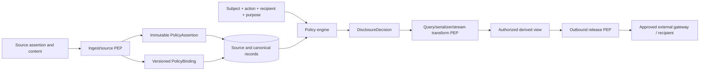

# Section 040: Policy, Releasability, and Cross-Boundary Access Constraints - Research Report

**Topic ID:** IDR-SRV-040 
**Report Status:** Final 
**Research Plan:** [IDR-SRV-040 Policy, Releasability, and Cross-Boundary Access Constraints](../IDR%20Plans/idr-srv-040-policy-releasability-and-cross-boundary-access-constraints.md) 
**Overall Research Plan:** [Glaux Server Overall IDR Research Plan](../IDR%20Plans/overall-idr-research-plan.md) 
**Research Questions Covered:** All questions concerning policy authority, releasability, classification/handling metadata, communities and purposes, controlled data, inference, resource existence, filtering, generalization, delay, aggregation, suppression, source caveats, dynamic data, streaming, command affordances, federation, DDIL, cross-boundary exchange, documentation, observability, and verification 
**Methodology Used:** Authority-ranked standards extraction; accepted-baseline reconciliation; controlled-data/field/inference inventory; end-to-end policy-flow modeling; disclosure-transform and side-channel analysis; profile/failure-mode analysis; policy-matrix and verification traceability 
**Research Time:** Approximately 28 hours of AI-assisted execution on September 15, 2026 
**Approved Standards Baseline:** OGC 23-001 and OGC 23-002 Version 1.0, repository tag `v1.0.0` at [`8e03b236a049849f2ccc24b4fd9fdce5ff69bed2`](https://github.com/opengeospatial/ogcapi-connected-systems/commit/8e03b236a049849f2ccc24b4fd9fdce5ff69bed2) 
**Policy Guidance Check:** SensorML 3.0 security constraints; NIST SP 800-162 and SP 800-53 Rev. 5 Release 5.2.0; W3C PROV; NATO NISP Volume 3 Version 15 references to ADatP-4774/4778/4778.2; RFC 9110 and RFC 9457; OWASP API Security Top 10 2023 checked September 15, 2026 
**Implementation Evidence:** CS-Go `v1.0.4` at [`244f4dd586da685d4d9b75e43f73001028b5bd0e`](https://github.com/SomethingCreativeStudios/connected-systems-go/commit/244f4dd586da685d4d9b75e43f73001028b5bd0e); OpenSensorHub `v2.0.2` at [`235c0eabf24b6d6137b499b4402943d2794b70e6`](https://github.com/opensensorhub/osh-core/commit/235c0eabf24b6d6137b499b4402943d2794b70e6); OS4CSAPI phase-9 at `754411897173c2ec4debaa9bcf4ed9e0f8a9e230`; SECD at `f018fd129bf0d0d1ce75e68198e3ab4d99d937a0` 
**Supporting Resources:** Accepted IDR-SRV-001 through IDR-SRV-039A, controlled-AEP findings, and upstream-history register Version 1.12 
**Document Purpose:** Define a policy-regime-neutral, data-centric Glaux disclosure and cross-boundary enforcement baseline without encoding real markings, selecting a policy engine, approving release, or claiming cross-domain-solution status 
**Author:** OpenAI Codex 
**Accepted By:** Glaux Project Lead 
**Acceptance Date:** September 15, 2026 
**Date:** September 15, 2026 
**Last Updated:** September 15, 2026

---

## Evidence and Decision Legend

| Mark | Meaning |
|---|---|
| N | Normative or controlling published-standard evidence |
| G | Official government or alliance guidance/reference evidence |
| A | Accepted Glaux design baseline |
| I | Pinned implementation or interoperability observation |
| E | Engineering/security analysis inferred from evidence |
| P | Proposed Glaux decision requiring report acceptance |
| X | Known gap, assumption, or unresolved choice |

External policy syntax, markings, and organizational release decisions are not reproduced or invented here. Example identifiers use the reserved `example` namespace and have no operational meaning.

---

## Contents

1. Executive Summary
2. Scope and Plan Alignment
3. Evidence Base and Authority Classification
4. Policy/Releasability Extraction Methodology
5. Policy and Releasability Concept Taxonomy
6. Controlled Data and Sensitive-Field Inventory
7. Enforcement Point Model
8. Resource Existence, Link Filtering, Counts, Extents, Pagination, and Query Behavior Findings
9. Metadata, SensorML, SWE Common, and Document Redaction/Generalization Findings
10. Observation, Status, Event, Latest-Value, and Dynamic-Data Policy Findings
11. Streaming/Event Publication Policy Findings
12. Command/Control, Feasibility, and Command-Affordance Policy Findings
13. Source Trust, Provenance, Ownership, Caveat, and Federation Policy Findings
14. DDIL, Cached Policy, Stale Policy, Synchronization, and Cross-Boundary Sharing Findings
15. Error, OpenAPI, Conformance, Observability, Logging, Metrics, Tracing, and Audit Implications
16. Fixture, Conformance, Security Testing, Performance, and Interoperability Test Implications
17. Downstream Topic Handoff Matrix
18. Recommendations
19. Risks, Constraints, and Open Questions
20. Validation Against This Plan's Success Criteria
21. References

---

## 1. Executive Summary

Glaux should implement **data-centric disclosure policy** as an independent decision layer composed with authentication and authorization. Authentication identifies a subject; authorization permits an action on a resource; disclosure policy decides whether the requested information or affordance may cross the subject, mission, community, organization, security-domain, deployment, or export boundary and in what form. Classification/handling markings, releasability, source caveats, source trust, command authority, safety, and audit are distinct inputs or evidence. None should be represented by one `is_allowed` or `classification` string. **[G/A/E/P]**

The server should preserve three separate truths: the source's immutable policy assertions and caveats; a locally authoritative, versioned **PolicyBinding** that maps recognized assertions and resource relationships into the active policy regime; and each contextual **DisclosureDecision** that allowed, denied, concealed, transformed, delayed, aggregated, or suppressed a view. This prevents a later policy change or federation mapping from rewriting provenance, and prevents an external label from becoming local authority merely because it was present in a payload. **[A/E/P]**

No single national, NATO, coalition, mission, organizational, test, or public regime is hardcoded. A `PolicyBinding` references a scheme/authority/version and structured opaque terms; project fixtures use fictional `urn:example:*` identifiers. NATO ADatP-4774 confidentiality labels and ADatP-4778 binding profiles are relevant candidates for deployments that require them, but Glaux should treat them as external adapters and protected evidence—not claim their implementation or reproduce operational markings in the core model. Unknown, incomparable, unverified, conflicting, or unsupported assertions produce `INDETERMINATE` and quarantine/deny for the affected disclosure; Glaux must never guess a “highest” label across regimes. **[G/E/P]**

Policy must be evaluated at multiple stages. Ingestion verifies and preserves source assertions, checks source authority and minimum acceptance rules, and assigns a binding to the immutable resource version. Storage preserves original/canonical evidence and protects it at its effective policy. Query and serialization evaluate current subject/purpose/resource context and produce an authorized derived view. Streaming evaluates at subscription and per event. Export/synchronization re-evaluates against current outbound, recipient and source constraints immediately before release. Command paths add policy gates to—not replace—authorization, feasibility, safety and dispatch controls. **[A/E/P]**

The disclosure result should be three-state (`ALLOW`, `DENY`, `INDETERMINATE`) plus an **existence disposition** (`REVEAL` or `CONCEAL`) and a versioned, schema-aware transformation plan. Permitted transforms are pass unchanged, project/redact properties or links, generalize precision, aggregate approved inputs, delay until a release condition/time, or suppress the whole representation/event. A transform never fabricates a value, silently relabels data, or removes a required property if doing so makes the response schema-invalid or semantically false. When no truthful valid representation exists, the resource is concealed or access denied. **[E/P]**

Policy defines a caller-specific **authorized view** before data access. Collection predicates, `numberMatched`, `numberReturned`, extents, latest/current values, ordering, pagination, cursors, ETags, links and alternate representations all derive from that view. “Latest” means the newest releasable record in the authorized view, never the global latest with a redaction notice that reveals a hidden update. Opaque cursors and caches bind to the policy/view version. Policy changes invalidate or narrow them; the server does not create observable page gaps by filtering after pagination. **[A/E/P]**

Source policy is preserved but not trusted automatically. The publisher identity, represented source, source authority, source trust, source-issued caveat, local binding, data-owner/custodian policy, recipient/domain policy, and export decision remain separately attributable. Derived data computes a policy binding through an explicit, versioned combination rule over all inputs. If schemes cannot be mapped or combined, derivation/export is held or denied rather than losing a caveat. Federation never imports a peer's release decision transitively. **[A/E/P]**

Glaux is not a cross-domain solution or release authority. It may enforce a deployment's approved policy, build a labeled/provenanced release package, validate recipient capability, and deliver only to an approved external gateway. The competent mission/data authority and accredited cross-domain infrastructure decide and effect an actual cross-domain transfer. Authentication of a federation peer or use of a recognized label syntax is not release approval. **[G/E/P]**

DDIL uses the locally embedded PE/PA and signed, audience-bound, anti-rollback policy bundles accepted by IDR-SRV-039A. Authority never broadens while disconnected. Reads, ingestion, streams, exports and commands continue only in an explicit offline class within policy, identity, source-trust, time-confidence, expiry and revocation bounds. Queued outbound transfers and delayed events are re-evaluated at transmission. Reconnection applies newer policy/trust epochs before expanding access and records unavoidable prior-disclosure risk without pretending disclosure can be undone. **[A/E/P]**

This report establishes no operational markings, policy engine, retention schedule, cross-domain approval, or implementation. IDR-SRV-041 remains unauthorized pending acceptance. It will own full audit/accountability; IDR-SRV-042/043 own final DDIL and synchronization behavior; later architecture, configuration, observability and test topics consume the defined bindings, views, obligations and fixtures. **[A]**

### 1.1 Recommended baseline at a glance

| Decision | Rationale | Implementation consequence | Confidence |
|---|---|---|---|
| Separate source assertion, local binding and disclosure decision | Preserves provenance and current policy truth | Three versioned internal records, no one mutable label field | High |
| Policy-neutral scheme/term references | Deployments differ and core cannot invent markings | Adapter registry plus fictional fixtures only | High |
| Unknown/incomparable means indeterminate | Ordering unrelated schemes can disclose data | Deny/quarantine affected action until explicit mapping | High |
| Evaluate at ingest, access/publication and export | Context and policy change over time | Stage-specific PEPs and atomic evidence |
| Authorized view before query/pagination | Post-filtering leaks counts, ordering and cost | Policy predicates and view-bound cache/cursor/ETag | High |
| Schema-aware allowlisted transforms | Generic field deletion can lie or break clients | Versioned transform catalog with provenance | High |
| Latest means latest visible | Global recency is sensitive | Selector operates after policy predicate | High |
| Preserve all input caveats on derivation/federation | Loss of constraints creates transitive release | Explicit combination/mapping or indeterminate | High |
| Glaux is not a cross-domain solution | Release authority/infrastructure is external | Prepare and enforce packages; approved gateway effects crossing | High |
| Re-evaluate delayed/outbound work | Policy can change between creation and delivery | No cached admission decision authorizes later release | High |

## 2. Scope and Plan Alignment

### 2.1 Included scope

This report defines policy concepts and records; inventories sensitive data and inference; locates PEPs from ingestion through storage, query, rendering, streaming, command, export and diagnostics; defines authorized-view, existence, transform, latest, count/extent, cursor and error behavior; addresses SensorML/SWE, source caveats, derived data, federation, cross-boundary infrastructure and DDIL; and specifies profiles, fixtures, tests, evidence and downstream handoffs.

### 2.2 Explicit exclusions

It does not define or reproduce operational classification/releasability markings, national rules, NATO implementation profiles, mission communities, clearance attributes, transfer guards, data-loss-prevention products, enterprise policy engines/languages, policy administration products, cryptographic binding implementation, label downgrade authority, legal review, accreditation, or ATO. It does not assert that any resource is releasable outside a fictional fixture.

Detailed identity/ZTA architecture remains IDR-SRV-039/039A; full audit remains IDR-SRV-041; DDIL public behavior and conflict handling remain 042/043; deployment and implementation choices remain later topics. This report does not enable command dispatch, inbound draft Part 3, federation, or cross-domain transfer.

### 2.3 Plan coverage

All 21 required sections are present. Sections 5-7 provide the concept, controlled-data and enforcement models and the required 14-column matrix. Sections 8-15 define concrete disclosure behavior for every required surface. Sections 16-20 provide test/evidence, handoffs, recommendations, risks and success-criteria traceability.

## 3. Evidence Base and Authority Classification

### 3.1 Controlling OGC/project evidence

CSAPI Part 1 expects protected functionality but intentionally does not define a policy regime. Part 2 inherits that security posture. SensorML 3.0 explicitly warns that documents may contain confidential or sensitive data and defines whole-document `securityConstraints` using external security models; SWE Common extension points can support finer-grained property tags. The standard does not interpret those tags or authorize release. SensorML identifiers, classifiers, contacts, location, capabilities, characteristics, deployments and command-related descriptions can all be sensitive even where intended to aid discovery. **[N/E]**

Accepted Glaux reports require source fidelity, authoritative resource versions, contextual semantics, one guarded write boundary, publisher/source/authority separation, policy-first queries, policy-bound streaming cursors, separate command authorization/safety, and ZTA PEPs at query, serializer, event, command and diagnostics boundaries. This report composes those invariants. **[A]**

Controlled AEP-4789 evidence remains governed by the project's recorded handling restrictions. Only accepted releasable findings are used. No controlled wording, operational marking, source identity, mission relationship, topology or command target is reproduced. **[A]**

### 3.2 Policy and provenance guidance

NIST SP 800-162 defines ABAC as decisions over subject, object, requested operation and environment attributes against policy/rules/relationships and explicitly addresses information sharing within and between organizations. NIST SP 800-53 provides control objectives for access enforcement, information flow, least privilege, security attributes, boundary protection, audit and data protection; deployment tailoring is not selected here. **[G]**

W3C PROV defines entities, activities, agents, attribution and derivation for interoperable provenance. Glaux may map internal provenance to PROV concepts, but provenance supports assessment—it is not policy or proof of trust by itself. **[N/E]**

The NATO Interoperability Standards and Profiles catalogue Volume 3 Version 15 lists ADatP-4774 Edition A Version 1 for confidentiality metadata label syntax, ADatP-4778 Edition A Version 1 for metadata binding, and ADatP-4778.2 Edition A Version 1 for binding profiles. These establish relevant external adapter candidates. The public catalogue entry alone does not specify a Glaux policy, authorize markings, or make a binding valid for a particular deployment. **[G/E]**

RFC 9110 governs HTTP semantics and caching; RFC 9457 supplies problem-detail structure. Neither authorizes policy disclosure. OWASP's BOLA/BOPLA categories reinforce that fields, relationships, counts and indirect representations require server enforcement. **[N/E]**

### 3.3 Implementation evidence and currency

OSH demonstrates configurable/granular permissions, while CS-Go, pygeoapi proofs, SECD and client work show the interoperability cost of hidden fields, broad discovery, static demo identity and uneven security descriptions. No studied implementation provides a complete, standards-neutral data-centric releasability model. Those observations are warnings and test inputs, not normative precedent. Sources were checked September 15, 2026; no material CSAPI-history delta was found, so the shared register remains Version 1.12.

## 4. Policy/Releasability Extraction Methodology

The analysis followed six passes:

1. Extract standards-visible data, optional fields, links, collections, dynamic values, commands and diagnostics without inferring policy semantics the standards do not define.
2. Reconcile accepted Glaux authority, storage, query, stream, command, identity and ZTA boundaries.
3. Inventory each data category's directly sensitive fields and indirect existence, relationship, location, time, capability, volume, activity and topology inferences.
4. Trace source assertion → normalization/binding → storage → query/view → publication/stream → export/synchronization → audit/diagnostics.
5. Evaluate pass, project, generalize, aggregate, delay, suppress, conceal and deny behaviors for schema truth, least disclosure, interoperability, DDIL, performance and testability.
6. Map every decision to PEP, evidence, invalidation, safe error, negative fixture and downstream owner.

The methodology never compares fictional “classification levels,” assumes that one label is higher than another, or treats absence as public. Qualitative consequence—not fake risk scoring—prioritizes physical command effects, source/mission topology, precise location/time, cross-domain release, raw payloads and aggregated audit/observability.

## 5. Policy and Releasability Concept Taxonomy

| Concept | Meaning in Glaux | Explicit non-equivalence |
|---|---|---|
| Authentication | Evidence identifying principal/client/workload | Not permission or releasability |
| Authorization | Permission to attempt action on resource | Not permission to disclose every property/form |
| Policy | Versioned rules/relationships mapping facts to decisions/obligations | Not a single label or role |
| Classification/handling assertion | External/source statement under a named scheme/authority | Not locally trusted or ordered automatically |
| Releasability | Contextual authority to disclose to a recipient/community/domain/purpose | Not equivalent to classification string |
| Caveat/constraint | Additional use, dissemination, source or handling restriction | Not discardable during normalization |
| Community/purpose | Named intended recipient group/use under a policy scheme | Not inferred from tenant or token alone |
| Security/mission/tenant domain | Administrative/policy namespace and boundary | Not implicit network trust or organization identity |
| Data owner/custodian/steward | Distinct policy, operational or governance responsibilities | Not source, publisher or API caller by default |
| Source trust/authority | Current right/confidence to assert specific facts | Not disclosure permission |
| Command authority/safety | Right and safety to request/dispatch an effect | Not information release decision |
| Redaction/projection | Omit allowed properties/relationships from a view | Not mutation of source truth |
| Generalization | Replace precision with an approved truthful coarser representation | Not fabricated value |
| Aggregation | Derive approved summary from policy-compatible inputs | Not automatically less sensitive |
| Delay | Withhold until an explicit release condition/time and re-evaluate | Not queued pre-authorization |
| Suppression/concealment | Emit no object/event and avoid confirming existence | Not a false assertion that it never existed |
| Derived view | Immutable or cacheable policy-contextual representation with provenance | Not a second authority record |
| Audit-only record | Evidence accessible only through protected accountability action | Not hidden from required authorized oversight |

### 5.1 Internal policy records

| Record | Required content | Lifecycle |
|---|---|---|
| `PolicyAssertion` | source/issuer/scheme/version, opaque terms/caveats, claimed scope, binding evidence/digest, observed time, original resource/version reference | Immutable source-fidelity evidence; untrusted until mapped |
| `PolicyBinding` | binding ID; exact resource/version/property scope; local authority and policy-set/version; security domain; normalized scheme/term references; owner/custodian/source/community/purpose constraints; validity; combination rule; assertion/derivation provenance; integrity/state | Locally authoritative and versioned; superseded, never overwritten |
| `DisclosureDecision` | decision ID; subject/client/recipient/domain/purpose; action/resource/view; policy and binding versions; allow/deny/indeterminate; existence disposition; transformation plan; evidence; expiry; safe reason; audit linkage | Contextual, immutable evidence; never reusable outside binding |
| `DerivedViewProvenance` | input resource/version/bindings; transform catalog/version/parameters; decision; generated time; schema/profile/media type; output digest/binding | Binds transformed/aggregated output to its inputs and policy |

These are internal Glaux records, not new public CSAPI resources or a selected interchange standard. Operational deployments may serialize recognized assertions through approved ADatP or other adapters while retaining this neutral internal separation.

### 5.2 Policy combining and defaults

Every policy set defines explicit attribute authorities, combination rules, missing/conflict behavior and transformation authority. Source caveats can impose constraints but cannot grant broader local release. Data-owner, source, domain, recipient and purpose rules must all permit the disclosure. Unknown scheme, unverified binding, missing mandatory attribute, incomparable terms, conflicting authorities, expired mapping or evaluator error returns `INDETERMINATE`; the PEP denies/conceals/quarantines according to the operation. No “unmarked means public,” “local means trusted,” lexicographic label order, last-writer-wins, or client-selected downgrade is allowed.

## 6. Controlled Data and Sensitive-Field Inventory

### 6.1 Required policy/releasability matrix

| Controlled data category | Resource family | Sensitive field or inference | Policy concept | Enforcement point | Filter/redact/generalize/deny behavior | Link/count/extent/pagination implication | Streaming/event implication | Command/control implication | DDIL/federation implication | Audit requirement | Test/security-test implication | Downstream topic handoff | Notes / unresolved issues |
|---|---|---|---|---|---|---|---|---|---|---|---|---|---|
| Landing/conformance | service metadata | capability/profile and enabled-module inventory | existence/capability disclosure | route + document generator | public profile projection or protect/conceal | links only to visible surfaces; no hidden counts | advertise only enabled authorized stream modes | hide real tasking capability | node/profile view may differ; bind version | view/profile/version access | public vs protected graph diff | 046,050,055,056 | Conformance truth cannot be fabricated |
| OpenAPI/AsyncAPI | API definition | private routes, security schemes, topics, internal endpoints/examples | capability and topology policy | capability registry + renderer | generate protected/profile view; sanitize | operations/links derived from same registry | topic examples omit resource/source IDs | no hidden command affordance | offline bundle must match node profile | definition/view digest | route/spec/security parity | 047,050,055 | Accepted OAS/experimental AsyncAPI versions unchanged |
| System | feature resource | identifiers, owner, contacts, location, capabilities, history | object/property/existence | query + serializer | pass/project/generalize/conceal | child/parent links, bbox/time/count visible-view only | changes suppressed/redacted per view | may reveal controllable target | preserve binding on federation/cache | decision/binding/transform | ID/property/link/count/geometry oracles | 040,042,055 | IDs are not secrets by themselves but relationships may be |
| Deployment | feature resource | platform association, operational time/location/configuration | relationship/mission scope | query + serializer | project/generalize/conceal | extents and related Systems filtered | operational changes can reveal activity | reveals availability/target context | delayed federation may need current release | decision and transform provenance | relationship and timing inference | 042,055 | Parent/child policies may differ |
| Procedure/SensorML | process document | model, input/output, contacts, capabilities, modes, configuration | document/property/caveat | document store + schema-aware transformer | approved property projection/generalization or deny whole doc | related resource/schema links filtered | document-change event uses output view | inputs/capabilities expose command affordance | preserve external security assertion/binding | source assertion, binding, transform digest | schema-valid golden views and active-content tests | 053,055,056 | Required fields may force whole-document deny |
| Sampling/Control Feature | feature resource | precise location/geometry and target relation | spatial/existence/control | spatial query + serializer | approved grid/precision/generalized geometry or conceal | bbox/count/order after transformed visible set | movement events use authorized precision | control feature can disclose targetability | domain-specific transform mapping required | transform/version/input geometry digest | boundary cells, bbox and timing tests | 040,054,055 | Generalization must remain truthful |
| Observed/controlled property | semantic metadata | capability, quantity, units/range/allowed values | property/capability | query + serializer | project or conceal stream/control definition | property summaries/counts filtered | event names/content cannot expose hidden property | parameter ranges reveal effect capability | vocabulary package may be policy-scoped | decision/property version | alternate encoding and schema-link tests | 053,055 | Vocabulary meaning is separate from disclosure |
| DataStream | dynamic parent | observed capability, source, time/spatial extent, latest | object/property/source | query + serializer | project/generalize/conceal | counts/extents/latest over visible observations only | subscription/topic view bound to stream policy | no direct command authority | cached/federated view includes binding | policy/stream/view versions | hidden stream, extent/latest oracle | 042,054,055 | Parent visibility does not grant every observation |
| Observation/result | dynamic record | value, precise time/location, quality, provenance, source | record/property/time/spatial | time-series predicate + serializer | filter/project/generalize/aggregate/delay/conceal | count/order/page/latest after policy; no hidden gap | per-event decision; policy-view sequence | may reveal target state/outcome | local cached record retains original binding | record/version/decision/transform | mixed policy, correction, latest, aggregate cases | 042,043,053,055 | Aggregates need derived binding |
| Status snapshot | dynamic semantic record | operational mode, health, position, readiness | operational sensitivity/freshness | query/materialization + serializer | filter/generalize/delay/conceal | latest visible selector; extent/count safe | event suppression/delay without global sequence leak | key command safety input protected separately | stale status does not become releasable | decision/freshness/transform | hidden freshest, older-visible semantics | 042,055 | Do not invent “current” from hidden data |
| System event | domain event | activity occurrence, transition, source/target relationship | event existence/type/content | event projection + publication PEP | suppress/project/delay; no fake event | replay cursor and visible sequence scoped | event type/topic/gap all policy-controlled | command events protected at action/property level | delayed sync re-evaluated before release | source event/output decision linkage | gap/timing/replay inference | 041,042,055 | Audit event is separate |
| Source registration/health | control metadata | publisher identity, represented source, trust state, endpoints, failures | source topology/trust | admin/query/diagnostic PEP | admin-only/protected aggregate; conceal ordinary clients | no links/counts identifying other sources | trust-change event protected/internal | gateway/source state may affect command gates | bilateral federation mapping only | every trust/mapping change | cross-source enumeration and diagnostic tests | 041,048,055 | Registration is not disclosure authority |
| Raw payload/quarantine | source evidence | original data, malformed content, credentials accidentally supplied, policy assertions | source fidelity/evidence | ingest/quarantine/audit access | never ordinary API; protected exact access or sanitized excerpt | no public link/count/extent | never streamed as domain event | command raw input strongly protected | export only by explicit evidence action | custody/access/digest/decision | secret canary, malformed and policy-conflict fixtures | 041,047,053,055 | Retention from IDR-SRV-030 |
| Validation artifact | diagnostic evidence | invalid values, hidden schema/capability, parser/source internals | diagnostic disclosure | validation + problem/audit serializer | safe class/location; protected detail | no existence/link oracle | aggregate safe failure event only | hide parameter/safety/policy constraints | local details not federated by default | request/source/artifact digest | differential error-body/timing tests | 041,048,055 | Schema-valid error can still leak |
| ControlStream/definition | command feature | target, action, parameters, limits, gateway, mode | command-affordance existence | query + serializer/link | conceal or schema-aware projection | counts/extents/links only visible targets | topic/event names cannot expose hidden controls | specialized authorization/policy/safety all apply | operational transfer requires approved profile | view/authority/policy versions | hidden affordance and parameter-range tests | 041,042,055 | Role alone insufficient |
| Command/feasibility | command resources | intent, parameters, submitter, target, analysis evidence/diagnostics | object/property/purpose | command/feasibility PEPs + serializer | deny/conceal/project safe status/result | related links/counts/status history filtered | per-event view and delayed release | all IDR-038 gates remain independent | queued/offline command re-evaluated before dispatch/release | atomic decision/lifecycle/effect evidence | cross-actor/status/result/reason tests | 041,042,055 | Feasible never means releasable or authorized |
| Audit record | accountability | combined identity, resource, source, policy, command, topology | audit-only/need-to-know | audit query/export PEP | minimize/project; exact access separately authorized | counts/time ranges can reveal activity | no public stream; protected audit feed if designed | command audit visibility distinct from command view | protected local buffer and governed sync | access-to-audit is itself audited | role/purpose, inference and export tests | 041,048,055 | Full model belongs to 041 |
| Logs/traces | operational evidence | identifiers, errors, policy reasons, endpoints, payload fragments | diagnostic minimization | pre-sink redaction + export PEP | tokenize/drop/coarsen; never raw secrets/policy/payload | metric/log counts not public | trace stream protected and destination-bound | no target/parameter/safety detail | buffer/export retains policy binding | redaction/export outcome | canary secret and log-injection tests | 041,047,048,055 | Redact before formatter/buffer |
| Metrics/health | operational aggregate | hidden-resource volume, source/command activity, topology/dependency state | aggregate/operational | metric instrument + endpoint | low-cardinality aggregate; liveness minimal; other views protected | no policy/source/resource labels in public dimensions | stream counts can expose activity | command-denial/dispatch metrics internal | local health detail protected | access/profile and aggregation rule | cardinality and inference comparison | 048,054,055 | Aggregate can remain sensitive |
| Cache/cursor/ETag | derived control artifact | existence, policy version, query/view identity, recency | authorized-view binding | cache/cursor issuance/validation | opaque, context-bound, expire/invalidate | computed after filter; no cross-view reuse | replay/stream cursor uses visible sequence | command tokens are separate single-use evidence | node/domain/epoch bound | issue/use/reject safe digest | cross-principal/policy/version swap | 042,043,055 | Never embed readable markings |
| Derived aggregate | generated data | contributing populations and hidden changes | derivation/combination/generalization | aggregate engine + serializer | only approved function/minimum population/precision; else deny | counts/extents are outputs with own binding | publish only derived-view event | never used to bypass command-state policy | all input caveats combine or indeterminate | input set/query/transform/output binding | differencing, small-set and update inference | 040,054,055 | Differential privacy out of current scope |
| Federation/export package | exchange artifact | peer/domain/source/marking/provenance and hidden payload | recipient/releasability/cross-boundary | outbound release PEP + approved gateway | allow exact package or deny; no silent downgrade | manifests/counts disclose only approved content | queued events re-evaluated at send | commands/results require explicit separate profile | preserve bindings/caveats and recipient mapping | release decision, package digest, gateway receipt | wrong recipient, unknown label, replay, policy change | 041,042,043,056 | Glaux is not CDS/release authority |
| DDIL cache/bundle | local protected state | cached data, identities, policy/trust epochs, offline classes | staleness/anti-rollback | local PE/PA and storage PEP | exact offline class; expire/conceal/deny | view artifacts bind node/policy epoch | close/suppress after expiry | dispatch only explicit offline grant | never broaden; reconnect before expansion | bundle/clock/decision/offline reason | stale/rollback/split-brain/reconnect | 041,042,043,055 | Numeric bounds deferred |
| Test fixture/golden | synthetic evidence | accidental real label/credential/source/target | environment/isolation | fixture loader + CI scan | fictional namespace only; production reject | isolated namespace/counts | simulator/test topics isolated | no real adapter/target | no production federation identity | fixture/build/profile digest | secret/marking scans and isolation tests | 047,053,055 | Examples have no operational meaning |

### 6.2 Inventory conclusions

Sensitivity is not confined to obvious payload values. Existence, absence, relationship, precision, freshness, ordering, volume, frequency, capability and failure reason can reveal operational state. Every generated or derived artifact therefore has its own policy binding or is inseparably keyed to an authorized decision/view; it cannot inherit “public” from its media type or endpoint.

## 7. Enforcement Point Model

### 7.1 End-to-end policy flow

The diagram separates preservation, local interpretation, contextual disclosure and actual boundary transfer. An approved source assertion cannot bypass local binding; a previously rendered view cannot bypass a fresh outbound decision.

### 7.2 Stage responsibilities

| Stage | Required decision/control |
|---|---|
| Source registration | Approve which publisher/source may assert which policy scheme/scope; no self-declared authority |
| Ingestion | Validate assertion binding/integrity, preserve original, map recognized terms, apply minimum acceptance/quarantine policy |
| Storage | Protect every source/canonical/derived version at effective binding; keep original and transformed data distinct |
| Metadata update | Rebind exact new resource version; prevent assignment/downgrade of server-owned policy fields |
| Query/list/item | Build authorized predicate/view before fetch, count, extent, order or pagination |
| Serialization/link | Apply schema-aware property/relationship/affordance transform and safe existence/error behavior |
| Latest/aggregate | Select/derive only from policy-compatible visible inputs; assign output binding/provenance |
| Stream/replay | Authorize subscription and each emitted event/view; scope topic, sequence, cursor and gaps |
| Command/feasibility | Compose policy with authorization/safety; protect affordances, inputs, reasons, status and results |
| OpenAPI/conformance/docs | Generate profile/policy view from capability registry; sanitize and avoid hidden topology |
| Logs/metrics/traces/audit | Minimize/redact before sink; separately authorize access/export |
| DDIL cache | Persist data, binding, policy/trust epochs and expiry together; enforce local offline class |
| Federation/sync/export | Re-evaluate recipient/domain/purpose/source/outbound policy at send; preserve caveats/binding/provenance |
| Approved boundary gateway | Externally validate/filter/transfer under deployment accreditation; never implied by Glaux decision alone |

### 7.3 Decision and transform contract

The IDR-SRV-039A decision envelope is extended with:

- `existenceDisposition`: `REVEAL` or `CONCEAL`;
- `contentDisposition`: `PASS`, `PROJECT`, `GENERALIZE`, `AGGREGATE`, `DELAY`, or `SUPPRESS`;
- transform catalog/version and typed parameters;
- source and effective PolicyBinding IDs/versions;
- recipient/community/domain/purpose context;
- schema/profile/media-type target;
- output-binding and provenance obligation;
- view/cursor/cache identity and decision expiry;
- safe public outcome plus protected reason.

If the PEP cannot implement an obligation exactly, the outcome is deny/conceal. Transform code is allowlisted, deterministic, side-effect-free, resource/schema aware, bounded in cost and tested against golden representations. Policy evaluation occurs before access where possible and again before any cross-boundary side effect whose inputs may have changed.

## 8. Resource Existence, Link Filtering, Counts, Extents, Pagination, and Query Behavior Findings

### 8.1 Authorized-view invariant

Every read operation is evaluated over an **authorized view**, not over the full collection followed by response filtering:

1. authenticate and establish immutable security context;
2. authorize the operation under IDR-SRV-039/039A;
3. resolve effective PolicyBindings and disclosure context;
4. construct a policy-compatible object/property/relationship predicate;
5. execute filter, temporal/spatial search, sort, aggregation, count and pagination inside that view;
6. apply deterministic serialization obligations; and
7. re-check any expiring or outbound decision before bytes or events leave the trust zone.

Fetching broadly and dropping rows after pagination is prohibited. It leaks population size and produces short/empty pages, unstable cursors and timing differences. A datastore that cannot express the authorized predicate must use a bounded server-owned materialized view or deny the operation; it must not silently weaken the rule.

### 8.2 Existence and errors

Existence disclosure is an explicit decision independent of content disclosure:

- unauthenticated requests use the authentication behavior defined by IDR-SRV-039;
- an authenticated requester denied access to a resource whose existence must be concealed receives the same public `404` representation, headers and materially equivalent timing class as a nonexistent identifier;
- `403` is used only where policy permits acknowledging the resource and operation;
- malformed requests may receive `400` only when validation does not disclose whether a protected target exists;
- protected policy reasons, labels, source identity and rule identifiers never enter the public problem detail;
- collection responses omit concealed resources without placeholders.

The audit trail records the actual internal outcome and protected reason. Publicly equal outcomes need not share an internal audit category.

### 8.3 Links and relationships

Links are disclosures. The link PEP evaluates target, relationship, action, representation and context before serialization. It removes links to concealed parents, children, deployments, procedures, datastreams, observations, controls, alternate encodings, history, source records and administrative endpoints. It must also suppress templated links whose variables or URI patterns reveal hidden topology.

A visible resource can therefore have fewer links than the canonical record. Required-link constraints must be checked against the target response profile: if removal makes a claimed profile invalid or materially false, the server returns a safer valid projection or denies/conceals the representation. It must not emit a dead link as camouflage.

### 8.4 Counts, extents and aggregate metadata

`numberMatched`, `numberReturned`, spatial/temporal extents, histograms, facets and summary statistics are calculated only from the authorized view. Even an authorized-view aggregate can reveal sensitive operational facts, so the decision may:

- omit an optional value;
- return an approved coarse bucket or generalized extent;
- delay or suppress the aggregate;
- require a minimum cohort and policy-compatible inputs; or
- deny/conceal the aggregate operation.

The server never substitutes global totals. A transformed aggregate becomes a derived resource with its own PolicyBinding and DerivedViewProvenance; it does not inherit a guessed least/most-restrictive value across incomparable schemes.

### 8.5 Sort, pagination and cursors

Sorting and cursor construction occur within the authorized view. Cursors are opaque, integrity-protected and bound to tenant/profile, policy/trust epochs, normalized query, sort, page size, subject/recipient context and projection. Reuse under a different view fails safely without revealing whether hidden data caused the failure. Policy change invalidates or narrows outstanding cursors; it never expands them implicitly.

Offset pagination is permitted only when its count/timing characteristics are acceptable for the selected profile. Stable keyset pagination is preferred for dynamic collections. Timing and response-size equalization may mitigate practical probes, but no constant-time guarantee is claimed for a network API.

### 8.6 Query validation and inference resistance

Filter properties, sort keys, coordinate systems, temporal predicates and stored-query identifiers are themselves policy-scoped. The server validates syntax before expensive execution but avoids target-specific diagnostics until disclosure is authorized. It rejects unbounded query complexity, repeated adaptive probing and high-cost combinations through the rate/resource controls of IDR-SRV-039.

Property filtering cannot request a forbidden field indirectly through aliases, functions, joins, aggregates or alternate encodings. Generalized geometry and time use approved grid, region, bucket or precision transforms; the server never invents a false point or timestamp. Query plans and statistics remain internal controlled diagnostics.

## 9. Metadata, SensorML, SWE Common, and Document Redaction/Generalization Findings

### 9.1 Whole-document and property-level controls

SensorML 3.0 explicitly recognizes that security constraints may protect an entire document and allows property-level constraint extensions. This supplies an encoding hook, not an authorization or release decision. Glaux therefore preserves source `securityConstraints` as PolicyAssertions and maps supported values through deployment-approved adapters into PolicyBindings. Unknown values remain preserved and yield `INDETERMINATE` where relevant.

SWE Common components, identifiers, classifiers, contacts, capabilities, characteristics, positions, modes, inputs, outputs, parameters, data interfaces and attached documents can each disclose capability or topology. The serializer applies policy to the complete semantic graph, including referenced resources and binary attachments, rather than removing only visibly marked JSON/XML fields.

### 9.2 Schema-valid projection rules

An approved transform catalog defines, per schema/profile/media type:

- fields and relationships that may be projected;
- substitutions explicitly allowed by the standard;
- geometry/time/numeric generalization operations;
- how identifiers and references are pseudonymized, if permitted;
- canonical ordering, precision and media-type behavior;
- validation rules and the output PolicyBinding; and
- provenance needed to explain the derived view without exposing protected causes.

Transforms operate on the typed canonical model before JSON/XML/binary encoding. Text replacement in serialized output is not a policy mechanism. If removal of a mandatory field would make the representation invalid, misleading or semantically unsafe, the server chooses a different valid approved profile or denies/conceals the complete resource. It never fabricates values to satisfy a schema.

### 9.3 Original, canonical, and derived truth

The immutable source payload, validated canonical version and each materialized derived view are distinct records. Derived content references its inputs, transform/version, PolicyBinding, decision evidence and creation time through DerivedViewProvenance. A derived view cannot overwrite or be mistaken for source truth. Checksums and signatures are retained and described only within their disclosure scope; a source signature generally does not authenticate transformed output.

Policy-sensitive attachments are fetched through a server-controlled PEP. External URLs are not passed through merely because the parent document is visible. The same rule applies to contact endpoints, thumbnails, schemas, tasking interfaces and alternate-format links.

### 9.4 Profile and conformance claims

A restricted representation may claim only conformance it actually satisfies. Glaux records the canonical conformance evaluation separately from the response-profile evaluation. If projection breaks a requirement class, the server omits that profile/format or reports the narrower supported profile; it must not advertise full conformance for a redacted but invalid representation.

## 10. Observation, Status, Event, Latest-Value, and Dynamic-Data Policy Findings

### 10.1 Observation disclosure

Observation control applies jointly to system/datastream identity, phenomenon/result time, feature of interest, procedure, observed property, result structure, values, quality, valid time and provenance. A visible datastream does not imply that all of its observations or fields are visible. Binary result blocks are decoded or structurally projected by approved codecs; opaque payloads that cannot be safely inspected are passed only under an explicit whole-payload rule or denied.

Filtering and aggregation use only policy-compatible observations. A result produced from differently governed inputs receives an explicit derived binding decided by an approved combining rule. Incomparable or conflicting rules result in hold/deny, not an assumed hierarchy. Differential privacy and disclosure-control algorithms beyond deterministic approved aggregation are deferred research, not an implicit feature.

### 10.2 Latest-value semantics

`latest` means the newest record in the requester's authorized view. It never means the global newest record with its value hidden, and the server does not reveal that a newer concealed record exists. If no releasable record exists, the endpoint follows the selected existence rule. `ETag`, `Last-Modified`, cache age and polling behavior are generated from the authorized view so they do not signal concealed updates.

An observation delayed by policy is reconsidered at release time. Its actual phenomenon/result times remain truthful within any approved temporal generalization; the server does not rewrite freshness merely to make delayed data appear current.

### 10.3 Status and events

Status values and system events can disclose availability, movement, operating mode, faults, maintenance, source activity and command effects. They use the same binding, view and transformation rules as observations. Event type names, correlation identifiers, sequence values, payload schemas and links are controlled fields.

Derived state must not combine concealed events into a visible transition unless the derived result has an approved output rule. A visible heartbeat or absence of one is also a disclosure. Health endpoints intended for infrastructure therefore expose only a minimal service-health contract and keep resource-specific state behind administrative policy.

### 10.4 Cache validators and variants

Every representation cache key and validator includes the authorized-view identity, target profile/media type, relevant binding/policy/trust epochs and transform version. Shared caches must not serve one requester's representation to another context. `Vary` is used where HTTP negotiation is sufficient, but sensitive authorization state is not placed in public headers; server-side partitioning remains mandatory.

Policy tightening invalidates affected variants. Policy relaxation requires a new request and decision rather than revealing additional content through an old cursor, conditional request or cached body.

## 11. Streaming/Event Publication Policy Findings

### 11.1 Two-level authorization

Subscription creation authorizes the requested collection/topic, filters, schema, delivery channel, recipient and retention/replay bounds. Each event is then re-evaluated against current subject/workload, resource binding, source trust, recipient/purpose, policy epoch and transform support immediately before emission. Subscription permission alone is never a durable grant to all future content.

The broker/transport is not trusted to perform all content policy. Glaux either publishes into policy-view-specific channels after application PEP evaluation or uses an equivalently enforced trusted adapter with decision evidence. Broad internal topics must not be exposed directly to clients.

### 11.2 Sequence, gaps, heartbeats and replay

Externally visible sequences and cursors are scoped to the authorized view. They do not reuse global offsets where gaps reveal concealed events. Heartbeats, watermarks, lag, backlog size and replay bounds likewise describe only the visible channel or are suppressed/generalized.

Replay performs fresh policy evaluation; possession of a cursor is not release authorization. If policy or trust changes, an existing subscription is re-evaluated, narrowed, paused or closed with a safe reason. A delayed event is evaluated again at actual release. Revocation cannot retract bytes already disclosed, so the server records the boundary event and prevents later replay/cache reuse.

### 11.3 Event transformation and failure

Event transforms are schema-aware and deterministic. The envelope, subject, type, time, correlation data, payload and links are all controlled. If a required payload element cannot be released without invalidating the event contract, suppress the whole event. The system may emit a generic policy-view-local control event only when that control event itself is authorized and cannot be correlated to hidden activity.

Backpressure, retry and dead-letter handling preserve PolicyBinding and decision evidence. Dead-letter queues and broker diagnostics are controlled stores. Cross-boundary delivery is an outbound transfer and requires a fresh decision at the actual send point.

## 12. Command/Control, Feasibility, and Command-Affordance Policy Findings

Policy/releasability does not replace authentication, API authorization, CommandAuthorityGrant, ControlAuthorityLease, feasibility, deterministic safety validation, approval/override handling or audit established by IDR-SRV-038 and IDR-SRV-039. A command can be releasable to view yet impermissible to dispatch, or dispatch-authorized while its detailed result must be redacted.

The following are separate protected objects:

- existence of a ControlStream and command definition;
- supported parameters, ranges, modes and tasking endpoint;
- feasibility request, normalized input, intermediate rationale and result;
- command resource, lifecycle state, schedule and approvals;
- dispatch ticket, adapter/gateway route and acknowledgements;
- status, result, exception, cancellation and protected audit evidence.

Affordance generation occurs from the intersection of API authorization, current command authority/lease, policy disclosure and capability/safety context. Absence of an affordance must not reveal which conjunct failed. Definitions and feasibility diagnostics receive schema-aware projections; unsafe ambiguity or a removed required field causes deny, not a guessed value.

Immediately before dispatch, Glaux re-evaluates the IDR-SRV-038 gates and the outbound policy decision. Cross-boundary commands and returned status/results default deny unless an explicit deployment-approved path, recipient/domain/purpose rule and gateway exist. A Glaux disclosure decision is not evidence that the external boundary transfer is accredited.

## 13. Source Trust, Provenance, Ownership, Caveat, and Federation Policy Findings

### 13.1 Independent dimensions

Glaux represents these dimensions independently:

- authenticated publisher and publishing workload;
- asserted source/origin and custody chain;
- source-registration trust and integrity status;
- immutable source PolicyAssertions/caveats;
- locally authoritative normalized PolicyBinding;
- resource owner and custodian;
- subject, recipient/community/domain and declared purpose;
- authorization, disclosure and outbound-export decisions; and
- PROV-compatible Entity/Activity/Agent lineage for source and derived views.

W3C PROV helps a consumer assess lineage, quality and reliability; it is not a policy language and does not grant access. Source trust affects whether data/assertions are accepted and how decisions are qualified, but a trusted source is not automatically releasable.

### 13.2 Assertion and binding rules

Only a registered source may assert an approved scheme within its assigned scope. Assertions are immutable evidence. A deployment-controlled mapping produces a versioned PolicyBinding for an exact resource/version/property or relationship. Source caveats can narrow disclosure but never grant broader release than local policy. A publisher cannot write server-owned effective bindings, decision fields or trust attributes.

Combining behavior is explicit and versioned. Equivalent supported terms may be normalized; ordered comparison occurs only within a declared comparable scheme; mutually applicable restrictions are conjunctive unless an approved rule says otherwise. Unknown, unverifiable, conflicting or cross-scheme-incomparable inputs yield `INDETERMINATE` and deny/quarantine. No last-writer-wins rule and no guessed “most restrictive” ordering is permitted.

### 13.3 Federation

A peer's decision or successful prior release is evidence, not local authority. Federation requires bilateral, explicitly scoped mappings for identity/trust, policy vocabulary, recipients/domains, purpose, resource type, action, expiry and provenance. Release is not transitive through a chain of peers. Unsupported markings, missing recipients, stale mappings or unverifiable provenance fail closed.

Imported data retains every source caveat and lineage record. Locally derived restrictions may be added but source evidence is not erased. Re-export uses current local and source constraints and names the intended next recipient; a generic “federated” permission is insufficient.

## 14. DDIL, Cached Policy, Stale Policy, Synchronization, and Cross-Boundary Sharing Findings

### 14.1 Offline authority envelope

DDIL operation uses the signed, versioned, anti-rollback policy/trust bundles and bounded local authorization envelope from IDR-SRV-039A. Cached data is stored with its PolicyBinding, source assertions, trust/policy epochs, integrity evidence, expiry and offline disclosure class. Disconnection never expands authority.

If required policy, recipient, revocation, time or source-trust inputs are absent or stale beyond their approved limit, the decision is `INDETERMINATE`; the server denies, conceals or quarantines according to the safe failure contract. A deployment may pre-authorize a narrow offline view, but this must be explicit, locally verifiable, time-bounded and testable.

### 14.2 Queues and reconnection

Queued publications, federation transfers, command dispatches, replay and synchronization are prospective side effects. Each is re-evaluated at actual send/apply time; a decision made when queued is not sufficient. Queue entries preserve intended recipient/domain/purpose, exact resource versions, binding/policy epochs and decision evidence.

On reconnection, Glaux verifies bundle monotonicity, applies revocations/tightening before any expansion, refreshes source/recipient trust and resolves policy conflicts before releasing queued content. Newly relaxed policy does not auto-release the historical backlog unless an explicit replay/export request is authorized. Already disclosed data cannot be recalled; the audit record captures the decision and boundary used.

### 14.3 Cross-boundary responsibility boundary

Glaux is not a cross-domain solution, transfer guard, release authority or accreditation mechanism. It may assemble a schema-valid, policy-evaluated, labeled/provenanced package and submit it to a specifically approved external gateway. The competent authority and accredited boundary infrastructure decide and effect transfer. Gateway rejection, transformation and receipt evidence are ingested as protected audit/provenance data; Glaux must not report “released” merely because it handed off bytes locally.

NATO's published interoperability-profile catalog identifies ADatP-4774/STANAG 4774 confidentiality-label syntax and ADatP-4778/STANAG 4778 metadata binding, including binding profiles. These are candidate adapter interfaces for applicable deployments, not universally required Glaux core semantics and not evidence of project approval to implement any operational marking scheme.

## 15. Error, OpenAPI, Conformance, Observability, Logging, Metrics, Tracing, and Audit Implications

### 15.1 Safe errors and diagnostics

RFC 9457 problem details carry stable public type/status/title plus a correlation identifier that is safe for the caller. Instance identifiers, validation paths, allowed values, source names, policy labels, rule identifiers, topology and internal exceptions are included only when independently releasable. Public `detail` never contains raw policy-engine text.

Operational diagnostics use protected channels with least-privilege access. Correlation must not let a low-privilege caller retrieve a richer record through an administrative endpoint. Validation ordering and latency are tested for resource-existence and field-enumeration leaks.

### 15.2 OpenAPI and conformance as policy surfaces

OpenAPI documents, JSON/XML schemas, examples, operation identifiers, tags, servers, callbacks/webhooks, enum values, security requirements and conformance declarations can reveal hidden capability. They are generated from the same capability/policy registry as runtime routing. A profile-specific document exposes only usable operations and representations and must not contain dangling references to removed definitions.

OpenAPI `securitySchemes` describes authentication mechanisms; it is not the authorization or releasability policy. A restricted document cannot claim a conformance class whose mandatory behavior it hides or cannot provide. The canonical internal specification and each published derivative have separate identifiers, validation results and provenance.

### 15.3 Logs, metrics, traces and audit

Telemetry is controlled data. Redaction/minimization happens before a log, metric label, trace attribute or exporter receives the value. Raw bodies, tokens, assertions, labels, coordinates, command parameters, policy reasons and high-cardinality identifiers are excluded by default. Metrics aggregate internally with bounded low-cardinality dimensions; public health surfaces reveal only deployment-approved service state.

Security audit is append-oriented and tamper-evident as defined downstream by IDR-SRV-041. IDR-SRV-040 requires it to capture at least decision/correlation ID, actor/workload, action, protected resource reference, source/effective binding versions, policy/trust epochs, outcome, existence/content disposition, transform, recipient/domain/purpose, PEP, time, reason reference, outbound gateway status and integrity evidence. Audit access and export undergo their own disclosure decision. Ordinary telemetry is not a substitute for audit, and audit is not copied wholesale into logs.

## 16. Fixture, Conformance, Security Testing, Performance, and Interoperability Test Implications

### 16.1 Synthetic policy profiles

Tests use only fictional namespaces and labels such as `urn:example:policy:alpha`, `urn:example:community:blue`, `urn:example:recipient:r1` and synthetic geometries/observations/commands. No real classification marking, clearance, operational caveat, credential, unit, mission or boundary rule is embedded in public fixtures. The corpus includes:

- unmarked-but-not-public data;
- recognized and unknown schemes;
- comparable, incomparable, conflicting and tampered assertions;
- inherited and property-level bindings;
- visible, projected, generalized, aggregated, delayed, suppressed and concealed outcomes;
- hidden parents/children/links, partial collections and protected attachments;
- policy changes during pagination, stream, cache, DDIL queue and command lifecycle;
- federation mappings, recipient mismatch, stale trust and gateway rejection; and
- schema-valid and deliberately impossible transformations.

### 16.2 Verification layers

| Layer | Required evidence |
|---|---|
| Unit/property | Combining rules, three-state decisions, transform determinism/idempotence, no authority expansion, cursor/view binding |
| Schema/golden | Valid projected SensorML/SWE/GeoJSON/JSON/XML/event/problem/OpenAPI outputs and denied impossible projections |
| Repository/query | Predicate-before-count/sort/page behavior, visible extents/latest/aggregates, cache invalidation |
| API integration | Consistent 401/403/concealed-404 behavior, links, headers, alternate encodings and docs |
| Stream/replay | Per-event re-evaluation, view-local sequence/cursor, no gap leak, policy change and delayed release |
| Command | Affordance concealment, feasibility/result projection, all IDR-SRV-038 gates and outbound re-evaluation |
| DDIL/federation | Signed-bundle expiry/rollback, queue re-evaluation, no transitive release, recipient/domain binding |
| Security/adversarial | ID enumeration, count/extent inference, adaptive query, timing/size, cache confusion, log/trace leakage, rule manipulation |
| Performance | Overhead by resource/field predicate, transform, count, stream fan-out and invalidation; fail safely under resource limits |
| Interoperability | Authorized views remain standards-valid for supported profiles; external clients do not require hidden artifacts |

Conformance tests must distinguish canonical API conformance from a restricted profile's advertised conformance. Security tests assert absence of forbidden facts, not merely expected status codes. Performance testing uses representative policy complexity and both allow/deny paths; it cannot justify a post-filtering shortcut.

### 16.3 Core invariants

The implementation and test strategy must preserve:

1. unmarked never means public by default;
2. a source caveat never grants local authority;
3. unknown or incomparable policy never expands disclosure;
4. count, extent, latest, page, cursor and sequence describe only the authorized view;
5. a transform never fabricates source truth or silently breaks a claimed schema/profile;
6. a cache, cursor, subscription or queued decision cannot outlive its policy/trust bounds;
7. command release never bypasses command authority, feasibility or safety;
8. federation does not make release authority transitive;
9. telemetry and documentation cannot bypass the resource PEPs; and
10. Glaux alone never claims or effects an accredited cross-domain transfer.

## 17. Downstream Topic Handoff Matrix

| Downstream topic/artifact | Required handoff from IDR-SRV-040 |
|---|---|
| IDR-SRV-041 audit/accountability | Decision, transform, recipient, gateway and policy-version fields; protected-reason and public-reason separation; append/integrity requirements |
| IDR-SRV-042 DDIL semantics | Offline disclosure classes, freshness/expiry/rollback rules, cached binding, queued-send re-evaluation and no-expansion invariant |
| IDR-SRV-043 synchronization | Exact-version/binding transfer, conflict/quarantine rules, recipient-specific re-export and policy-before-payload apply order |
| IDR-SRV-045 architecture | PolicyAssertion/Binding/Decision/DerivedViewProvenance ports; PDP/PIP/PAP/PEP boundaries; transform registry |
| IDR-SRV-046 deployment | Approved gateway integration, protected stores, policy/trust distribution, cache/broker partitioning and deployment profiles |
| IDR-SRV-048 observability | Pre-sink minimization, protected diagnostics, bounded labels and separate audit pipeline |
| IDR-SRV-050 conformance | Canonical versus restricted-profile claims, schema-valid projection and authorization-neutral standards checks |
| IDR-SRV-052 test architecture | Policy oracle, synthetic profiles, cross-layer negative assertions and deterministic transform seams |
| IDR-SRV-053 fixtures | Fictional assertion/binding/recipient corpus, golden projections and no real operational markings |
| IDR-SRV-054 performance | Authorized-query and transform workloads, policy churn/cache invalidation, stream fan-out and safe resource limits |
| IDR-SRV-055 security tests | Inference channels, identifier/timing/cache/cursor/stream/log/doc attacks, policy administration and fail-closed cases |
| IDR-SRV-056 interoperability | Client behavior against valid restricted views, omitted links/counts, safe errors and external gateway contracts |
| IDR-SRV-057 final synthesis | Accepted terminology, invariants, decisions, deferred choices, risks and traceable source anchors |

No upstream-history-register update is required: this report derives a server design baseline and does not establish a new fact about an upstream implementation.

## 18. Recommendations

### 18.1 Adopt for the first implementation slice

1. Define typed, immutable/versioned `PolicyAssertion`, `PolicyBinding`, `DisclosureDecision` and `DerivedViewProvenance` domain records with fictional default fixtures.
2. Extend the IDR-SRV-039A three-state decision envelope with existence/content dispositions, typed obligations, policy/trust epochs, recipient context, transform identity and safe/protected reasons.
3. Implement one server-owned PEP path shared by item/list/query/serializer/link/latest/count/extent and generated documentation; reject adapters that bypass it.
4. Make the authorized view a repository/query contract, including opaque view-bound cursors, cache partitioning and policy-epoch invalidation.
5. Build a small allowlisted transform registry for projection plus coarse geometry/time/precision operations, with schema/golden validation and provenance.
6. Apply subscription-time and per-event decisions, policy-view-local stream positions and fresh replay decisions.
7. Integrate policy decisions as an additional mandatory command/feasibility/affordance/outbound gate without weakening IDR-SRV-038.
8. Preserve source caveats and provenance, quarantine unknown/conflicting inputs and require explicit bilateral federation mappings.
9. Redact/minimize before observability sinks and expose only safe problem details and policy-compatible OpenAPI/conformance views.
10. Provide synthetic local-development, CI, public-demo and operational-shaped profiles; no production policy vocabulary is shipped as a default.

### 18.2 Defer behind explicit decisions and deployment authority

- final policy-engine/runtime product and policy-administration UX;
- a production identity/attribute authority or recipient/community registry;
- operational national, NATO, coalition or organizational label/caveat adapters;
- complex semantic generalization or differential-privacy mechanisms;
- accredited cross-domain solution or transfer-guard integration;
- multilateral/transitive federation trust;
- deployment-specific retention, legal hold, export-control or records rules; and
- automatic release under newly relaxed policy.

The neutral records, decision/PEP interfaces and conformance tests should be implemented before any one adapter. This keeps the Rust core testable and prevents a deployment regime from becoming accidental protocol semantics.

## 19. Risks, Constraints, and Open Questions

| Risk/trade-off | Consequence | Required treatment / owner |
|---|---|---|
| Policy vocabulary ambiguity | Incorrect comparison or unintended release | Preserve assertion; explicit adapter/mapping; `INDETERMINATE`; deployment policy authority |
| Field-level transformation breaks semantics | Invalid or misleading standards response | Typed transform catalog; schema/golden validation; whole-resource deny fallback; architecture/conformance topics |
| Authorized-view query is expensive | Latency/resource exhaustion | Policy-aware indexes/materialized views, bounded queries and performance tests; architecture/performance topics |
| Concealment side channels | Hidden population/topology inferred | View-before-operation, safe errors, cursor/cache/sequence partitioning, adversarial tests; security topic |
| Stale DDIL context | Revoked content or command crosses boundary | Signed bounded bundles, expiry, no expansion, send-time re-evaluation; DDIL/sync topics |
| Transform/output binding error | Derived data released under source assumptions | Explicit output PolicyBinding and provenance; deny incompatible aggregates |
| Documentation/telemetry bypass | Capability or payload leaks outside API | Same policy registry/PEPs, pre-sink minimization, separate access controls |
| External gateway confusion | Glaux falsely claims release/accreditation | Explicit responsibility boundary and terminal receipt evidence; deployment owner |
| Over-redaction | Interoperability/client failure | Publish only valid profiles, precise conformance claims, client matrix tests |
| Policy churn | Cursor/cache/stream instability | Versioned epochs, invalidation, safe reconnect semantics and operational observability |

Open decisions intentionally left downstream are the concrete policy engine, storage/index technology, policy-administration workflow, transform implementation language/API, production vocabularies, approved boundary products/topology, retention periods and profile-specific timing/size mitigations. None blocks the neutral model or test seams recommended here.

## 20. Validation Against This Plan's Success Criteria

| Plan success criterion | Result and evidence |
|---|---|
| Concepts distinguished and anchored | Met: Sections 3, 5 and 13 separate identity, authorization, policy/releasability, markings/handling, trust, safety, provenance and audit using OGC, NIST, W3C and NATO anchors. |
| Controlled categories and inference risks documented | Met: Section 6 supplies the required fourteen-column inventory across API, data, command, source, diagnostic and derived artifacts. |
| Enforcement points documented | Met: Section 7 defines control flow and stage responsibilities from registration/ingest through query, stream, command, telemetry and export. |
| Redaction/generalization/deny behavior documented | Met: Sections 8–10 define existence, links, counts, extents, pages, latest, schema-aware documents and dynamic data. |
| DDIL/federation/deployment/test implications documented | Met: Sections 11–17 cover stream, command, federation, DDIL, boundary, observability and every required test/downstream handoff. |
| Implementation/community findings incorporated | Met: accepted IDR-SRV-014A–014H and IDR-SRV-039/039A findings constrain the design without displacing normative sources. |
| Recommendations bounded and decision-usable | Met: Section 18 separates a neutral first slice from production/deployment choices explicitly deferred. |
| Downstream handoffs explicit | Met: Section 17 assigns concrete outputs to IDR-SRV-041–043, 045–046, 048 and 050–057. |
| References reproducible | Met: Section 21 provides dated primary/current URLs plus accepted local reports. |

Internal completion gates are satisfied. Project-lead acceptance remains the next governance action. The report does not authorize IDR-SRV-041, implementation, a production policy regime, or any cross-domain deployment.

## 21. References

### 21.1 Controlling and primary sources

- OGC API - Connected Systems landing page, Parts and artifacts: https://ogcapi.ogc.org/connectedsystems/
- OGC API - Connected Systems - Part 1: Feature Resources: https://docs.ogc.org/is/23-001/23-001.html
- OGC API - Connected Systems - Part 2: Dynamic Data: https://docs.ogc.org/is/23-002/23-002.html
- OGC API - Connected Systems development repository and v1.0.0 API artifacts: https://github.com/opengeospatial/ogcapi-connected-systems
- OGC API - Features - Part 1: Core: https://docs.ogc.org/is/17-069r4/17-069r4.html
- OGC SensorML 3.0, including security considerations and `securityConstraints`: https://docs.ogc.org/is/23-000/23-000.html
- OGC SWE Common Data Model 3.0: https://docs.ogc.org/is/24-014/24-014.html
- OGC schemas: https://schemas.opengis.net/
- NIST SP 800-162, *Guide to Attribute Based Access Control (ABAC) Definition and Considerations*, updated February 2019: https://csrc.nist.gov/pubs/sp/800/162/upd2/final
- NIST SP 800-207, *Zero Trust Architecture*, August 2020: https://csrc.nist.gov/pubs/sp/800/207/final
- NIST SP 800-53 Rev. 5, *Security and Privacy Controls for Information Systems and Organizations*: https://csrc.nist.gov/pubs/sp/800/53/r5/upd1/final
- NIST SP 800-92, *Guide to Computer Security Log Management*: https://csrc.nist.gov/pubs/sp/800/92/final
- W3C PROV Overview: https://www.w3.org/TR/prov-overview/
- RFC 9110, *HTTP Semantics*: https://www.rfc-editor.org/rfc/rfc9110
- RFC 9457, *Problem Details for HTTP APIs*: https://www.rfc-editor.org/rfc/rfc9457
- CloudEvents specification: https://github.com/cloudevents/spec
- NATO Interoperability Standards and Profiles, Volume 3, Version 15 (ADatP-4774/STANAG 4774 and ADatP-4778/STANAG 4778 profile entries): https://nhqc3s.hq.nato.int/apps/architecture/nisp/pdf/NISP-Vol3-v15-release.pdf

### 21.2 Accepted project evidence

- [IDR-SRV-038 — Command Authorization, Safety, and Audit Strategy](idr-srv-038-command-authorization-safety-and-audit-strategy-report.md)
- [IDR-SRV-039 — Authentication, Authorization, and API Security Threat Model](idr-srv-039-authentication-authorization-and-api-security-threat-model-report.md)
- [IDR-SRV-039A — Zero-Trust Architecture Alignment and Enforcement Model](idr-srv-039a-zero-trust-architecture-alignment-and-enforcement-model-report.md)
- [IDR-SRV-031 — Server Write and Ingestion Model](idr-srv-031-server-write-and-ingestion-model-report.md)
- [IDR-SRV-032 — Publisher-to-Server Contract Boundary](idr-srv-032-publisher-to-server-contract-boundary-report.md)
- [IDR-SRV-036 — Control Stream and Command Lifecycle Model](idr-srv-036-control-stream-and-command-lifecycle-model-report.md)
- [IDR-SRV-037 — Feasibility and Asynchronous Tasking Strategy](idr-srv-037-feasibility-and-asynchronous-tasking-strategy-report.md)

### 21.3 Supporting security and implementation evidence

- OWASP API Security Top 10: https://owasp.org/API-Security/
- OWASP Application Security Verification Standard: https://owasp.org/www-project-application-security-verification-standard/
- Open Policy Agent documentation (non-normative implementation option): https://www.openpolicyagent.org/docs/latest/
- Open Sensor Hub: https://github.com/opensensorhub/osh-core
- Connected Systems Go: https://github.com/opensensorhub/connected-systems-go
- pygeoapi: https://github.com/geopython/pygeoapi
- OS4CSAPI organization and client research: https://github.com/OS4CSAPI
- SECD interoperability repository: https://github.com/Sam-Bolling/csapi-server-interop-secd

### 21.4 Scope and evidence limitations

- Publicly available NATO profile catalogs establish that standardized label syntax and metadata binding interfaces exist; they do not provide deployment authorization, operational policy, accreditation or a universal ordering for Glaux.
- No real marking vocabulary, clearance, recipient list, cross-boundary rule or mission datum was used in this report.
- Vendor/project implementations are comparative evidence only. Normative OGC requirements and accepted Glaux decisions control where they differ.
- The research was completed against sources reachable on September 15, 2026. Downstream implementation must pin exact artifacts and repeat the evidence check.
