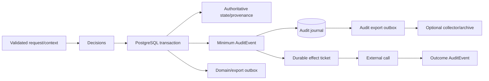

# Section 041: Audit Logging and Accountability Strategy - Research Report

**Topic ID:** IDR-SRV-041<br>
**Report Status:** In Review<br>
**Research Plan:** [IDR-SRV-041 Audit Logging and Accountability Strategy](../IDR%20Plans/idr-srv-041-audit-logging-and-accountability-strategy.md)<br>
**Overall Research Plan:** [Glaux Server Overall IDR Research Plan](../IDR%20Plans/overall-idr-research-plan.md)<br>
**Research Questions Covered:** All questions concerning auditable events, deployment-profile selection, actor/delegation/authority representation, audit schema, phases/outcomes/reasons, time/order/correlation, minimization, integrity, transaction coupling, buffering, failure, storage, access, review, export, retention, DDIL, synchronization, observability, scenarios, and verification<br>
**Methodology Used:** Current primary-source freeze; accepted-baseline reconciliation; control-to-server mapping; event/actor/field inventory; evidence-channel separation; threat/failure analysis; transaction and custody modeling; deployment-profile comparison; scenario and test traceability<br>
**Research Time:** Approximately 30 hours of AI-assisted execution on September 15, 2026<br>
**Approved Standards Baseline:** OGC 23-001 and OGC 23-002 Version 1.0; accepted Glaux IDR-SRV-001 through IDR-SRV-040; controlled AEP-4789 package `AC/224(JCGISR)D(2026)0005` as the project baseline subject to its recorded status and handling limits<br>
**Audit Guidance Baseline:** NIST SP 800-53 Revision 5 Release 5.2.0; NIST SP 800-92 final; SP 800-92 Revision 1 Initial Public Draft used only as draft planning guidance; OWASP Logging Cheat Sheet; RFC 3339 and RFC 5424; W3C PROV-DM, checked September 15, 2026<br>
**Implementation Evidence:** PostgreSQL 18.6; pgAudit 18.0; OpenTelemetry Logs specification at `315a88671b51162bd0da8c72d3b75bfac9ca510a`; Rust `tracing` 0.1.44 and `tracing-subscriber` 0.3.23, used only as feasibility evidence<br>
**Supporting Resources:** Accepted transaction, provenance, lifecycle, ingestion, streaming, command, security, ZTA, and policy reports; upstream-history register Version 1.12<br>
**Document Purpose:** Define a deployable, policy-aware and falsifiable Glaux audit/accountability baseline without conflating telemetry with authoritative evidence or claiming legal sufficiency, non-repudiation, perfect completeness, identity truth, or tamper-proof storage<br>
**Author:** OpenAI Codex<br>
**Accepted By:** TBD until controlling-plan owner acceptance<br>
**Acceptance Date:** TBD until accepted<br>
**Date:** September 15, 2026<br>
**Last Updated:** September 15, 2026

---

## Evidence and Decision Legend

| Mark | Meaning |
|---|---|
| N | Normative published specification requirement within its stated scope |
| G | Official government/control-catalog guidance; applicability and parameters require deployment tailoring |
| A | Accepted Glaux design baseline |
| I | Pinned implementation evidence; not a requirement |
| E | Engineering/security inference from the evidence |
| P | Proposed Glaux decision requiring report acceptance |
| X | Known limitation, open parameter, or downstream choice |

“Must” in a proposed Glaux invariant means violating it would make the recommended profile untruthful or unsafe; it does not assert that every cited NIST control is legally applicable to every deployment. Audit evidence can show what the server recorded and protect that record against defined threats. It cannot by itself prove real-world identity, intent, physical effect, source truth, or legal non-repudiation.

---

## Contents

1. Executive Summary and Decisions Requested
2. Research-Question Coverage Table
3. Source Inventory with Authority, Version, Access Date, Status, and Limitations
4. Standards/Profile Requirement and Control Map
5. Audit/Accountability Terminology and Adjacent-Record Boundary
6. Auditable-Event Taxonomy and Deployment-Profile Matrix
7. Actor, Delegate, Authority, Automated-Process, Source, and Node Model
8. Versioned Conceptual Audit Record Schema and Field Matrix
9. Outcome, Phase, Reason, Time, Ordering, and Correlation Semantics
10. Prohibited-Data, Minimization, Redaction, Digest, and Injection Controls
11. Threat Model and Integrity/Tamper-Evidence Decision Matrix
12. Capture, Transaction, Outbox, Buffering, Backpressure, Failure, Gap, and Recovery Model
13. Storage-Role, Access, Search, Review, Annotation, Export, and Audit-of-Audit Model
14. Retention, Archive, Delete, Backup, and Restore Handoff
15. DDIL Continuity and Synchronization Handoff
16. Observability and Alerting Handoff
17. Worked End-to-End Scenarios for Resource Change, Policy Denial, Command Lifecycle, Disposition Action, and Synchronization Conflict
18. Fixture and Verification Matrix with Expected Outcomes
19. Implementation Implications, Selected/Rejected Options, Risks, Unresolved Questions, and Review Triggers
20. Validation Against This Plan's Success Criteria

---

## 1. Executive Summary and Decisions Requested

Glaux should implement audit as a **dedicated authoritative evidence plane**, not as a filtered copy of application logs. A typed, versioned `AuditEvent` is appended through a server-owned audit port with a mandatory event-selection floor, explicit actor/object/action/phase/result semantics, protected references to decision and payload evidence, local order and time-quality fields, policy/retention metadata, and integrity-chain fields. Logs, traces, metrics, security alerts, provenance, domain events, command status and delivery records remain separate records connected by generated identifiers. **[G/A/E/P]**

The first implementation should use PostgreSQL as the authoritative audit journal, with a separate schema, narrowly privileged append function/writer role, immutable original rows, transaction coupling for authoritative changes, and a durable bounded local spool for audit records that cannot share the domain transaction or must survive DDIL/store outages. A derived search projection and asynchronous export outbox may be rebuilt from the journal. PostgreSQL logs or pgAudit can supplement database-administration evidence but cannot replace application-semantic audit. OpenTelemetry and Rust `tracing` may carry correlation identifiers and operational telemetry but are not the authoritative sink. **[A/I/E/P]**

Event coverage is risk- and capability-aware. Authentication, authorization/policy decisions that protect meaningful access, authoritative mutations, source/trust/policy/configuration administration, lifecycle/disposition actions, command gates/effects, cross-boundary release, synchronization decisions, and all audit administration/integrity failures form the non-disableable floor. Ordinary public reads need no per-item audit by default. Protected bulk reads and exports are audited at request/view/result-summary level. High-volume observation/stream access uses subscription/session start, material policy changes, bounded periodic summaries and termination, unless deployment policy explicitly requires per-record evidence. **[G/A/E/P]**

Failure behavior is classified rather than global. A state-changing commit must atomically include its minimum audit record. A privileged or externally effective operation must have durable pre-effect evidence before the effect. A denial still denies when its independent audit path fails; the server must never turn audit failure into permission. Safe unaudited public/read-only functions may continue during a declared audit degradation, while a protected disclosure that requires per-access evidence fails before disclosure. Already executing safety-critical work follows its accepted fail-safe model and emits an incident through every remaining path rather than inventing a domain outcome. **[G/A/E/P]**

Integrity is layered. Database constraints and role separation prevent ordinary mutation; deterministic canonical event encoding and per-stream sequence/hash linkage expose insertion, change, reorder and truncation relative to a known checkpoint; protected periodic checkpoints, signatures/MACs, remote forwarding or immutable media can strengthen specific deployment profiles. None proves that the producer told the truth or defeats a fully privileged attacker who controls both records and unanchored keys/checkpoints. Accordingly, Glaux should use “append-oriented,” “integrity-checked,” and “tamper-evident against the declared threat model,” never “tamper-proof” or “non-repudiable” without separately assessed AU-10-grade evidence. **[G/E/P]**

The audit record is itself controlled data. Secrets and unrestricted request/response, SensorML/SWE, observation, command, feasibility, policy or diagnostic payloads are prohibited. Exact evidence is stored only in a separately governed content-addressed artifact when justified; the audit event carries an algorithm-qualified digest and protected reference. Low-entropy values use a keyed correlation token or are omitted because a plain digest can enable guessing. Sanitization, type/length bounds and safe output encoding occur before the authoritative append, not only at display/export. **[G/A/E/P]**

Disconnected nodes keep globally unique event identities, a stable node identity plus boot/chain epoch, local sequence, occurrence/observation/record times, clock confidence, cached authority references and protected checkpoints. Reconnection transfers immutable records without renumbering, verifies range manifests and checkpoints, deduplicates exact identities, quarantines collisions or invalid chains, and appends a local receipt/decision event. Arrival order and central disagreement never rewrite the historical local claim. Exact conflict and replication mechanics remain IDR-SRV-043. **[A/E/P]**

### 1.1 Decisions requested

Accept the following bounded baseline:

1. the dedicated `AuditEvent` evidence plane and adjacent-record boundaries in Sections 5 and 8;
2. the mandatory/capability-dependent/aggregate event taxonomy and profiles in Section 6;
3. the actor/delegation model and honest identity limitations in Section 7;
4. the phase/result, time/order/correlation and minimization contracts in Sections 9–10;
5. the layered integrity model and deliberately limited claim language in Section 11;
6. the transaction/failure class table and durable spool rules in Section 12;
7. the journal/search/export/access/custody design in Sections 13–16;
8. the scenarios, verification matrix, first-slice selections and rejected defaults in Sections 17–19; and
9. the handoff of numeric retention, DDIL, synchronization, deployment, observability and test parameters to their assigned later topics.

Acceptance does not select an external SIEM, policy engine, key-management service, WORM product, audit interchange product, production retention period, legal standard, operational label scheme, or cross-domain solution. It does not authorize implementation or IDR-SRV-042.

## 2. Research-Question Coverage Table

| Core question | Resolution | Primary sections |
|---|---|---|
| Which actions, decisions, accesses, failures and changes are auditable? | A mandatory floor plus capability-dependent, aggregate and non-audit classes prevents both silent disabling and indiscriminate volume. | 6, 12, 17 |
| What fields make evidence attributable, ordered, reviewable and safe? | `AuditEventV1` field groups capture asserted/observed actor, object, action, phase/result, time quality, local order, correlation, evidence references, handling and integrity without payload copying. | 7–10 |
| How is audit captured, protected, stored, accessed, reviewed, exported, retained and verified? | Atomic journal append, separate failure spool, derived search, protected checkpoints, independent roles, immutable annotations and manifest-bound exports provide the baseline. | 11–14 |
| How does audit behave under failure, overload, DDIL, replay and synchronization? | Event assurance classes choose fail-before-commit/effect, buffer-and-continue or declared degraded behavior; node sequences, epochs, manifests and quarantine preserve uncertainty. | 12, 15, 18 |
| How is audit separated from adjacent evidence? | Each channel has one authority purpose and cross-references rather than copies another record. | 5, 9, 13, 16 |

Every detailed plan question is answered by the required-content section bearing its subject. Numeric organizational parameters and external product/legal decisions are explicitly routed in Sections 14, 15 and 19 rather than invented.

## 3. Source Inventory with Authority, Version, Access Date, Status, and Limitations

| Source | Version/date and status | Authority/use | Limitations |
|---|---|---|---|
| Project-controlled `AC/224(JCGISR)D(2026)0005`, including STANAG 4789 Edition 1 and AEP-4789 Volumes I/II Edition A Version 1 | Package dated 2026-04-27; SHA-256 `56DC757B6E677B3584E3152A957849F21A24B22854F562613FF283A8B599DA8C`; project-controlling pre-promulgation ratification draft; reviewed through accepted IDR-SRV-001–003 | Controls Glaux NATO/AEP scope and handling of the adopted OGC package | Controlled, not redistributed or publicly linked; does not define a detailed Glaux audit schema, event set, retention period or evidence guarantee |
| [NIST SP 800-53 Rev. 5](https://csrc.nist.gov/pubs/sp/800/53/r5/upd1/final) and [official OSCAL catalog](https://github.com/usnistgov/oscal-content/blob/main/nist.gov/SP800-53/rev5/json/NIST_SP-800-53_rev5_catalog.json) | Release 5.2.0; official OSCAL content at `78650f02ad9321bb7b817846f8fbd4f2bcd620de`; accessed 2026-09-15 | Government control objectives and exact AU identifiers/text | Controls contain organization-defined parameters and are not automatically a legal/control baseline for every Glaux deployment |
| [NIST SP 800-92](https://csrc.nist.gov/pubs/sp/800/92/final) | Final, September 2006; accessed 2026-09-15 | Final high-level enterprise log-management guidance | Older technology context; not a Glaux schema or product selection |
| [NIST SP 800-92 Rev. 1](https://csrc.nist.gov/pubs/sp/800/92/r1/ipd) | Initial Public Draft, 2023-10-11; comment period closed; still listed Draft on 2026-09-15 | Non-controlling planning playbook for generation, transmission, storage, access and disposal | Not final and not used to override SP 800-53, accepted Glaux decisions or normative standards |
| [OWASP Logging Cheat Sheet](https://cheatsheetseries.owasp.org/cheatsheets/Logging_Cheat_Sheet.html) | Living guidance, accessed 2026-09-15 | Application event selection, field, exclusion, injection, verification and outage guidance | Security guidance, not a compliance standard; describes broader logging as well as audit |
| [RFC 5424](https://www.rfc-editor.org/rfc/rfc5424) | Proposed Standard, March 2009 | Structured syslog message/transport separation and time-quality concepts | Does not specify storage, Glaux event semantics or accountability; secure transport is separate |
| [RFC 3339](https://www.rfc-editor.org/rfc/rfc3339) | Standards Track, July 2002 | Interoperable timestamp syntax | Syntax does not establish clock correctness, synchronization or total order |
| [W3C PROV-DM](https://www.w3.org/TR/prov-dm/) | W3C Recommendation, 2013-04-30 | Entity/activity/agent, attribution, derivation and influence relationships | Provenance can support investigation but is not an audit authorization, access log or truth guarantee |
| [OGC API - Connected Systems Part 1](https://docs.ogc.org/is/23-001/23-001.html) and [Part 2](https://docs.ogc.org/is/23-002/23-002.html) | OGC Standards Version 1.0, 2025-07-16 | Normative API/resource/dynamic-data behavior being audited | No general audit resource, event taxonomy, integrity model or retention requirement; audit remains a private Glaux concern |
| [OpenTelemetry Logs](https://opentelemetry.io/docs/specs/otel/logs/data-model/) | Living specification at repository `315a88671b51162bd0da8c72d3b75bfac9ca510a`; accessed 2026-09-15 | Candidate correlation/export model: occurrence and observed time, trace/span, resource, scope, attributes and event name | Telemetry pipeline may sample, transform or drop; not authoritative audit storage |
| [`tracing`](https://docs.rs/tracing/0.1.44/tracing/) and [`tracing-subscriber`](https://docs.rs/tracing-subscriber/0.3.23/tracing_subscriber/) | Crates 0.1.44 and 0.3.23; repository `d9d4c542de10f5d3a711b7a45ffe450fd0666437`; accessed 2026-09-15 | Rust structured instrumentation/correlation feasibility | Instrumented arguments and subscriber filters can leak/drop data; not the audit domain port or store |
| [PostgreSQL](https://www.postgresql.org/docs/18/) | 18.6 current supported release on 2026-09-15 | Feasibility for transactional journal, constraints, roles, partitions, indexes and outbox | Owner/superuser/storage compromise remains in threat model; database alone is not immutable external evidence |
| [pgAudit](https://github.com/pgaudit/pgaudit/tree/18.0) | 18.0 for PostgreSQL 18; implementation HEAD observed at `52a32536711514467d0481f42c87c5ba700a3504` | Optional database statement/object administration evidence | Standard log output; statements may contain sensitive data; duplicates occur; its own documentation says superusers cannot be reliably audited; lacks Glaux application semantics |
| Accepted Glaux reports IDR-SRV-019, 029–040 | Accepted through 2026-09-15 | Controlling project decisions on provenance, transactions, lifecycle, ingest, streams, commands, identity/ZTA and disclosure | Later reports may specialize implementation but cannot rewrite historical evidence silently |

No upstream implementation/history finding changed while executing this topic; the shared upstream-history register remains Version 1.12.

## 4. Standards/Profile Requirement and Control Map

| Authority and anchor | Source requirement/control objective | Glaux binding | Limitation/parameter owner |
|---|---|---|---|
| NIST SP 800-53 AU-2 | Identify loggable event types, select events, justify adequacy for after-the-fact investigation, and review/update selection | Versioned taxonomy, mandatory floor, profile manifest and audited selection changes | Deployment control owner sets applicable selection/review cadence |
| AU-3; AU-3(1); AU-3(3) | Establish event type, time, place, source, outcome and associated identities/objects; add tailored information while limiting PII | Required field groups and privacy/minimization matrix in Section 8 | Organization defines additional fields and justified PII |
| AU-4; AU-4(1) | Allocate capacity and optionally transfer to alternate storage | Capacity budgets, reserved critical class, warnings, bounded spool and export/alternate-store seam | Numeric capacity and transfer interval belong to deployment/configuration topics |
| AU-5 and enhancements | Alert and take organization-defined action on logging failure; alternate logging and selective shutdown are available choices | Per-assurance-class failure table; no universal shutdown/continue rule | Alert recipients/timing and exact thresholds are deployment parameters |
| AU-6; AU-6(3) | Review/analyze/report and correlate repositories | Protected review/search and cross-reference model | Glaux supplies capability/evidence, not a SIEM or organizational review program |
| AU-7 | Reduction/reporting must support review/investigation without altering original content or time order | Derived search/report/export views reference immutable journal and retain order/gap metadata | Query output is not the original trail |
| AU-8; AU-8(1) | Use system clocks, UTC/offset timestamps and selected granularity; synchronize where selected | Occurred/observed/recorded times plus clock source, sync state, precision and uncertainty | Numeric skew/granularity and authoritative time sources belong to deployment/DDIL profiles |
| AU-9 and enhancements | Protect audit information/tools from unauthorized access, modification and deletion; alert on detected interference; stronger profiles may separate systems and roles or add cryptographic protection | Separate roles/schema, append-only API, protected checkpoint/export, audit-of-audit and alerting | Fully privileged collusion and key compromise remain explicit threats |
| AU-10 and enhancements | Non-repudiation requires irrefutable evidence and validated identity bindings for selected actions | Glaux records identity evidence and can sign/checkpoint, but makes no AU-10 or legal non-repudiation claim | Competent authority must define actions, identity proof, signing/receipt/custody and assessment |
| AU-11 | Retain records for organization-defined investigation/regulatory/operational needs | Record classes, dependencies, holds and disposition evidence handed to IDR-SRV-030/049 | No numeric period invented here |
| AU-12 and enhancements | Generate selected AU-2 events with AU-3 content and controlled component selection; support correlated trails where selected | Typed emitters, component registry, taxonomy/profile validation and node/correlation fields | System-wide correlation precision is deployment-defined |
| OWASP Logging Cheat Sheet | Application owns business/security context; exclude secrets, sanitize/encode, prevent disabling required logging, and test outage/resource/injection/access behavior | Server-owned audit port, prohibited-data policy, typed bounded fields and Section 18 tests | Guidance is adapted to an authoritative audit subset, not copied wholesale |
| RFC 5424 §§3, 5–7 | Separates content/application/transport; defines structured messages and optional time-quality/origin elements | Optional export adapter and inspiration for explicit producer/time quality | Syslog is not the canonical store; transport/storage guarantees remain external |
| RFC 3339 §5.6 | Defines Internet date-time syntax including UTC offset | Canonical external timestamp representation | Does not prove time accuracy or event ordering |
| W3C PROV-DM §2 | Distinguishes entities, activities, agents, derivation and responsibility | Audit events reference provenance activities/entities when state was generated | Failed access and security decisions remain audit even when no entity was derived |
| OGC 23-001/23-002 | Defines the public resource and dynamic-data operations whose use or mutation may be audited | Audit remains private and cannot alter CSAPI responses/conformance except accepted failure policy | No fabricated OGC audit conformance class |
| Controlled AEP/STANAG baseline | Establishes authorized, policy-aware server responsibilities and adopted OGC package | Audit supports accountable server enforcement within that architecture | No detailed audit event/schema/retention rule was extracted; public report does not reproduce controlled text |

This is a design-control crosswalk, not a declaration that Glaux or a future deployment satisfies a NIST baseline. Assessment evidence, organization-defined parameters and operational review remain external responsibilities.

## 5. Audit/Accountability Terminology and Adjacent-Record Boundary

### 5.1 Terms

| Term | Glaux meaning | What it does not mean |
|---|---|---|
| Accountable action | Attempt, decision, state change, privilege use, disclosure or effect for which reviewable attribution/evidence is required | Proof of intent or real-world identity |
| Audit event | Semantic occurrence selected by the versioned Glaux audit taxonomy | A text log line or public domain event |
| Audit record | Immutable serialized evidence for one event appended to an authoritative journal | Complete request/payload copy or guaranteed truth |
| Audit trail | Ordered, queryable set of records plus checkpoints, gaps and custody metadata | One globally total order across nodes |
| Actor/initiator | Principal/workload/process observed to initiate an action | Necessarily the natural person controlling a credential |
| Delegate/on-behalf-of subject | Separately evidenced subject for whom an actor acts | A client-supplied name promoted to identity |
| Executor | Server worker, adapter, gateway or administrator that performs a later phase | The original initiator |
| Authority reference | Versioned grant, role/scope, lease, approval, policy or source-authority evidence used | The sensitive policy/grant content itself |
| Outcome | What Glaux observed at a named phase | End-to-end physical truth unless independently acknowledged |
| Integrity | Ability to detect or prevent defined unauthorized changes under a declared model | Universal immutability or correctness |
| Completeness | Coverage relative to a named event taxonomy/profile/range and known gaps | Proof that an uncompromised producer observed every real event |
| Review annotation | New attributable note/disposition linked to evidence | Edit of the original event |
| Repudiation claim | Challenge to attributed action/evidence | Automatically defeated by ordinary logs |

### 5.2 Adjacent-record authority boundary

| Record/channel | Authoritative purpose | May reference | Must not become |
|---|---|---|---|
| Audit record | Durable accountability for attempted/completed action or decision | request, decision, provenance, domain event, trace, alert, artifact | Debug dump, domain truth, public event or SIEM alert |
| Provenance record | Explain how an entity/revision was used, generated, attributed or derived | audit correlation and activity/entity IDs | Failed-read/access log or authorization trail |
| Domain/system event | State a committed business/resource occurrence under domain semantics | producing transaction/revision and audit correlation | Security-decision dump or proof an external consumer received it |
| Command status/result | Authoritative command lifecycle/effect evidence | gate, attempt and audit IDs | Record of who viewed/approved/exported it |
| Delivery record | Track outbox/broker/gateway attempt and acknowledgement | domain/audit event and recipient | Proof of application/physical effect |
| HTTP/access log | Diagnose transport request/response behavior | request/correlation/audit event ID | Application-semantic audit record |
| Trace/span | Diagnose causal execution path and latency | request/decision/audit references | Unsampled complete evidence or identity authority |
| Metric | Low-cardinality aggregate health/capacity/outcomes | no sensitive record identities | Per-action evidence |
| Security alert | Notify/recommend response to suspicious condition | audit and telemetry evidence | Authoritative source event or automatic proof of compromise |
| Validation artifact | Explain accepted/rejected input under a rule/schema | ingest/audit/provenance IDs | Unrestricted raw-payload copy in audit |
| Policy/disclosure decision | Authoritative contextual allow/deny/obligation evidence | audit event and policy/input versions | Audit of who administered or enforced it |

One occurrence may legitimately create several records. For example, a committed resource correction creates a new resource revision and provenance activity, a domain lifecycle event/outbox row, and an audit record in one transaction; a trace and operational metric may observe the work. Their shared correlation does not collapse their meanings.

## 6. Auditable-Event Taxonomy and Deployment-Profile Matrix

### 6.1 Selection classes and invariants

The event catalog is a versioned artifact. Each event type has a stable URN, schema version, assurance class, producing component, required fields, default sensitivity and selection rule:

- **M — mandatory floor:** enabled in every profile and not suppressible by runtime log level;
- **C — capability-dependent:** mandatory whenever the named capability is enabled;
- **P — profile/policy-selected:** required only when a reviewed deployment rule selects it;
- **A — aggregate/session evidence:** individual records are deliberately replaced by bounded start/end/summary evidence;
- **N — not audit:** remains domain, provenance or telemetry evidence unless another accountable action occurs.

An event-selection change is itself an M-class audited configuration action. A profile cannot reclassify M or an enabled C event to P/A/N. Unknown event types fail build/startup registration or enter a protected forward-compatibility quarantine; they are never silently dropped. Taxonomy versions remain resolvable for the lifetime of retained records.

### 6.2 Auditable-event taxonomy

| Family / example stable type prefix | Required occurrences | Selection | Capture/volume rule | Primary correlation |
|---|---|---|---|---|
| Authentication `glaux.audit.authn.*.v1` | success for privileged/protected sessions; failure/rejection; emergency/local credential use; revocation/issuer failure; identity-map change | M for failures/admin/emergency; P/A for routine success by profile | Rate controls may aggregate repeated identical failures only after preserving first/last/count/window and no loss of a threshold/alert transition | request, session, credential-reference digest, principal/client/workload mapping |
| Authorization `glaux.audit.authz.decision.v1` | deny/indeterminate; privileged permit; permission/grant/role administration | M | Ordinary repeated read permits may be request/session summarized; every state/effect/admin decision remains individual | request, subject, action, protected object ref, decision/version |
| Disclosure policy `glaux.audit.disclosure.decision.v1` | conceal/project/generalize/aggregate/delay/suppress/deny; cross-boundary allow/deny; binding/policy administration | M for deny/indeterminate/transform/export/admin; P/A for unchanged ordinary reads | Record disposition/transform and protected reason reference, never removed values | DisclosureDecision, PolicyBinding, recipient/domain/purpose, output digest |
| Resource access `glaux.audit.resource.access.v1` | protected item/list/query/document access; bulk download/export | P or A; M for export and designated high-sensitivity views | One request/view/result summary; no per-returned-object duplication unless explicitly required | request, normalized-query digest, authorized-view ID, returned count/bounds |
| Authoritative mutation `glaux.audit.resource.mutation.v1` | create/import/replace/patch/delete/correct/restore; rejected/conflicted attempts | M | One event per material phase/transaction and affected aggregate; batch items retain bounded item result references | request, transaction, resource/revisions, provenance activity |
| Ingestion/validation `glaux.audit.ingest.*.v1` | source receipt/replay/duplicate; reject/quarantine/release; manual correction; normalization/rule change | C when ingest enabled; source/rule administration M | High-volume accepted observations may batch-summary; rejects/security anomalies individual within anti-flood policy | source, publisher, artifact digest, batch/item, validation evidence |
| Source/trust administration `glaux.audit.source.*.v1` | registration lifecycle; publisher/source authority or trust change; gateway/adapter identity change | C and M when capability enabled | Individual, no sampling | admin request, source/publisher/gateway, before/after versions |
| Stream/subscription `glaux.audit.stream.*.v1` | protected subscription create/authorize/reevaluate/close; replay/export; policy change; delivery ambiguity | C | Session start/end plus bounded summaries; not per observation/event by default | subscription, policy-view cursor, subject, topic/filter digest |
| Command/feasibility `glaux.audit.command.*.v1` | complete IDR-SRV-038 Appendix B catalog: request, gates, approval/override, create/update, dispatch, acknowledgement, status/result, cancel, timeout, unknown/reconciliation | C and M when command capability enabled | Individual for every material gate/transition/effect; no sampling | command/revision, feasibility, attempt/fence, grant/lease/policy/safety decisions |
| Lifecycle/disposition `glaux.audit.lifecycle.*.v1` | policy/hold change; impact preview/approval; archive/restore/delete/purge; backup expiry; sanitization; failed propagation | M for any enabled lifecycle action | Individual plus job progress summaries; every terminal or exception state | disposition job, manifest, copy inventory, approval, resource set digest |
| Configuration/security administration `glaux.audit.admin.*.v1` | profile/config activation; privilege/audit-policy/redaction/key/certificate reference change; migration/maintenance; break-glass | M | Individual, protected before/after digests and changed-field names | change request, approver, config/build/schema/key reference |
| DDIL/node state `glaux.audit.ddil.*.v1` | enter/exit constrained mode; cached-authority use; time/policy uncertainty; buffer pressure; reconnect | C when DDIL enabled | Transition plus periodic bounded state summary; significant threshold crossings individual | node/boot epoch, bundle/policy/trust version, clock state |
| Synchronization/federation `glaux.audit.sync.*.v1` | session/manifest verify; import/duplicate/replay/gap/collision/conflict; accept/quarantine/reject/resolve | C when sync/federation enabled | Batch/session plus individual conflicts, policy/export decisions and gaps | sync session, origin node/epoch/range, manifest/package, local receipt |
| Audit use/administration `glaux.audit.audit.*.v1` | search/read/export/verify/annotate; taxonomy/selection/redaction/retention/access change; integrity failure; gap; recovery | M | Individual administrative action; bounded query/export summary avoids recursively logging each returned record | audit query/export/annotation/checkpoint and actor |
| Backup/migration/restore `glaux.audit.recovery.*.v1` | start, approval, manifest verification, migration, restore publication/failure, audit continuity check | C and M when operation occurs | Individual phase and terminal events | job, archive/backup manifest, migration package, integrity range |
| Security response `glaux.audit.security.*.v1` | suspected bypass, injection, credential abuse, rate-limit/lockout action, audit interference, protected alert acknowledgement | M for bypass/audit interference; otherwise profile-selected | Preserve material state transition; rate-control repetitive attacker-generated noise with declared summary | detection/alert, request/session, response action, confidence |
| Domain/provenance-only fact | ordinary Observation/SystemEvent/CommandStatus content or derivation with no distinct accountable use | N | Stay in authoritative domain/provenance store; audit the creating/viewing/admin action as selected | domain/provenance ID |
| Ordinary diagnostics | debug spans, adapter timing, cache hit, retry detail | N | Logs/traces/metrics under IDR-SRV-048 | trace/request/audit ID only |

An “accepted high-volume batch” summary includes exact batch/source identity, first/last item identity or range rule, accepted/rejected/duplicate counts, item-result artifact digest, transaction bounds and gaps. Aggregation is never permitted for a command gate, privilege change, protected export, audit administration action or known integrity incident.

### 6.3 Deployment-profile matrix

| Profile | Identity/accountability statement | Event selection | Authoritative journal/buffer | Integrity/export | Failure posture |
|---|---|---|---|---|---|
| Local development | Explicit developer or `unsafe-dev` synthetic actor; no real-person assurance | M floor plus enabled local capabilities; verbose diagnostics remain separate | Local PostgreSQL or equivalent test journal; ephemeral only when prominently declared | Local chain/checkpoint self-test; no operational claim | State/effect invariants still fail closed; disposable diagnostics may drop visibly |
| CI | Deterministic fictional actors, clocks, nodes and faults | All M/C test paths forced; fixture manifest pins taxonomy | Ephemeral PostgreSQL plus deterministic durable-spool simulation | Golden canonical bytes, chain/checkpoint/tamper tests | Every failure class injected and asserted |
| Conformance | Harness identity distinguished from anonymous/public client | M plus audited administrative setup; standards traffic summarized unless protected | Isolated journal separate from fixture/domain stores | Test artifact export with profile/build/taxonomy references | Audit cannot change normative API result except declared security/failure profile |
| Public demo | Anonymous read-only synthetic access or short-lived demo identity; no operational attribution claim | M admin/security events; anonymous ordinary reads aggregate; simulator actions C if isolated | Protected local journal inaccessible from public routes | Local checkpoints; optional protected export | Public synthetic reads may continue under declared degradation; admin/simulator effects do not |
| Connected operational reference | External identity evidence plus local mapping, delegation and authority references | Full M/C; policy selects protected reads/stream summaries | PostgreSQL journal; durable spool; derived search; export outbox | Periodic protected checkpoint and verifier; optional remote anchor/SIEM | Table in Section 12; protected disclosure/effect requires evidence |
| Tactical/DDIL edge | Locally verified actor/authority plus explicit time/policy uncertainty | Same M/C floor; DDIL/reconnect C; compact approved summaries only | Encrypted/protected bounded local journal/spool with reserve | Node/epoch sequence chain and locally protected checkpoints; delayed export | Never expand authority; capacity thresholds constrain operations before silent loss |
| Federation/cross-boundary | Remote asserted actor/source kept separate from local importer/exporter and boundary recipient | M/C sync, disclosure, package, gateway and receipt events | Local authoritative journal; remote evidence imported as referenced artifact/claim | Manifest-bound export, local decision/checkpoint and gateway receipt | No transfer without durable pre-handoff decision; external rejection/unknown remains explicit |

The operational profile determines organization-defined parameters, not whether accountability exists. A SIEM, remote collector or managed service is optional; every profile retains a locally testable minimum.

## 7. Actor, Delegate, Authority, Automated-Process, Source, and Node Model

### 7.1 Actor envelope

An audit record captures what Glaux actually validated and observed through independent fields:

| Dimension | Required representation | Honesty rule |
|---|---|---|
| Initiating principal | Stable local principal ID and actor kind; authentication-context reference and result | Never copy token/credential or assert a natural person beyond identity evidence |
| Client/application | OAuth client or local application ID; authentication method/issuer mapping version | Client is not the user and does not inherit user intent |
| Workload/service | Workload identity, service/component and software instance where relevant | A service account may act automatically or for a delegate; record both |
| Delegate/on-behalf-of subject | Locally validated delegated-subject ID plus delegation/impersonation evidence reference | Omit if not validated; preserve client claim only as untrusted evidence outside authority fields |
| Represented source | Source/publisher/simulator/federated-origin IDs and source-authority reference | Publisher, source and authenticated transport principal remain distinct |
| Effective authority | Grant/role/scope/lease/approval/policy/trust version references used for the phase | Record versions/digests, not full sensitive rules or claims |
| Executor/reporter | Worker, adapter, gateway, target reporter, scheduled job or administrator performing a phase | Later executor does not replace the initiator; reporter authority is separately validated |
| Node/place | Deployment/security domain, service, node ID, boot/chain epoch and component | Network origin is evidence, not trusted identity |

### 7.2 Special cases

- **Anonymous access:** actor kind `anonymous`, no fabricated subject ID; retain only policy-permitted network/client evidence. Public aggregate access evidence is not personal attribution.
- **Failed authentication:** record observed credential type/issuer/key-reference class and a keyed token/session fingerprint only when justified; never create an authenticated principal from an unverified claim.
- **Shared credential:** mark actor kind and attribution quality `shared_or_uncertain`; do not name the assumed human.
- **Compromised credential:** historical records truthfully state the authentication result at that time. A later compromise finding appends linked evidence; it does not rewrite the original actor.
- **Delegation/impersonation:** capture authenticated actor, effective subject, delegation chain/evidence, authorizing action and expiry separately. Self-asserted `on_behalf_of` text is prohibited from authoritative fields.
- **Automated/scheduled work:** capture controlling job/configuration/policy, initiating actor if known, executor workload, scheduler event and causation chain. “System” alone is insufficient.
- **Break-glass/local emergency:** use a named local credential reference, approved emergency authority and reason category; force individual M-class records, alert and later review. Do not accept free-text reason as authority.
- **Federation:** preserve remote asserted actor/source/node as a signed or integrity-referenced claim; also capture local peer principal, importer and local decision. Never collapse remote and local identities.
- **Batch/migration:** one batch actor/envelope may govern many results, but item/range mapping and failures remain reconstructable through a protected result artifact.

### 7.3 Attribution confidence

`identity_evidence_class`, `authentication_context_ref`, `delegation_validation`, `source_authority_ref`, `time_confidence` and `reporter_authority_ref` communicate evidence quality. A single numeric “trust score” is rejected because it hides incomparable facts. Audit review may later associate a person or incident through a linked annotation; that conclusion remains separate evidence.

## 8. Versioned Conceptual Audit Record Schema and Field Matrix

### 8.1 `AuditEventV1` envelope

The canonical record is an internal domain object, not an OpenTelemetry log or new CSAPI resource:

```text
AuditEventV1 {
  identity, taxonomy, assurance, time, place,
  actor, delegation, authority,
  action, object, phase_result,
  correlation, evidence_refs, change_summary,
  handling, producer, integrity
}
```

Presence codes are **M** mandatory, **C** conditional by event schema, **O** optional only when justified, and **X** prohibited. Access codes are **P** protected reviewer, **R** restricted/high-sensitivity, and **AO** audit-administrator/verifier only. Mandatory fields can still be protected.

### 8.2 Field matrix

| Field/group | Presence | Content/semantics | Access/sensitivity rule |
|---|---|---|---|
| `schema_id`, `schema_version` | M | Exact canonical audit schema | P; public only as empty schema documentation if approved |
| `event_id` | M | Globally unique immutable event identity; time-sortable ID allowed but not ordering authority | P; opaque outside audit |
| `event_type`, `event_type_version`, `taxonomy_version` | M | Stable registered semantic event identity | P; type can itself reveal capability |
| `assurance_class`, `selection_class` | M | Capture/failure and M/C/P/A classification | P |
| `occurred_at` | C | External/domain asserted event time | P; never replace with receive time |
| `observed_at`, `recorded_at` | M | First Glaux observation and authoritative append time | P |
| `clock_source`, `sync_state`, `precision`, `uncertainty` | M | Quality/limitations of relevant clock | P/AO for detailed source topology |
| `deployment_profile`, `security_domain` | M | Versioned local profile/domain reference | R; public export uses approved alias if any |
| `service_id`, `node_id`, `boot_epoch`, `component_id` | M | Producer/place and restart boundary | R |
| `node_sequence`, `chain_stream_id` | M | Local append order in one explicit stream/epoch | R; not global time |
| `principal_id`, `actor_kind` | C | Validated local identity and human/service/shared/anonymous class | R; anonymous has no invented ID |
| `client_id`, `workload_id`, `session_ref` | C | Validated application/workload/session references | R; session uses keyed opaque reference |
| `delegated_subject_id`, `delegation_ref` | C | Validated effective subject and delegation evidence | R |
| `represented_source_id`, `source_authority_ref` | C | Publisher/source/federated origin separation | R |
| `executor_id`, `reporter_id`, `reporter_authority_ref` | C | Worker/gateway/target reporter for later phase | R |
| `authentication_context_ref`, `identity_evidence_class` | C | Method/result/mapping version reference | R; no assertion/token content |
| `authority_refs` | C | Role/scope/grant/lease/approval versions/digests actually used | R; no full policy/grant body |
| `action` | M | Stable requested/performed action vocabulary | P/R by capability |
| `phase`, `result` | M | Orthogonal lifecycle phase and observed result from Section 9 | P |
| `reason_code` | M | Stable bounded internal code; `none` only where schema permits | R; safe public reason is a separate projection |
| `reason_detail` | O | Typed/bounded protected detail or artifact reference | R; never arbitrary exception/payload text |
| `route_template`, `http_method`, `response_class` | C | Normalized route, method and response class | P/R; never raw query/URI by default |
| `object_type`, `object_ref`, `object_revision` | C | Protected stable subject of action | R; identifier may reveal existence |
| `parent_refs`, `affected_scope_digest` | C | Bounded relationship or set identity | R |
| `request_id`, `correlation_id`, `causation_event_id` | C | Generated interaction/cross-phase links | P; not identity/authentication |
| `trace_id`, `span_id` | O | Telemetry correlation when present | P; sampling must not affect audit |
| `transaction_id`, `commit_order_ref` | C | Local transaction/commit correlation without exposing DB internals externally | R |
| `batch_id`, `idempotency_digest`, `replay_of` | C | Retry/batch identity under scoped keyed digest | R |
| `command_id`, `attempt_id`, `fence_ref`, `sync_session_id` | C | Specialized workflow correlation | R |
| `decision_refs` | C | Authentication/authorization/policy/safety/validation decision IDs and versions | R |
| `before_version`, `after_version`, `changed_field_names` | C | Minimal change summary for mutation/admin events | R; field names omitted if they reveal protected schema |
| `before_digest`, `after_digest`, `artifact_refs` | C | Algorithm-qualified digests and governed evidence references | R; low-entropy inputs require keyed construction/omission |
| `counts`, `range`, `gap_summary` | C | Bounded batch/stream/export or known-loss summary | R; never global hidden population |
| `policy_binding_ref`, `access_tier` | M | Policy controlling the audit record itself | R/AO |
| `retention_class`, `hold_refs` | M/C | Organization-defined lifecycle class and active holds | AO; periods not embedded as assumptions |
| `producer_build`, `config_digest`, `schema_registry_version` | M | Code/config capable of interpreting generation | P/AO where topology-sensitive |
| `previous_event_hash`, `event_hash`, `algorithm_id` | M | Canonical per-stream integrity linkage | P/AO; digest is evidence, not secrecy |
| `checkpoint_ref`, `signer_key_ref`, `verification_state` | C | Stronger integrity/custody evidence where configured | AO; never private key/signature secret |
| Raw password/token/key/cookie/authorization header | X | Never stored | Prohibited at source |
| Unrestricted request/response/domain/command payload | X | Use minimized fields or governed artifact reference | Prohibited in audit journal |
| Raw SQL, stack trace, policy expression or arbitrary user message | X | Use stable code/template/digest; details remain separately governed diagnostics if needed | Prohibited by default |

### 8.3 Schema evolution

Event type and envelope schemas are independently versioned. Additive optional fields cannot change old meaning; semantic change creates a new event-type/schema version. The registry preserves JSON Schema or equivalent, canonicalization rules, code lists, field sensitivity, selection/failure class and migrations used for derived search—not rewrites of original bytes. Readers reject or quarantine unsupported mandatory semantics and preserve the opaque original artifact where policy allows.

## 9. Outcome, Phase, Reason, Time, Ordering, and Correlation Semantics

### 9.1 Phase and result are orthogonal

A flat `success/failure` field cannot explain asynchronous and physical workflows. Each event pairs a phase with the result observed at that phase:

| Phase | Representative results | Interpretation boundary |
|---|---|---|
| `RECEIPT` | `OBSERVED`, `DUPLICATE`, `REJECTED` | Request/message reached this Glaux boundary; not yet valid or accepted |
| `VALIDATION` | `PASSED`, `FAILED`, `INDETERMINATE`, `QUARANTINED` | Schema/semantic/source checks only |
| `DECISION` | `ALLOWED`, `DENIED`, `INDETERMINATE`, `OVERRIDDEN` | Named authorization/policy/safety decision; no commit/effect implied |
| `ACCEPTANCE` | `ACCEPTED`, `REJECTED`, `DEFERRED` | Work/resource accepted under API contract |
| `COMMIT` | `COMMITTED`, `ROLLED_BACK`, `FAILED`, `UNKNOWN` | Authoritative local transaction outcome |
| `DISPATCH` | `AUTHORIZED`, `BLOCKED`, `ATTEMPTED`, `DELIVERED`, `AMBIGUOUS` | External-effect boundary, progressively stronger observations |
| `TARGET` | `ACKNOWLEDGED`, `REJECTED`, `REPORTED` | Authenticated target/gateway statement, not independently verified physical truth |
| `COMPLETION` | `COMPLETED`, `FAILED`, `CANCELED`, `TIMED_OUT`, `UNKNOWN`, `PARTIAL` | Terminal/observed workflow state under its domain model |
| `DISPOSITION` | `PLANNED`, `APPROVED`, `APPLIED`, `VERIFIED`, `FAILED`, `PARTIAL` | Archive/delete/purge/restore phase with named scope |
| `EXPORT_SYNC` | `PREPARED`, `AUTHORIZED`, `SENT`, `RECEIVED`, `ACCEPTED`, `QUARANTINED`, `REJECTED`, `UNKNOWN` | Each boundary/custody step is distinct |
| `INTEGRITY_REVIEW` | `VERIFIED`, `MISMATCH`, `GAP`, `UNVERIFIABLE`, `RECOVERED` | Verification result relative to named range/checkpoint/key |

Material phase transitions produce separate events. An asynchronous operation never updates an earlier `ACCEPTED` record to `COMPLETED`. Rollback records are written through the independent path when the domain transaction does not commit. Partial results name the exact completed/unknown scope through a protected range/artifact reference.

### 9.2 Reasons

Reason codes are stable, machine-readable, event-specific and versioned (for example, authentication evidence invalid, policy input unavailable, optimistic conflict, audit capacity exhausted, checkpoint mismatch). They distinguish denial from evaluator failure and known failure from unknown outcome. Free text is optional, bounded, pre-sanitized and protected; public RFC 9457 detail is a separately authorized projection and does not have to reveal the internal audit reason.

### 9.3 Time and order

- `occurred_at` preserves externally asserted/domain time; `observed_at` is when Glaux first saw the occurrence; `recorded_at` is authoritative journal append time.
- Timestamps use an RFC 3339-compatible UTC representation at interfaces and preserve actual supported precision. The database representation and canonical encoder must not invent nanosecond accuracy.
- `clock_source`, synchronization state, last verified offset/uncertainty class and boot epoch qualify time. Uncertain/offline time remains explicit.
- `(chain_stream_id, boot_epoch, node_sequence)` defines local production order. A transaction/commit reference defines local commit relation; resource revisions define object order; `causation_event_id` defines asserted causal linkage.
- Event ID timestamp bits, wall-clock time, receipt order and cross-node sequence are never treated as a universal total order. Ties, skew, delay and incomparable clocks are preserved.

### 9.4 Correlation and causality

`request_id` links one interaction; `correlation_id` links a broader workflow; `causation_event_id` claims a direct predecessor known to Glaux; trace/span IDs link diagnostics; domain/provenance/decision/transaction/command/sync identifiers retain their own meanings. Correlation alone does not prove causality. An automated consequence cites both the initiating evidence and the policy/rule/configuration that caused the server to take it.

## 10. Prohibited-Data, Minimization, Redaction, Digest, and Injection Controls

### 10.1 Capture policy

The audit API accepts typed fields, not an arbitrary message map. Every event schema declares allowed fields, type, length/cardinality, sensitivity, normalization and whether a governed artifact reference is permitted. Unknown fields are rejected or quarantined before append. Minimization occurs at construction and again at the central audit boundary; post-collection scrubbing is defense in depth, not the primary safeguard.

Always prohibit passwords, private/secret keys, bearer/access/refresh tokens, cookies, complete authorization headers, database connection strings, secret configuration, raw identity assertions/proofs, unbounded stack traces, and data above the audit store's approved policy. Do not copy whole HTTP bodies, query strings, SensorML/SWE documents, observations, command parameters/results, feasibility evidence, policy expressions, source payloads or validation artifacts merely for convenience.

### 10.2 Safe substitutes

| Need | Preferred evidence | Caveat |
|---|---|---|
| Identify governed object | Protected internal object/version reference | Object existence is sensitive and audit access is policy-filtered |
| Show content used/changed | Algorithm-qualified digest, size, media/schema/profile, changed-field allowlist and protected artifact reference | Digest does not prove content meaning or secrecy |
| Correlate token/session/idempotency value | Deployment-keyed HMAC/tokenization with purpose/version and rotation reference | Plain hash of low-entropy or enumerable value enables guessing |
| Explain rejection | Stable reason/rule/schema version and bounded field-location class | Field names/allowed values can reveal hidden schema |
| Show bulk access | Normalized query/view digest, authorized result count/range and export manifest | Never record global hidden count or raw query secrets |
| Show command intent/effect | Command/revision/contract plus normalized input/output artifact digests and gate/attempt references | Keep sensitive parameter/result artifacts separately governed |
| Preserve exact evidence | Content-addressed encrypted/protected artifact with independent retention/access and custody | Audit reference does not itself authorize artifact access |

Digests are always labeled with algorithm, canonicalization/profile and purpose. They are not treated as anonymization, proof of authorship or policy labels. When a value has a small possible domain, omit it or use a keyed construction with separated keys and access rather than a bare digest.

### 10.3 Injection and presentation

- Normalize only according to the field's semantic type; preserve identity distinctions and never silently coerce malformed text into authority.
- Reject invalid encoding, prohibited control characters, overlong values, excess nesting/cardinality and unknown enum values at the audit boundary.
- Structured encoders escape CR, LF, delimiter, quote, backslash, bidirectional-control and format-specific metacharacters. Display/export layers encode again for their target context.
- Human-readable text never controls event type, severity, field name, SQL, query, template or terminal escape behavior.
- Database writes are parameterized and performed through the typed append function. Search queries use independent authorization and bounded prepared predicates.
- Preserve a stable safe reason for rejected hostile input; do not echo the hostile content into the audit event. A governed forensic artifact is optional and separately authorized.

### 10.4 Redaction changes

Redaction/minimization policy and code versions are recorded in producer/config fields. A change is reviewed, tested with secret canaries and audited before activation. It affects future events and derived views; it never rewrites original journal records. If an earlier record contains prohibited data, incident response may cryptographically isolate or disposition it under IDR-SRV-030, appending a replacement/tombstone and integrity explanation rather than pretending the original never existed.

## 11. Threat Model and Integrity/Tamper-Evidence Decision Matrix

### 11.1 Assurance layers

Glaux uses cumulative layers and states exactly which are active:

1. **Semantic validity:** schema/type/producer authorization and mandatory-field validation.
2. **Ordinary prevention:** database constraints, append-only application interface, separate roles, encryption/access control and protected configuration.
3. **Local detection:** deterministic canonical event encoding, local sequence, previous-event hash and explicit segment/checkpoint records.
4. **Separated detection:** checkpoint/signature/MAC protected by a different role/key boundary or copied to a separately administered store.
5. **Independent custody:** timely remote anchor, immutable media, gateway receipt or independent verifier outside the audited node's control.

All profiles implement Layers 1–3. Operational/DDIL profiles expose a Layer 4 interface and declare whether it is active. Layer 5 is deployment-selected. A chain stream is scoped by security domain, node and chain epoch so one hot tenant or disconnected node does not require a global lock. A new segment records why it began, its predecessor checkpoint where available, software/configuration identity and any known gap.

### 11.2 Threat and control matrix

| Threat/failure | Baseline control | Stronger profile option | What the evidence supports | What it does not prove | Required test |
|---|---|---|---|---|---|
| Producer omits selected event | Typed mandatory emitter registry; transaction/pre-effect invariant; coverage self-test | Independent database/gateway/host corroboration | Registered code path cannot complete selected invariant without evidence | Compromised producer observed every real action | Bypass/missing-emitter build and runtime fault |
| Spoofed actor/source fields | Server-owned security context, validated delegation/source/reporter authority; client fields excluded | Independent identity-provider/gateway receipt | Which evidence Glaux validated and used | Natural person controlled the credential | Client-field spoof and delegation tests |
| Record modified | Restricted append interface, canonical hash/chain and verification | Signed/MAC checkpoint in separated boundary | Change after checkpoint relative to protected anchor | Original content was truthful | Bit/field/canonicalization mutation |
| Record inserted/reordered/replayed | Event uniqueness, stream sequence, prior hash, idempotent import and range manifest | Independent sequence/checkpoint ledger | Unexpected insertion/order/duplicate within named stream/range | Global chronological order across streams/nodes | Insert/delete/reorder/duplicate test |
| Tail truncated or journal rolled back | Checkpoint high-water mark, segment closure and startup/reconnect comparison | Frequent remote/immutable anchoring | Missing tail since last protected checkpoint | Events after the last external anchor survived | Snapshot rollback/truncated-tail test |
| Whole chain rewritten with local keys | Separate audit roles and locally protected key/checkpoint | External key custody/remote timestamped checkpoint | Resistance when attacker lacks separated boundary | Resistance to colluding fully privileged operators controlling all anchors | Privileged rewrite threat exercise |
| Audit configuration weakened | Signed/versioned manifest, mandatory floor, audited approved activation | Independent configuration monitor | Which configuration was active/approved under local controls | Governance approval was substantively correct | Disable-floor and rollback attempts |
| Checkpoint/signing key compromised | Key IDs, validity, rotation/revocation events, overlapping continuity proof and re-verification | Hardware-backed or external signing service | Verification under the named key at the named time | Secret was never compromised before discovery | Rotate/revoke/wrong-key/expired-key cases |
| Clock changed/skewed | Multiple time fields, sync/offset/uncertainty, monotonic sequence, clock-change event | Independent trusted time/receipt evidence | Local order and declared time quality | Precise global occurrence time under uncertainty | Jump/backward/unknown-time cases |
| Store unavailable/full | Reserved capacity, threshold warning, alternate durable spool and class-specific fail behavior | Separate physical collector/storage | Known degradation, buffered range and response taken | Infinite availability or zero loss after all storage exhausts | Outage, disk-full and permission faults |
| Audit record exfiltrated | Data minimization, policy binding, encryption, separate readers, audit-of-access/export | Isolated repository and dual authorization | Reduction of exposed content and attributable access attempts | Copied plaintext can be recalled | Access/export policy and secret-canary tests |
| Exporter/collector transforms/drops | Original journal remains authority; manifest counts/ranges/digests/checkpoints and delivery receipts | Independent verifier compares source/export/receipt | Completeness/integrity of named exported selection | Completeness beyond selected policy view or source journal | Omit/reorder/transform/ack-loss tests |
| Malicious value causes injection/exhaustion | Typed bounds, safe encoding, quotas and no arbitrary message fields | Isolated parser/export renderer | Rejected/bounded hostile input behavior | Absence of unknown implementation bugs | CRLF/Unicode/delimiter/oversize/fuzz cases |
| Authorized administrator deletes/corrects evidence | No ordinary update/delete; separate disposition workflow, holds and immutable linked annotations | WORM/independent custody and separation of duty | Detectable/approved disposition within retained dependency model | Legal propriety without external governance | Role abuse and disposition-chain tests |

### 11.3 Hashing, signing and claim language

The chain input is a canonical, versioned byte representation of every integrity-covered field plus the prior hash and stream identity. It excludes storage-specific row layout and derived search values. Algorithm and canonicalization identifiers are recorded, and migrations verify original bytes rather than recompute history under a new format. Key rotation closes/checkpoints one segment and opens a linked segment; it does not resign old records as if newly produced.

A plain hash chain mainly detects accidental or unauthorized changes when the attacker cannot rewrite every link/checkpoint. A keyed MAC strengthens producer authenticity only while the key boundary holds. A digital signature binds signed bytes to control of a private key, not to human intent or payload truth. “Non-repudiation” is rejected as a default claim; NIST AU-10 requires irrefutable evidence for selected actions and a deployment-specific identity, signature/receipt, custody and assessment design beyond this server baseline.

## 12. Capture, Transaction, Outbox, Buffering, Backpressure, Failure, Gap, and Recovery Model

### 12.1 Assurance/failure classes

| Class | Typical events | Durability point | If primary audit append is unavailable | Prohibited shortcut |
|---|---|---|---|---|
| E0 — telemetry only | Debug detail, retry timing, cache statistics | Best-effort observability pipeline | Drop/sample according to telemetry policy and expose metric | Calling it audit evidence |
| E1 — routine/session evidence | Selected protected read; stream start/end/summary; ordinary authentication success | Journal before bounded-buffer acknowledgement; async export allowed | Append to durable spool and continue only while capacity/profile permits; otherwise deny new access requiring this evidence | Memory-only queue or silent sampling |
| E2 — independent attempt/denial | Failed authentication, denied policy, rejected validation, rolled-back mutation | Separate journal transaction or durable spool because domain transaction cannot contain it | Original operation remains denied/rolled back; alert through surviving channel and declare a gap if record cannot be preserved | Turning evidence failure into allow or placing event in transaction guaranteed to roll back |
| E3 — atomic authoritative change | Resource/source/trust/config/policy/lifecycle/command state commit | Minimum audit record in same local database transaction as authoritative state/provenance/outbox | Fail/roll back before commit | Commit state then hope telemetry captures it |
| E4 — durable pre-disclosure/effect | Protected export, cross-boundary handoff, command dispatch, privilege/audit administration, protected audit export | Durable decision/audit/ticket before bytes/effect; completion evidence later | Fail before disclosure/effect | Treating a trace span or precomputed decision as durable evidence |
| E5 — post-effect/reporter outcome | Gateway/target acknowledgement, already-running action result, remote receipt | Append immediately on validated observation | Do not invent or reverse outcome; enter incident/reconciliation/fail-safe path and preserve through alternate spool if possible | Reporting false domain failure/success to make audit consistent |

Event schemas pin one class; runtime callers cannot lower it. A policy that makes a read auditable-before-disclosure elevates it to E4. Safe anonymous/public reads that are not selected audit events may continue through audit degradation, but administrative and detailed health interfaces disclose that limitation only to authorized operators.

### 12.2 Transaction and external-effect boundaries



- E3 state, provenance, minimum audit and relevant domain outbox commit atomically in PostgreSQL.
- E2 events use a separately committing audit connection/transaction or the durable spool after the failed/rolled-back transaction ends.
- E4 creates an immutable single-use/fenced effect or export ticket with the pre-effect audit record. Network I/O occurs only after commit.
- Exporting audit records is asynchronous after authoritative append. Collector acknowledgement updates delivery/custody evidence by appending events, never editing the journal.
- Request cancellation or process crash at each boundary is tested. Reconciliation distinguishes not attempted, attempted with unknown result, delivered and acknowledged.

### 12.3 Ordering, retry and duplicate handling

The audit append allocates stream sequence and hash link in the same transaction as the record. Concurrent streams are allowed; no global sequence is promised. Duplicate `event_id` plus identical canonical hash is idempotent at import/export. The same identity with different bytes is an integrity collision and quarantine incident. Repeated user requests may produce distinct attempt events even when an idempotency key returns one domain result; `replay_of` and a scoped keyed idempotency digest link them without duplicating the authoritative change.

Outbox delivery is at least once. Export receivers deduplicate by issuer/node/epoch/event ID and verify the selection manifest. They do not assign a new source sequence. The local receipt/verification outcome is a different event with its own identity.

### 12.4 Buffer, capacity and backpressure

The alternate spool is durable, encrypted/protected as required, bounded, checksummed/chained, crash-recoverable and writable by the same narrow audit port. It reserves capacity for E3–E5 and audit-integrity/failure events; E0 diagnostics shed first. E1 aggregation or rate control is allowed only as defined by its event schema and emits exact first/last/count/window/drop-or-summary semantics.

Threshold crossings generate protected health/alerts before exhaustion. Exact byte/event/time reserves, warning levels and recovery objectives are deployment inputs. When all durable capacity is exhausted, the server follows the class table and records a known gap at the first recovered opportunity. It never overwrites oldest authoritative records as an unannounced default.

### 12.5 Gap and recovery contract

A gap is evidence, not a synthetic reconstruction. `glaux.audit.audit.gap.v1` records stream/node/epoch, known or bounded missing range, detection time/method, last verified and next observed checkpoints, suspected cause, affected event classes, confidence and recovery disposition. If counts/ranges are unknowable, say so.

Recovery proceeds by isolating the affected journal/segment, preserving forensic copies where authorized, verifying from the last trusted checkpoint, replaying intact spool/outbox records idempotently, starting a linked recovery segment if continuity cannot be restored, and appending incident/reviewer decisions. Derived indexes are rebuilt only from accepted records. A broken chain is never hidden by recalculating it.

## 13. Storage-Role, Access, Search, Review, Annotation, Export, and Audit-of-Audit Model

### 13.1 Store roles

| Store role | Authority and contents | Mutation model | Failure/rebuild rule |
|---|---|---|---|
| Authoritative journal | Canonical AuditEvent bytes/typed columns, stream sequence/hash and checkpoint linkage | Append only through narrow function/port; no ordinary update/delete | Primary accountability source; isolate on integrity failure |
| Alternate local spool | Temporarily authoritative not-yet-journaled E1/E2/failure/DDIL records and range metadata | Append/acknowledge segments; deletion only after verified journal promotion and policy | Crash replay idempotently; capacity/failure visible |
| Search projection/index | Policy-filterable typed columns, text-safe summaries and verification state | Rebuildable/materialized; corrections are projection state | Never overrides journal; stale/failed projection yields safe degraded search |
| Audit export outbox | Exact selection/range, destination, package/manifest and delivery attempts | Append/status transitions with evidence | At-least-once delivery; source journal retained by lifecycle policy |
| Export package | Authorized immutable records/view, schemas, manifest, checkpoints and custody evidence | New version/package for correction | Verify against journal and receipt; never become sole authority silently |
| Archive/backup | Reference-closed journal segments, schemas/taxonomy, checkpoints, keys/verification metadata and holds | Managed under IDR-SRV-030/049 | Restore isolated, verify, apply current policy/disposition before use |

### 13.2 Roles and separation of duties

- `audit_writer`: execute typed append only; no search, update, delete, retention or export authority.
- application/domain transaction role: may invoke approved atomic append function but cannot alter journal tables/tools.
- `audit_reader`: policy-scoped read/search with no administration or export by default.
- `audit_reviewer`: read plus append review annotations/dispositions; cannot change originals.
- `audit_exporter`: create an authorized manifest/package for an approved destination; cannot weaken selection policy.
- `audit_verifier`: read canonical ranges/checkpoints and append verification results; no state administration.
- `audit_records_manager`: propose/apply policy-driven holds/disposition through the lifecycle workflow; not a general superuser.
- `audit_administrator`: manage taxonomy, capacity, checkpoint and writer configuration under restricted change control; ordinary server administration does not imply this role.

Production database owner/superuser capability cannot be made harmless by SQL grants. Access is restricted, separately monitored, and corroborated through database/host/remote evidence where the deployment threat model requires it. pgAudit can supplement these operations but does not solve privileged-user accountability alone.

### 13.3 Search and review

Search supports protected predicates over event type/version, phase/result/reason class, actor kind/reference, object type/reference, action, occurred/observed/recorded time, node/epoch/sequence, request/correlation/transaction/command/sync identifiers, decision/policy/config versions, assurance class, gap and verification state. Exact identifiers remain policy-controlled; counts, time ranges and query errors cannot expose concealed activity.

Results use stable authorized-view ordering and policy-bound opaque cursors from IDR-SRV-040. Review reports are derived views that state selection, omissions, policy view, taxonomy/schema versions, time/order limitations and gaps. AU-7's original-content/time-order requirement is met by leaving the journal untouched and linking reductions/reports to their source ranges.

### 13.4 Annotations and corrections

Reviewer note, investigation association, identity clarification, false-positive disposition, legal hold, redaction decision, integrity finding and superseding interpretation are new immutable records with actor, authority, time, reason and target event/range. The original event never receives an editable comment/status field. A projection may show current review state while preserving the complete annotation chain.

### 13.5 Export and custody

An export manifest contains package/export ID, authorized selection/query digest, requester/approver/recipient/domain/purpose, policy decision and binding versions, event stream/ranges/counts, explicit omissions/gaps, schema/taxonomy/canonicalization versions, record and package digests, included checkpoints/signatures, generation tool/build/config, time bounds, handling/retention, encryption/key reference, delivery attempts and receipt/verification state. The export action is E4 and audited before release.

An export is a derived governed copy. Recipient receipt does not prove review; gateway handoff does not prove cross-domain release; lack of receipt yields `UNKNOWN`. Each custody transition appends evidence. Glaux does not implement a legal chain-of-custody program merely by producing the manifest.

### 13.6 Audit of audit without infinite recursion

Search, view, export, verify, annotate, configuration, access grant, hold, disposition, restore and integrity-recovery actions against audit data are M-class events. One boundary event summarizes the authorized query/export and outcome; internal reads/writes performed solely to append that audit-of-audit record do not recursively create more events. Failure of that direct path uses the reserved spool and gap/alert rules.

## 14. Retention, Archive, Delete, Backup, and Restore Handoff

IDR-SRV-030's trigger-based, no-invented-period lifecycle governs. IDR-SRV-041 defines classes and dependencies, not durations:

| Audit lifecycle class | Preservation need | Dependencies/hold considerations | Disposition evidence |
|---|---|---|---|
| Command/safety/external effect | Explain authority, gates, attempt, acknowledgement and uncertainty | Command revisions, contracts, grants/leases, policy/safety versions, protected artifacts, investigations | Approved range/copy action and continuity checkpoint |
| Cross-boundary disclosure/export | Establish what view/package went to which recipient and boundary | DisclosureDecision, PolicyBinding, transform/schema, package/gateway receipts | Export-copy inventory, revocation/expiry limitation and disposition |
| Privilege/policy/trust/audit administration | Explain who changed accountability/security behavior | Before/after version/digest, approval, configuration/taxonomy and key references | Separately authorized disposition, never same unilateral privilege |
| Authoritative resource/lifecycle change | Explain create/update/delete/archive/restore and rejected conflict | Resource revisions, provenance, manifests, tombstones and holds | Preserve enough anti-resurrection/investigation evidence |
| Authentication/authorization/security decision | Support investigation without indefinite identity/payload retention | Identity mapping/policy versions, incident/hold, keyed-reference rotation | Pseudonymize/remove only under approved purpose and dependency analysis |
| Protected read/stream/bulk summary | Establish accessed view/session/export at bounded volume | Policy/view/query digest and subject/recipient context | Do not infer permission to retain returned payload |
| Integrity/checkpoint/gap/recovery | Verify retained trail and explain known uncertainty | Canonical schemas, algorithms, public verification material/key status, segment/range manifests | Must outlive dependent records long enough to verify them |
| Review/annotation/custody | Preserve interpretation, investigation, export and verifier action | Target record/range, reviewer authority and case/hold | Append successor/tombstone if law/policy permits removal |

Audit may outlive a deleted resource, account, credential, source or policy when investigation/accountability policy requires it. References then resolve to protected tombstones or retained version identifiers rather than resurrected content. Conversely, accountability is not blanket authority to retain personal data, raw payloads or secrets indefinitely.

Archive publication is reference-closed for included audit ranges: original canonical bytes, stream/segment manifests, schemas/taxonomy, canonicalization and algorithm identifiers, checkpoint/signature verification material, policy/retention/hold context and known gaps. Restore occurs into isolation, verifies all ranges, applies current access/holds/disposition ledgers, preserves event IDs/sequences, appends the restore/verification events, and publishes only accepted evidence. Backup expiry, cryptographic erasure and media sanitization keep the distinctions defined by IDR-SRV-030 and are themselves audited.

If policy lawfully requires redaction/pseudonymization/deletion of audit content, use a governed disposition that records authority, exact scope, copies, verification and resulting integrity implications. A preserved tombstone/checkpoint must not retain the very identifier the policy required removed. Numeric schedules, RPO/RTO, archive media, legal holds and key lifetime remain deployment/IDR-SRV-030/049 inputs.

## 15. DDIL Continuity and Synchronization Handoff

### 15.1 Local continuity contract

An edge node retains the same event taxonomy and minimum schema. It adds stable node/security-domain identity, boot and chain epochs, local sequence, locally verified identity/authority/policy bundle references, connectivity mode, clock source/sync/uncertainty, offline decision class and buffer/checkpoint state. The local journal/spool is durable before an E3/E4 commit or effect; disconnection never permits memory-only evidence or a reduced mandatory floor.

Storage reserves and explicit thresholds constrain accepted work before silent loss. If time or policy is insufficient, the action is denied/indeterminate under IDR-SRV-039A/040 and that decision is recorded using local observed/record time. A later central disagreement does not rewrite the fact that the edge made and applied the local decision under the then-available bundle.

### 15.2 Reconnect and synchronization contract

1. Authenticate node/peer and validate its current trust, key and epoch.
2. Exchange a range manifest by origin node, chain/boot epoch, first/last sequence, counts, hashes/checkpoints, gaps and policy/handling class before record bodies.
3. Transfer immutable exact records/checkpoint evidence with bounded resumable chunks.
4. Deduplicate only identical event ID/canonical hash pairs.
5. Quarantine identity collisions, invalid signatures/hashes, impossible sequence relations, unknown mandatory schema/taxonomy, rollback and unauthorized disclosure.
6. Append a local receipt/verification/accept-or-quarantine event; do not renumber or reattribute the remote event.
7. Correlate remote/local domain decisions without using arrival time or last-writer-wins.
8. Resume/export only the authorized policy view and preserve every known gap/conflict.

IDR-SRV-042 owns exact offline operation classes, numeric staleness/time/capacity bounds and externally visible degraded semantics. IDR-SRV-043 owns synchronization protocol, conflict representation, range negotiation and retry. IDR-SRV-041 fixes the evidence they must preserve.

## 16. Observability and Alerting Handoff

Audit availability is observed without exporting audit content. IDR-SRV-048 should implement low-cardinality metrics such as append latency/outcome by assurance class, primary/spool availability, spool utilization and oldest age, reserve threshold state, journal/export backlog, checkpoint age/outcome, verifier outcomes, gap/collision/quarantine counts, export delivery state and audit-access denials. Labels use bounded event family/profile/node-class values, never principal, resource, source, command, policy term, recipient or event ID.

Protected alerts are required for primary plus alternate append failure, capacity thresholds, mandatory event-emitter self-test failure, sequence/hash/checkpoint mismatch, unexpected segment reset/rollback, signing/key failure, unauthorized audit access/change, configuration/taxonomy weakening attempt, export custody failure and unreconciled gap. An alert references the audit/integrity event when available; it is not the authoritative record and may be deduplicated/routed under incident policy.

Liveness answers whether the process runs. Readiness states which operation classes remain safe under the Section 12 table. Detailed audit health is administrative; public health exposes only the approved coarse service state. Diagnostic logs contain component/error class and correlation ID, not audit payload or protected reason. Traces may connect request, decision, append, outbox and export latency, but sampling cannot suppress audit. OpenTelemetry `Timestamp`, `ObservedTimestamp`, `TraceId`, `SpanId`, `Resource`, `InstrumentationScope`, attributes and `EventName` map naturally to derived telemetry/export fields; their optionality and pipeline transformations are why they remain non-authoritative.

Rust `tracing` is suitable for operational spans/events and correlation. Its `#[instrument]` default can record function arguments, so sensitive types must be skipped and allowlisted fields added explicitly. Subscriber filtering/layering is useful for diagnostics, not for deciding whether an M/E3/E4 audit event exists. Audit append health and latency should be measured around the typed audit port without putting canonical audit bodies into general logs.

## 17. Worked End-to-End Scenarios for Resource Change, Policy Denial, Command Lifecycle, Disposition Action, and Synchronization Conflict

All identifiers and data in these scenarios are fictional. Events show distinct evidence phases; they are not a required public API.

### 17.1 Authoritative resource change

1. A publisher workload authenticates; Glaux resolves publisher, represented source and source authority without accepting client-supplied identity fields.
2. Authorization and disclosure/ingest decision references are created. The raw artifact and validation/provenance evidence remain separately governed.
3. Validation succeeds for resource `urn:example:resource:r7`; the request identifies an expected prior revision.
4. One PostgreSQL transaction commits the new resource revision, provenance activity, lifecycle/domain outbox row, idempotency outcome and E3 `resource.mutation` event. The audit event records actor/source/authority, prior/new revisions and digests, changed-field allowlist, decision/rule versions, transaction/correlation and local chain order—not the full document.
5. The API returns the committed resource/receipt under its authorized projection. A duplicate request returns the same domain result and may add a rate-controlled `request_replay_observed` attempt; it never creates another revision.

If validation fails or the transaction rolls back, no authoritative revision/domain event exists. An E2 rejection/rollback event commits through the independent audit path. If audit cannot be durably preserved, the mutation remains failed and a recovery gap/alert is produced when possible.

### 17.2 Concealed policy denial

1. An authenticated client requests an identifier whose existence is protected.
2. The IDR-SRV-040 policy decision is `DENY`/`CONCEAL`, referencing exact policy/binding/trust versions and a protected reason.
3. Glaux durably appends an E2 `disclosure.decision` event with actor/client, requested action, protected object reference, decision, reason code, context, policy epoch and request/correlation ID. No hidden resource body, title, geometry or raw identifier is copied.
4. The client receives the same safe concealed `404` representation and materially equivalent response class as a nonexistent identifier. The audit record retains the internal distinction under protected access.
5. If the primary audit store is unavailable, the denial still occurs and the event uses the alternate spool. Audit failure can never convert deny to allow.

### 17.3 Command lifecycle and uncertain outcome

1. Request receipt, authentication/source mapping, validation and feasibility evidence use distinct records/references.
2. Authorization, CommandAuthorityGrant, ControlAuthorityLease, disclosure policy, safety and any approval/override each append their own typed decision event with exact evidence versions.
3. Command creation/status/provenance/domain outbox and E3 audit commit atomically. Feasibility or an API permit never substitutes for another gate.
4. Immediately before dispatch, Glaux re-evaluates required gates. An E4 pre-dispatch event and fenced single-use dispatch ticket commit before the adapter call.
5. The adapter call occurs. Gateway transport acknowledgement is recorded separately from target acknowledgement and physical effect.
6. If the connection fails after send, Glaux appends `DISPATCH/AMBIGUOUS` and later reconciliation events. It never rewrites the attempt to failed or successful merely to close the trail.
7. Status/result reporter authority, transition and schema are validated before domain evidence, E3/E5 audit and outbox commit. Audit failure during an already executing action invokes the accepted fail-safe/incident behavior rather than inventing a CSAPI status.

### 17.4 Archive/delete/purge disposition

1. A records manager requests an impact preview; the preview manifest enumerates dependency roots, holds, external copies, policy and estimated scope without changing authority state.
2. Required separate approval is linked. Request, preview and approval are audited.
3. The logical disposition transaction commits policy/lifecycle state, tombstone/job, audit and work/outbox atomically. A failure rolls back all authoritative changes.
4. Idempotent workers act on each named active, archive, cache, broker, replica and backup-controlled copy. Each result appends scope, method/tool/version and verification evidence; partial failure remains visible.
5. Final verification records which copies are removed, pending, unavailable or outside Glaux control. It does not claim recipient recall, backup expiration or media sanitization unless that exact action was verified.
6. Legitimate audit-record disposition follows an even narrower path with holds, range/checkpoint impact, separate authority and a surviving policy-compatible disposition marker.

### 17.5 DDIL synchronization conflict

1. Edge node `urn:example:node:e1` records local actions under cached bundle `urn:example:bundle:b4`, uncertain-time class `offset-bounded`, chain epoch `c8` and sequences 120–180.
2. On reconnect it presents a signed/integrity-protected range manifest with checkpoints and a known gap 151–153.
3. The receiver authenticates the peer, validates policy for audit transfer and verifies schemas, sequence, hashes and checkpoint. Identical event IDs/hashes deduplicate.
4. Event ID 166 arrives with different canonical bytes than an already held record. Both artifacts are quarantined; no arrival-wins merge occurs. A local `sync` integrity-collision event records protected references and decision.
5. Accepted remote events retain their original node/epoch/sequence/times. A separate local receipt event records receive/verify/commit time. The known gap stays explicit.
6. Resolution is an authorized new annotation/decision with both inputs; it never rewrites the remote claim or silently repairs the chain.

## 18. Fixture and Verification Matrix with Expected Outcomes

All fixtures use `urn:example:*`, synthetic actors/resources/commands and non-operational policies. Secret canaries are generated test values, never real credentials.

| Test/fixture | Layer/type | Expected falsifiable outcome |
|---|---|---|
| Taxonomy registry and golden schemas | Unit/schema | Every M/C type has stable ID/version, producer, fields, selection and assurance class; unknown required type fails startup/build validation |
| Mandatory-floor disabling attempt | Configuration/security | Activation rejected; attempted change appended and alerted; prior profile remains active |
| Actor spoof in body/header | Unit/API security | Client claim never populates principal/delegate/source authority; protected rejection evidence contains no raw claim |
| Valid delegated action | API/integration | Actor, client/workload, effective subject and delegation evidence appear separately |
| Shared/emergency credential | Integration | Attribution quality is explicitly uncertain/emergency; alert/review requirement created; no assumed person |
| Resource create success | Transaction | Revision, provenance, audit and outbox all commit or all roll back; digests/versions correlate |
| Resource transaction crash at each write boundary | Fault injection | No authoritative state without E3 audit; recovered transaction has one result |
| Denied/rolled-back request | Failure path | No domain state; E2 evidence survives independent commit/spool and uses protected reason |
| Audit failure during denial | Failure path | Request remains denied; spool or known gap/alert appears; no allow path |
| Protected export with primary/spool unavailable | Boundary | No bytes leave and no gateway call occurs |
| Command crash before/after ticket and network call | Effect/fault | No call before E4 durability; exactly one fenced attempt identity; post-send ambiguity preserved |
| Reporter acknowledgement/status | Command | Reporter authority and attempt link required; transport/target/effect meanings remain distinct |
| Stream session and 1,000,000 synthetic events | Volume | Start/end/material-change/approved summaries recorded; no per-item audit by default; exact summary bounds/counts and no mandatory loss |
| Policy change during stream | Policy/stream | Re-evaluation and close/narrow event linked to subscription; global hidden event sequence absent |
| Bulk protected read | Access | One view/query/result-summary event with authorized count; returned payload and hidden global count absent |
| Password/token/cookie/private-key canaries in all inputs/errors | Negative/security | No canary appears in journal, spool, logs, traces, metrics, export or error body |
| Low-entropy digest dictionary | Privacy/security | Plain digest is rejected/not emitted; keyed reference or omission prevents offline equality guessing without key |
| CRLF, delimiter, bidi, invalid UTF and terminal sequences | Injection/fuzz | Input rejected or encoded as typed data; cannot create extra record/field/terminal behavior |
| Oversized/deep/high-cardinality fields | Resource/security | Bounded rejection with safe reason; reserved audit capacity remains usable |
| Unauthorized journal/search/export/config access | Access control | Denied and audited through nonrecursive audit-of-audit path; no count/existence leak |
| Reviewer annotation/correction | Integrity | New linked event changes derived review state; original canonical bytes/hash unchanged |
| Row modification/insertion/deletion/reorder | Tamper | Verification reports mismatch/gap at exact or bounded range; chain is not auto-rewritten |
| Tail truncation/snapshot rollback | Tamper/recovery | Last protected checkpoint detects rollback; affected journal isolated and recovery segment linked |
| Canonical encoder/schema migration | Compatibility | Historical bytes verify with original version; derived search migrates without rewriting events |
| Key rotation/revocation/wrong key | Crypto lifecycle | Old segment verifies under old valid key state; linked new segment opens; invalid key produces `UNVERIFIABLE`/incident |
| Clock moves backward/offline uncertainty | Time/DDIL | Node sequence stays monotonic; time quality changes; no false global reorder |
| Primary journal outage | Availability | Class-specific spool/deny behavior matches Section 12; protected health/alert identifies degradation |
| Spool crash/restart/replay | Recovery | Checksummed segments replay idempotently; journal contains one canonical event per identity |
| Disk-full/reserve exhaustion | Backpressure | Threshold alert precedes exhaustion; E0 sheds first; selected operations stop before silent mandatory-event loss |
| Exporter drops/reorders/transforms record | Export integrity | Manifest/count/range/digest verification fails; source journal remains unchanged; delivery not marked accepted |
| Audit export | Audit-of-audit | Durable pre-export event precedes package; receipt/unknown is appended; no recursive record storm |
| Archive/restore with corrupted checkpoint | Lifecycle | Restore stays isolated/failed; no evidence is published as verified |
| Legitimate disposition under hold | Lifecycle | Disposition rejected; hold and attempt remain auditable |
| DDIL identical replay | Sync | Exact ID/hash deduplicates and local receipt may record duplicate; source sequence unchanged |
| DDIL ID collision/different bytes | Sync/integrity | Both claims quarantined, incident appended, no last-writer-wins |
| DDIL known and unknowable gaps | Sync | Exact range or explicit unknown bound persists through manifest/search/export |
| Database superuser/pgAudit comparison | Deployment exercise | Threat limitation documented; supplemental DB evidence cannot substitute for missing application event |
| Sustained audited workload and policy churn | Performance | Measure append/commit p50/p95/p99, throughput, partition/index/spool/export cost and storage growth without weakening M/E3/E4 coverage |
| End-to-end five-scenario reconstruction | Acceptance | Authorized reviewer can trace Sections 17.1–17.5 with actors, decisions, phases, state/effect, gaps and integrity evidence and identify every unknown |

Security assertions test forbidden absence as well as required presence. Performance results must state event mix, payload/reference sizes, index set, checkpoint/export cadence, storage hardware and failure mode. No passing latency threshold is invented here; IDR-SRV-054 sets measured budgets without permitting audit bypass.

## 19. Implementation Implications, Selected/Rejected Options, Risks, Unresolved Questions, and Review Triggers

### 19.1 Selected first-implementation direction

1. Create a dedicated Rust audit domain module and `AuditPort`, independent of `tracing`, with typed event builders per registered event type and compile/test-time mandatory-field/sensitivity metadata.
2. Carry immutable `RequestSecurityContext` and generated correlation IDs into domain services; callers supply semantic facts, while the audit boundary owns event identity, recorded time, producer/config identity, local sequence and integrity fields.
3. Use PostgreSQL as the authoritative journal in a separate schema with partitioning appropriate to measured volume, unique event and stream-sequence constraints, a narrowly privileged append function/role, no ordinary update/delete path, and policy-aware indexes/search projections.
4. Commit E3 minimum audit with domain state/provenance/outbox in the existing unit of work. Model E4 evidence/ticket before external effect. Use an independent audit transaction and durable protected local segment spool for E1/E2/outage/DDIL capture.
5. Define `AuditEventV1` canonicalization separately from JSON display/storage layout. Store exact canonical bytes or reproducible typed content plus canonicalization version; verify on read, checkpoint, archive, restore and export.
6. Implement per-domain/node/epoch hash-linked streams and periodic checkpoint records. Provide a signer/remote-anchor interface, but report the active assurance layer truthfully when no separated key/anchor is configured.
7. Build derived authorized search/review and manifest-bound export through the IDR-SRV-040 policy PEP. Append annotations, verification and custody results instead of changing originals.
8. Ship synthetic local-development and CI profiles, a mandatory-floor manifest, emitter coverage tests, secret-canary/injection tests and failure/tamper harness before operational adapters.
9. Expose safe audit-health metrics and correlation to OpenTelemetry/`tracing`; never send canonical audit bodies through a filterable telemetry subscriber.
10. Treat PostgreSQL/host logs and optional pgAudit as supplemental evidence for direct database/DDL/role activity. Keep statement parameters off by default and review statement text because database logging can create another sensitive store.

The minimum usable implementation slice covers event registry/schema, actor/correlation envelope, resource mutation, denial, policy decision, audit administration and command pre-effect events; atomic journal append; independent failure spool; local verification/checkpoint; protected search; safe health; and deterministic fixtures. It does not need an external SIEM, WORM product or final signing service.

### 19.2 Rejected defaults and conditional options

| Option | Disposition | Reason / condition to revisit |
|---|---|---|
| Use `tracing`/OpenTelemetry logs as the audit store | Reject | Filters, sampling, exporter transforms and optional fields cannot enforce transaction/effect invariants |
| Rely on web-server/access logs | Reject | Lacks domain actors, decisions, versions, state phases and effect semantics |
| Rely on PostgreSQL statement logging/pgAudit | Reject as primary; optional supplement | SQL view can leak statements/parameters and cannot express all application meaning or reliably audit superusers |
| Copy request/response/domain payloads | Reject | Creates an unnecessary high-value secondary data store; governed artifacts/digests suffice where justified |
| Audit every observation/event/read individually | Reject as default | Unsustainable volume and duplicated sensitive data; profile-selected request/session summaries preserve accountability |
| Sample mandatory security/state/effect events | Reject | Makes selected trail completeness unknowable and can remove rare critical events |
| One global sequence/hash chain | Reject | Contention and DDIL prevent a truthful scalable global order; scoped streams plus manifests/correlation suffice |
| Hash chain equals tamper-proof/non-repudiation | Reject claim | Same-boundary privileged rewrite/key compromise and producer truth remain unresolved |
| Per-record digital signature | Conditional | Cost/keys/canonicalization may not improve the selected threat model over protected periodic checkpoints |
| Blockchain/ledger | Reject for baseline | Adds complexity without removing producer, identity, policy, confidentiality or endpoint-compromise problems |
| Mandatory remote SIEM/collector | Reject | Violates single-node/DDIL deployability; optional export/corroboration remains valuable |
| Universal shutdown on audit failure | Reject | NIST AU-5 is organization-defined and safe read/effect classes differ |
| Universal continue on audit failure | Reject | Would silently permit unaudited state, privilege, disclosure and physical effects |
| WORM/immutable object archive | Conditional stronger layer | Useful where threat/retention/custody justify it; product/topology selected in deployment topics |
| RFC 5424/OTLP export | Conditional adapters | Useful interoperability transports after policy/minimization/manifest controls; not canonical semantics |

### 19.3 Risks and unresolved parameters

| Risk/open decision | Consequence | Owner/next action |
|---|---|---|
| Production event selection for sensitive reads | Too little evidence or untenable volume/privacy | Deployment policy plus IDR-SRV-046/055; benchmark representative access patterns |
| Numeric retention/holds/legal duties | Premature deletion or over-retention | Competent records/legal authority through IDR-SRV-030/049; no period inferred |
| Checkpoint key and independent anchor | Overstated tamper resistance | IDR-SRV-044/046/047 select crypto/provider/topology and publish assurance manifest |
| Spool/reserve/backpressure thresholds | Silent loss or avoidable denial | IDR-SRV-042/046/054 measured sizing/fault tests |
| Audit data sensitivity and insider access | Concentrated identity/mission/topology disclosure | IDR-SRV-040 policy binding, separation of duties, access/export tests |
| Canonicalization/schema evolution | Historical verification failure | IDR-SRV-044/049 pin codec/schema and migration/restore golden tests |
| Fully privileged or producer compromise | Omission/rewrite before independent anchor | Deployment threat model, host/DB/remote corroboration and explicit residual risk |
| Clock uncertainty/multi-node causality | False sequence reconstruction | IDR-SRV-042/043 preserve causal/range evidence and uncertainty |
| Audit-induced denial of service | Storage/latency exhaustion or security-event amplification | Reserved classes, bounded fields/rate summaries and IDR-SRV-054/055 testing |
| Product/interchange lock-in | Core semantics distorted by SIEM/syslog/OTLP schema | Keep internal model authoritative; version adapters and loss/transform manifests |
| Legal non-repudiation/chain-of-custody expectation | Unsupported assurance claim | External authority/assessment; Glaux claims only defined technical evidence |

### 19.4 Downstream handoffs

| Topic | Required handoff |
|---|---|
| IDR-SRV-042 | E1–E5 operation behavior, spool reserve, clock/authority uncertainty fields, local mandatory floor; choose exact offline classes and numeric bounds |
| IDR-SRV-043 | Node/epoch/sequence/range/checkpoint manifest, exact-ID dedupe, collision/gap/quarantine rules and local receipt event; choose sync protocol/conflict mechanics |
| IDR-SRV-044/045 | Rust audit types/port, canonical codec, transaction integration, verifier/export/spool adapters and no-telemetry-substitution architecture |
| IDR-SRV-046 | Role/schema/store topology, optional separated checkpoint/collector/archive, capacity/RPO/RTO and truthful assurance profile |
| IDR-SRV-047 | Taxonomy/config/redaction/selection manifest, signing/HMAC key references, rotation and secrets exclusion |
| IDR-SRV-048 | Safe logs/traces/metrics/health/alerts around—not instead of—the audit plane |
| IDR-SRV-049 | Reference-closed audit archive, verification keys/schemas, isolated restore, continuity and disposition/backup evidence |
| IDR-SRV-050–051 | Separate OGC conformance from Glaux audit invariants; requirement/control traceability and evidence manifests |
| IDR-SRV-052–055 | Typed fixture harness; transaction/fault/tamper/DDIL/performance/security tests and negative absence assertions from Section 18 |
| IDR-SRV-056 | Authorized audit/export correlation for interoperability runs without requiring external clients to consume private audit records |
| IDR-SRV-057 | Accepted event/actor/schema/integrity/failure decisions, residual claims and downstream parameters in final synthesis |

### 19.5 Review triggers

Revisit this strategy when adopted AEP/OGC profiles add audit obligations; identity/delegation, policy/releasability or command authority changes; multi-node/federation/DDIL topology is selected; production retention/privacy/legal requirements are supplied; a crypto/key/checkpoint/WORM/SIEM product is proposed; the journal/storage architecture changes; new event families or high-volume access patterns appear; or testing finds a bypass, secret leak, unsustainable overhead, unverifiable migration or misleading assurance claim.

## 20. Validation Against This Plan's Success Criteria

### 20.1 Completion validation

| Success criterion | Result and report evidence |
|---|---|
| Every core question answered or explicitly unresolved | Met: Section 2 resolves all five core questions; Sections 14, 15 and 19 assign remaining parameters. |
| Standards/profile assertions cite exact anchors | Met: Sections 3–4 identify source version/status and NIST AU controls, RFC sections, W3C/OGC scope and controlled-source limits. |
| Audit distinguished from adjacent records | Met: Section 5 defines authority boundaries and cross-reference rules. |
| Mandatory/profile events cover all required domains | Met: Section 6 covers authentication, authorization, policy, reads, mutations, ingestion, sources, streams, commands, lifecycle, administration, DDIL, synchronization, recovery and audit use. |
| Actor/delegation/process/source/node semantics defined | Met: Section 7 separates every identity/authority dimension and handles anonymous/shared/emergency/federated cases honestly. |
| Record schema classifies required/conditional/prohibited/sensitive/admin fields | Met: Section 8 supplies the conceptual envelope, presence/access codes and complete field matrix. |
| Phase/outcome semantics distinguish required states | Met: Section 9 separates receipt, validation, decision, acceptance, commit, dispatch, target, completion, disposition, export/sync and integrity results. |
| Secret/payload minimization and injection controls testable | Met: Section 10 defines prohibited data, safe substitutes, keyed low-entropy correlation, typed bounds/encoding and redaction evolution. |
| Integrity controls selected against threat model with limits | Met: Section 11 provides five assurance layers and a threat/control/proof/non-proof/test matrix. |
| Capture/ordering/buffer/backpressure/failure/replay/gap/recovery defined | Met: Section 12 defines E0–E5, atomic/independent/pre-effect boundaries, scoped sequence, durable spool, capacity and recovery. |
| Access/search/export/review/annotation/verification/audit-of-audit defined | Met: Section 13 supplies store roles, separation of duties, protected query, immutable annotation, manifest export and nonrecursive capture. |
| Retention/DDIL/sync/observability handoffs explicit | Met: Sections 14–16 and 19.4 route exact evidence and leave only proper numeric/product/protocol decisions downstream. |
| Positive/negative/boundary/failure/tamper/access/DDIL/replay/performance fixtures explicit | Met: Section 18 defines 39 falsifiable cases and an end-to-end reconstruction gate. |
| No overclaim of tamper-proofing, identity, non-repudiation, completeness or legal sufficiency | Met: Sections 1, 7, 11 and 13 constrain every assurance claim and name residual threats. |
| Report is polished, recommendation-first and self-contained | Met: Section 1 states decisions; Sections 2–20 provide independent evidence, design, scenarios, selections, risks and validation. |

All internal completion gates are satisfied. Project-lead acceptance remains open. This report does not authorize IDR-SRV-042, implementation, production policy/retention parameters, an audit product, a cryptographic assurance claim, legal sufficiency, or a cross-domain deployment.

### 20.2 Reproducible references

- NIST SP 800-53 Revision 5 Release 5.2.0: https://csrc.nist.gov/pubs/sp/800/53/r5/upd1/final
- Official NIST SP 800-53 OSCAL catalog: https://github.com/usnistgov/oscal-content/blob/main/nist.gov/SP800-53/rev5/json/NIST_SP-800-53_rev5_catalog.json
- NIST SP 800-92 final: https://csrc.nist.gov/pubs/sp/800/92/final
- NIST SP 800-92 Revision 1 Initial Public Draft: https://csrc.nist.gov/pubs/sp/800/92/r1/ipd
- OWASP Logging Cheat Sheet: https://cheatsheetseries.owasp.org/cheatsheets/Logging_Cheat_Sheet.html
- RFC 5424, *The Syslog Protocol*: https://www.rfc-editor.org/rfc/rfc5424
- RFC 3339, *Date and Time on the Internet: Timestamps*: https://www.rfc-editor.org/rfc/rfc3339
- W3C PROV-DM: https://www.w3.org/TR/prov-dm/
- OGC API - Connected Systems Part 1: https://docs.ogc.org/is/23-001/23-001.html
- OGC API - Connected Systems Part 2: https://docs.ogc.org/is/23-002/23-002.html
- OpenTelemetry Logs data model: https://opentelemetry.io/docs/specs/otel/logs/data-model/
- Rust `tracing` 0.1.44: https://docs.rs/tracing/0.1.44/tracing/
- Rust `tracing-subscriber` 0.3.23: https://docs.rs/tracing-subscriber/0.3.23/tracing_subscriber/
- PostgreSQL 18.6 documentation: https://www.postgresql.org/docs/18/
- pgAudit 18.0: https://github.com/pgaudit/pgaudit/tree/18.0
- [IDR-SRV-001 — STANAG 4789 / AEP-4789 Server Obligation Baseline](idr-srv-001-stanag-4789-aep-4789-server-obligation-baseline-report.md)
- [IDR-SRV-002 — AEP-4789 Volume I Functional Mapping](idr-srv-002-aep-4789-volume-i-functional-mapping-to-server-responsibilities-report.md)
- [IDR-SRV-003 — AEP-4789 Volume II Standards Package Baseline](idr-srv-003-aep-4789-volume-ii-standards-package-implementation-baseline-report.md)
- [IDR-SRV-019 — Provenance, Lineage, Quality, and Trust Metadata Model](idr-srv-019-provenance-lineage-quality-and-trust-metadata-model-report.md)
- [IDR-SRV-029 — Transaction, Consistency, Idempotency, and Concurrency Strategy](idr-srv-029-transaction-consistency-idempotency-and-concurrency-strategy-report.md)
- [IDR-SRV-030 — Data Lifecycle, Retention, Archival, and Deletion Strategy](idr-srv-030-data-lifecycle-retention-archival-and-deletion-strategy-report.md)
- [IDR-SRV-035 — Streaming and Event Publication Strategy](idr-srv-035-streaming-and-event-publication-strategy-report.md)
- [IDR-SRV-036 — Control Stream and Command Lifecycle Model](idr-srv-036-control-stream-and-command-lifecycle-model-report.md)
- [IDR-SRV-038 — Command Authorization, Safety, and Audit Strategy](idr-srv-038-command-authorization-safety-and-audit-strategy-report.md)
- [IDR-SRV-039 — Authentication, Authorization, and API Security Threat Model](idr-srv-039-authentication-authorization-and-api-security-threat-model-report.md)
- [IDR-SRV-039A — Zero-Trust Architecture Alignment and Enforcement Model](idr-srv-039a-zero-trust-architecture-alignment-and-enforcement-model-report.md)
- [IDR-SRV-040 — Policy, Releasability, and Cross-Boundary Access Constraints](idr-srv-040-policy-releasability-and-cross-boundary-access-constraints-report.md)

The controlled NATO package is cited by identifier, edition/date, digest and accepted source report; it is intentionally neither linked nor reproduced. Public sources were checked September 15, 2026. Living implementation/guidance sources are feasibility evidence and must be pinned again when implementation begins.
